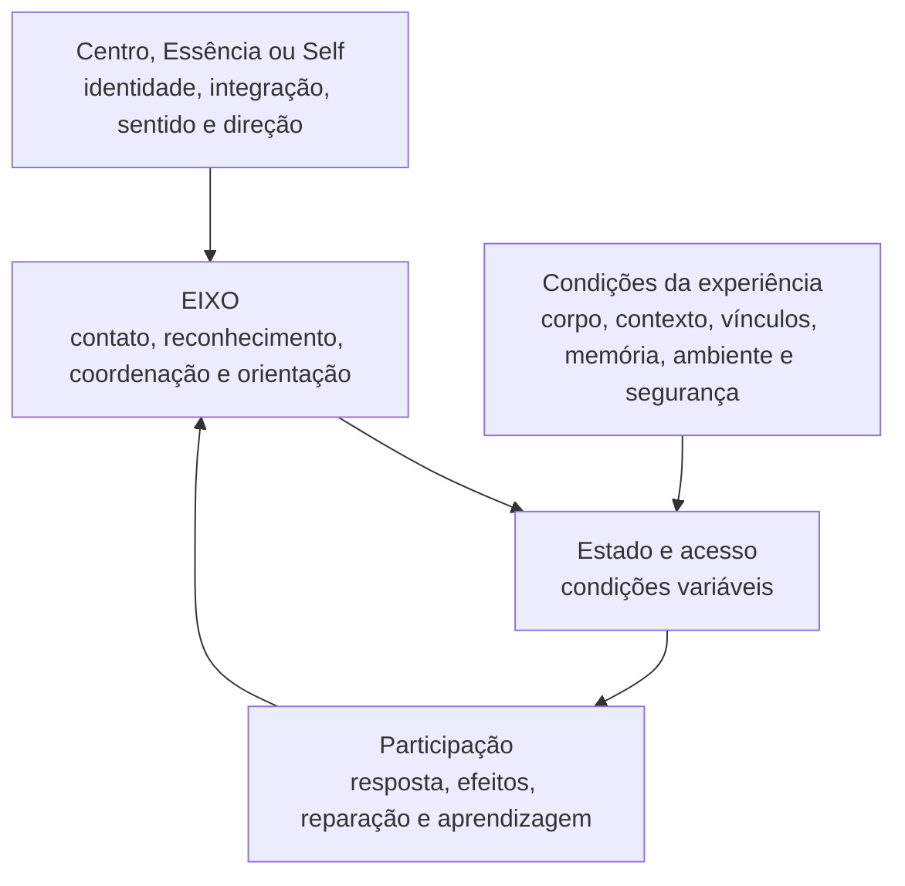

# Mapa Mestre — Referência, EIXO e Estado

## Pergunta que o mapa responde

> O que permanece como referência, o que se desenvolve e o que varia ao longo da experiência?

## Versão visual principal

## Leitura do mapa

- **Centro, Essência ou Self:** referência profunda; não é um estado emocional ideal.
- **EIXO:** conjunto articulado de capacidades que favorece contato, reconhecimento do deslocamento, coordenação, retorno e orientação.
- **Condições da experiência:** influenciam o que fica acessível; segurança atua como campo de possibilidades, não como degrau isolado.
- **Estado e acesso:** oscilam; uma capacidade pode existir e ficar temporariamente menos disponível.
- **Participação:** torna o processo observável em escolhas, efeitos, limites, apoio, reparação e aprendizagem.

O eixo não substitui a Essência nem produz o Self. Favorece condições para reencontrar essa referência e viver progressivamente a partir dela.

## Versão simples para o participante

| O que permanece como referência | O que se desenvolve | O que varia |
|---|---|---|
| Centro, Essência ou Self | EIXO | estado momentâneo e acesso às capacidades |

> Você pode estar afastado de sua referência sem ter perdido sua Essência. Pode estar ativado sem ter perdido todo o percurso. Pode não conseguir acessar uma capacidade naquele momento sem que ela tenha desaparecido.

## Frase para slide

> **A Essência permanece como referência. O acesso oscila. O eixo favorece o retorno.**

## Uso inicial — Unidade 0.2

Apresentar depois de uma situação cotidiana em que o participante reconheça que “sabia”, mas não conseguiu acessar tudo o que havia compreendido quando o padrão foi ativado.

### Perguntas de aplicação

1. O que mudou em meu estado?
2. O que ficou menos acessível?
3. Quais condições participaram disso?
4. Que contato, apoio ou orientação se tornou possível depois?
5. O que aprendi sobre meu modo de retornar?

## Retomadas previstas

| Fase/unidade | Função da retomada |
|---|---|
| Fase 1 | diferenciar identidade, estado, sensação, emoção e interpretação |
| Fase 2 | mostrar como corpo, ambiente, vínculo e segurança influenciam acesso |
| Fase 3 | observar sem confundir uma parte ou um estado com a totalidade do ser |
| Fase 4 | aprofundar EIXO como coordenação e orientação |
| Fase 5 | ligar elementos diferenciados sem apagar suas diferenças |
| Fase 6 | observar expressão, coerência, participação, efeitos e reparação |

## Articulação com outros mapas

- **Pêndulo:** representa a variação do estado e do acesso.
- **Espiral:** representa o reencontro de temas no percurso.
- **Bússola dos Quatro Movimentos:** organiza ações possíveis quando há deslocamento.
- **Cinco Janelas:** ajuda a reconhecer dimensões distintas que participam da experiência.
- **Desenvolvimento do Retorno:** mostra o que pode mudar com o treino.

## Guardas conceituais

- Não transformar Essência em estado permanente de calma.
- Não afirmar que toda ativação representa afastamento espiritual.
- Não tratar o estado momentâneo como identidade.
- Não apresentar EIXO como controle completo do organismo ou da experiência.
- Não usar “retorno” como volta a uma versão anterior ou idealizada.
- Não sugerir que vontade individual determina sozinha o acesso às capacidades.

## Bastidor teórico e didático

O mapa articula formulações antropológicas, fenomenológicas, clínicas, pedagógicas e espirituais do projeto. A variação de acesso pode ser iluminada por neurobiologia autonômica, interocepção, memória implícita, experiência preditiva, contexto e relação; nenhuma dessas perspectivas esgota o mapa nem prova a existência da Essência.

### Formulação canônica de retorno

> Retornar não é voltar a uma versão anterior nem reproduzir um estado ideal. É recuperar progressivamente o contato com um centro mais profundo de identidade, sentido e orientação, a partir das condições reais do presente.
