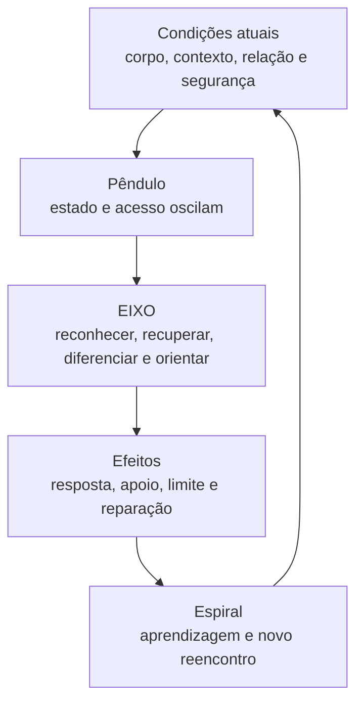

# Mapa Mestre — Pêndulo, Espiral e Percurso

## Pergunta que o mapa responde

> Como um estado pode oscilar e um tema pode retornar sem que a pessoa esteja exatamente no mesmo ponto?

## Versão visual principal

## Três funções diferentes

| Elemento | O que mostra | O que não significa |
|---|---|---|
| Pêndulo | variação de estado e de acesso numa experiência | lei física da consciência, falha ou retorno automático |
| Espiral | reencontro de temas sob outras condições | ascensão garantida ou progresso linear |
| Percurso | transformações acumuladas na maneira de reconhecer, responder, reparar e aprender | ausência definitiva de repetição |
| EIXO | capacidade de participar do movimento de retorno e orientação | ponto imóvel em que a pessoa deveria permanecer |

> O pêndulo mostra o movimento vivido; a espiral mostra o percurso construído; o eixo favorece reconhecimento, retorno e direção.

## Oscilação vital e deslocamento desorganizador

| Oscilação vital | Deslocamento desorganizador |
|---|---|
| atividade e repouso | ativação que reduz excessivamente percepção e escolha |
| aproximação e recolhimento | afastamento prolongado da própria referência |
| expansão e interiorização | captura rígida por um estado ou padrão |
| mobilização e recuperação | dificuldade persistente de reorganização |
| adaptação ao contexto | repetição automática com efeitos prejudiciais |

O curso não busca eliminar expansão, recolhimento, mobilização ou repouso. Busca reduzir a frequência, intensidade, duração e efeitos de deslocamentos desorganizadores e ampliar flexibilidade e retorno.

## Versão simples para o participante

> Um tema pode retornar sem que você tenha voltado ao mesmo ponto.

O percurso pode aparecer quando a pessoa:

- percebe o que aconteceu mais cedo;
- reconhece sinais corporais ou relacionais antes invisíveis;
- diferencia sensação, emoção, pensamento, memória e interpretação;
- identifica o efeito do medo, cansaço, ameaça ou contexto;
- mobiliza apoio, pausa ou limite;
- considera os efeitos da própria resposta;
- conversa, ajusta, repara e aprende.

Nada disso torna desejável uma resposta inadequada nem apaga suas consequências. Mostra que aprendizagem também pode ser reconhecida pela transformação da participação.

## Frase para slide

> **Oscilar não é perder a Essência. Reencontrar um tema não apaga o percurso.**

## Aplicação pelos quatro movimentos

| Movimento | Pergunta |
|---|---|
| Reconhecer | O que aconteceu e quando comecei a me afastar de minha referência? |
| Sustentar ou recuperar presença | Que contato com corpo, ambiente, relação ou apoio se tornou possível? |
| Organizar e diferenciar | O que era sensação, emoção, pensamento, memória, interpretação, impulso ou necessidade? |
| Orientar e aprender | O que precisa ser feito agora e o que a experiência ensina para uma próxima situação? |

Os movimentos não constituem uma sequência rígida. O mapa organiza possibilidades sem impor uma única maneira correta de retornar.

## Uso inicial — Unidade 0.2

1. Introduzir o pêndulo na microaula **O pêndulo e as oscilações do crescimento humano**.
2. Utilizar o subtítulo aprovado: **Por que nem sempre nossas capacidades ficam mais acessíveis ao longo da experiência**.
3. Introduzir a espiral na microaula seguinte, a partir da situação “o mesmo tema sob outras condições”.
4. Fechar a unidade mostrando que o estado atual e o percurso longitudinal respondem a perguntas diferentes.

## Retomadas previstas

- Fase 2: reconhecer estados, amplitudes, duração, segurança e recuperação.
- Fase 3: observar oscilações sem julgamento ou fusão identitária.
- Fase 4: fortalecer a participação orientada pelo eixo.
- Fase 5: compreender reorganização, integração e novos equilíbrios provisórios.
- Fase 6: construir continuidade, responsabilidade, reparação e expressão coerente.

## Guardas conceituais

- Oscilação não é automaticamente crescimento.
- Repetição não é automaticamente fracasso.
- A espiral não garante melhora a cada volta.
- O pêndulo não implica dois “eus”, um bom e outro ruim.
- O curso não promete eliminar ativação ou caos.
- A responsabilidade pelos efeitos permanece, sem culpabilização global da pessoa.
- Apoio adicional pode ser necessário quando a reorganização não se torna suficientemente possível.

## Bastidor teórico e didático

- Yin–yang ajuda a compreender equilíbrio como transformação e relação, não imobilidade.
- A neurobiologia autonômica ajuda a compreender variação de estado, acesso, mobilização, conexão, proteção e recuperação.
- A equilibração ajuda a compreender como uma perturbação pode exigir assimilação, acomodação e reorganização.
- Essas perspectivas iluminam perguntas diferentes e não devem ser fundidas numa explicação única.
