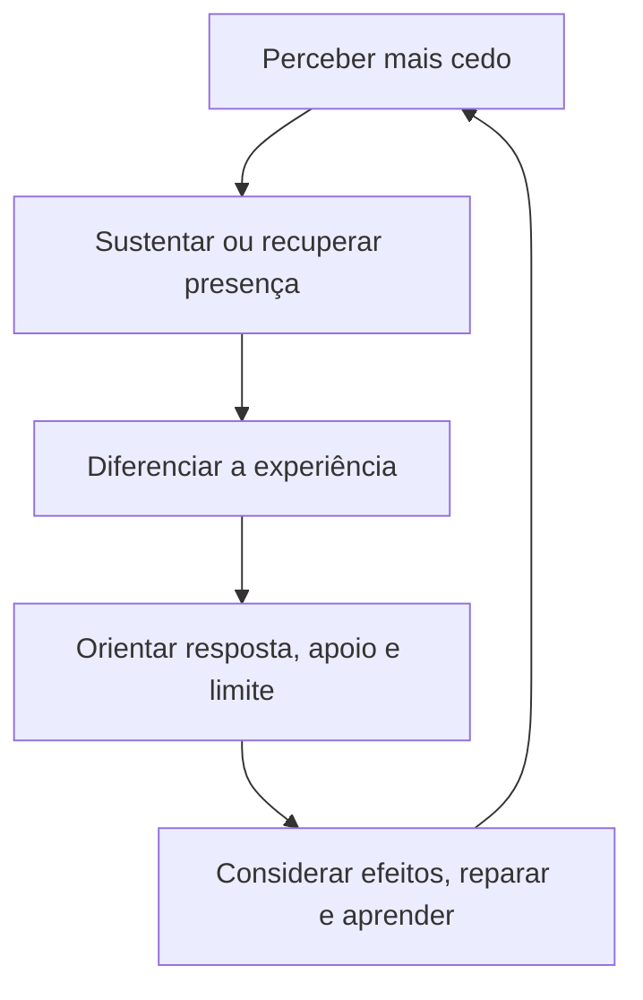

# Mapa Mestre — Desenvolvimento do Retorno

## Pergunta que o mapa responde

> Se o objetivo não é nunca mais oscilar, o que muda concretamente com o treino?

## Versão visual principal

O ciclo não é uma sequência rígida. Em algumas situações, o retorno começa por apoio, ambiente, pausa ou limite; em outras, por sensação, palavra, relação ou reconhecimento posterior.

## Dimensões observáveis do desenvolvimento

| Dimensão | Transformação possível |
|---|---|
| Reconhecimento | perceber mais cedo sinais de ativação e afastamento |
| Frequência | reduzir recorrência de deslocamentos desorganizadores em certas condições |
| Intensidade | diminuir a captura ou conservar alguma capacidade de participação |
| Duração | permanecer menos tempo sem acesso suficiente à referência |
| Amplitude | oscilar sem perder tantas capacidades ao mesmo tempo |
| Recursos | mobilizar corpo, ambiente, relação, pausa, apoio ou limite |
| Diferenciação | distinguir sensação, emoção, pensamento, memória, interpretação, impulso e necessidade |
| Retorno | reencontrar coordenação de modo mais possível, confiável e ajustado |
| Participação | ampliar escolha e considerar as condições reais da experiência |
| Efeitos | reconhecer consequências e ajustar a resposta |
| Reparação | comunicar, responsabilizar-se e reparar quando necessário |
| Continuidade | viver progressivamente mais a partir da Essência |

## Formulação consolidada

> Oscilar significa que nosso estado e nosso acesso às capacidades variam. Não significa que nossa Essência desaparece a cada mudança. O treino busca tornar progressivamente mais estável e acessível o contato com essa referência profunda, para que possamos viver a partir dela por períodos cada vez mais amplos, com oscilações menos intensas, menos prolongadas e menos desorganizadoras. Quando ocorrer um deslocamento, o treino favorece seu reconhecimento mais precoce e torna o retorno mais possível, facilitado e confiável.

## Versão simples para o participante

O progresso pode aparecer quando:

- você percebe antes;
- permanece menos capturado;
- recupera alguma presença com mais facilidade;
- encontra apoio ou estabelece um limite;
- diferencia melhor o que está acontecendo;
- escolhe com mais liberdade;
- reconhece efeitos e repara;
- aprende algo utilizável numa próxima situação;
- vive com mais paz, equilíbrio e constância diante do caos.

> **O desenvolvimento não elimina todo movimento. Torna mais estável o contato com a Essência, reduz deslocamentos desorganizadores e facilita o retorno.**

## Uso inicial — Unidade 0.2

Apresentar apenas como reconhecimento de possibilidades de desenvolvimento. Não transformar o mapa numa lista de exigências nem pedir pontuação global.

### Pequena prática de auto-observação

Escolher uma situação recente e perguntar:

1. O que percebi durante ou depois da situação?
2. O que ficou menos acessível?
3. O que me ajudou ou poderia ter ajudado?
4. Houve alguma mudança no tempo, intensidade, recursos ou efeitos?
5. O que preciso aprender, comunicar, ajustar ou reparar?

## Uso longitudinal

Ao final de cada fase, selecionar somente as dimensões que foram efetivamente praticadas e perguntar por exemplos concretos. O participante pode reconhecer avanço, ausência de mudança, variação entre contextos ou necessidade de apoio.

| Fase | Dimensões prioritárias |
|---|---|
| 1 — Traduzir | reconhecimento, linguagem e diferenciação |
| 2 — Regular | intensidade, duração, recursos, segurança e retorno |
| 3 — Observar | percepção precoce, amplitude, equanimidade e diferenciação |
| 4 — Fortalecer o EIXO | coordenação, orientação, limite e escolha |
| 5 — Integrar | estados mistos, ligação entre dimensões e continuidade |
| 6 — Expressar | efeitos, comunicação, reparação, coerência e contribuição |

## Guardas éticas e pedagógicas

- Não usar como escala diagnóstica.
- Não comparar participantes.
- Não sugerir progresso uniforme em todos os contextos.
- Não atribuir toda dificuldade à falta de treino.
- Não prometer que a pessoa permanecerá continuamente calma ou “centrada”.
- Não apagar condições sociais, relacionais, ambientais ou clínicas.
- Não confundir reconhecer condições com retirar responsabilidade.
- Encaminhar para apoio apropriado quando a necessidade exceder o campo educacional do curso.

## Relação com competência incorporada

Competência incorporada não é saber explicar o mapa. É tornar reconhecimento, presença, diferenciação, orientação, apoio, limite, reparação e aprendizagem progressivamente mais acessíveis quando a experiência real acontece.

## Frase para slide

> **O percurso aparece na qualidade do retorno: perceber, recuperar, escolher, reparar e aprender.**

## Representação gráfica vetorial

![[20 - Sistema Visual/03 - Gráfico Mestre - Desenvolvimento do Retorno.svg]]

- Fonte conceitual oficial: esta nota.
- Uso inicial: introdução breve na Unidade 0.2, após a distinção entre oscilação e percurso.
- Derivações: auto-observação formativa ao longo das seis fases, conforme [[20 - Sistema Visual/00 - Sistema Visual dos Mapas - Traduzindo o Ser Humano]].
