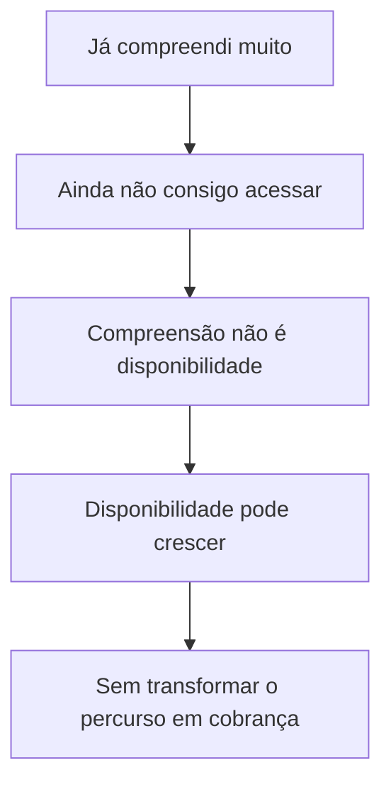

# Transcrição integral — elaboração das Partes 1–5 da Aula 0.1

> [!important] Transcrição histórica — não utilizar como regra vigente
> O texto abaixo é preservado literalmente. Ocorrências de “consiliência”, referências a E. O. Wilson como fundamento epistemológico ou instruções produzidas pela IA naquele momento foram superadas pela decisão autoral de 26/07/2026, formalizada em [[04 - Deliberação Transversal - Pluralismo Epistemológico Não Redutivo e Integração Autoral]] em 22/08/2026. Prevalecem o pluralismo epistemológico não redutivo, a identidade autoral integrada e a autoridade exclusiva de Fabiano para aprovar decisões.

**Fonte:** conversa compartilhada “Curso Módulo 0”  
**Link de origem:** https://chatgpt.com/share/6a66b520-b7fc-83e9-85ae-40ce808a3124

**Critério de delimitação:** sequência cronológica iniciada na intervenção do usuário que antecede a revisão integral do arco e encerrada na resposta em que foi elaborado o Capítulo 5, posteriormente denominado Parte 5. Foram preservadas as mensagens do usuário e do assistente exibidas na conversa nesse intervalo. Mensagens técnicas internas, raciocínio oculto, chamadas de ferramentas e resultados redigidos pelo compartilhamento não integram a conversa reproduzível e não foram incluídos.

**Preservação:** o texto abaixo não foi resumido, corrigido, atualizado nem combinado. As marcações “Imagem carregada” e “Arquivo carregado” reproduzem a indicação visual dos anexos; seus conteúdos binários não foram convertidos em texto.

---

## USUÁRIO

“Não precisamos apagar a interpretação. Precisamos apenas reconhecê-la como interpretação, diferenciando-a do acontecimento e das manifestações que surgiram em nós.” A essa frase eu acrescentaria: o problema muitas vezes não vem da experiência em sí, mas da interpretação que fazemos dela. Avalie

Depois prosseguimos com a revisão do arco inteiro. 

Quero adotar como padrão a produção de um roteiro que oriente minha fala, pautado nas elaborações e refinamentos que alcançamos aqui. E que isso seja adotado com padrão nos materiais a serem produzidos para o curso.

Quero também a verificação de onde e como entram os mapas que já foram produzidos e estão armazenados no Obsidian. Há vários mapas pertinentes, já prontos ou que podem ser adaptados com material pedagógico nos power points a serem produzidos. Avalie.

Quanto a produção e gravação de aulas, como o objetivo inicial é gravação pelo zoom de cada uma das aulas, estive pensando em estruturar os power points como algo que pode ser depois editado como ajulas menores dentro da plataforma, para facilitar quem comprar e assistir o curso posteriormente. Avalie.

---

## ASSISTENTE

Vou tratar suas quatro propostas como decisões de arquitetura da Aula 0.1 e do curso inteiro: refinar a formulação sobre interpretação, definir o roteiro de fala como padrão oficial, inventariar a entrada dos mapas já existentes e avaliar uma gravação longa que possa ser modularizada depois.

Como você pediu uma consulta ao material do Obsidian, verificarei o repositório sincronizado no GitHub. Também usarei as orientações de continuidade e de apresentações, porque essas decisões precisam funcionar tanto no roteiro quanto nos futuros PowerPoints — sem congelar prematuramente o arco que ainda será revisado.

---

## ASSISTENTE

A distinção sobre interpretação já aparece, em essência, nos materiais anteriores do curso. O refinamento agora não é introduzir uma tese nova, mas impedir duas simplificações opostas: nem tratar toda reação como efeito direto do acontecimento, nem insinuar que o sofrimento é “apenas uma interpretação” e, portanto, responsabilidade ou culpa da pessoa.

Também confirmei que o curso já vinha assumindo roteiro falado, mapas visuais e modularidade como recursos. Agora vou localizar os mapas efetivamente registrados no repositório para separar o que já existe, o que está prototipado e o que apenas foi mencionado.

---

## ASSISTENTE

As quatro direções são adequadas e coerentes com o curso. Minha recomendação é adotá-las, mas com um refinamento importante na formulação sobre interpretação e com uma arquitetura que diferencie claramente: slide, roteiro de fala, mapa pedagógico e futura edição em vídeo.

## 1. A interpretação participa da experiência, mas não deve ser culpabilizada

Seu acréscimo contém uma ideia central do curso, porém eu evitaria:

> “O problema muitas vezes não vem da experiência em si...”

Há dois riscos:

- “experiência” já inclui, na arquitetura do curso, manifestações, interpretações, significados e respostas;
- a frase pode sugerir que acontecimentos realmente dolorosos ou injustos não seriam o problema e que a pessoa sofreria somente porque “interpretou errado”.

A formulação mais precisa seria:

> **Não precisamos apagar a interpretação. Precisamos reconhecê-la como interpretação, diferenciando-a do que aconteceu e das manifestações que surgiram em nós. Muitas vezes, a dificuldade não vem apenas do acontecimento, mas também do sentido que atribuímos a ele e da maneira como passamos a responder a partir desse sentido.**

Para o PowerPoint, podemos condensar:

> **O que nos mobiliza não é apenas o que aconteceu.  
> O sentido que atribuímos ao acontecimento também participa daquilo que vivemos.**

Essa redação preserva quatro possibilidades:

1. o acontecimento pode ter sido difícil em si;
2. as manifestações corporais e emocionais são reais;
3. a interpretação pode ampliar, manter ou reorganizar a experiência;
4. reconhecer uma interpretação não significa declará-la falsa.

No caso de Lívian, por exemplo, a raiva não precisa ser tratada como produto de uma interpretação equivocada. O ponto decisivo é que uma interpretação adicional — “observar minha reação seria tornar-me indiferente ou psicopática” — restringe as possibilidades disponíveis. A Tradução não invalida a emoção; torna legível a relação entre emoção, proteção, significado e resposta.

Essa distinção já está coerente com a formulação consolidada no repositório: **fenômeno–manifestação–tradução–interpretação–significado–hipótese**. Ela também aparece como resultado esperado do Módulo 1: distinguir fenômeno, manifestação, interpretação, hipótese e indeterminação. [Registro Mestre de Formulações Estruturantes](https://github.com/fabianodeliberalli/base-cognitiva-vault/blob/main/70%20-%20Produ%C3%A7%C3%B5es/Cursos/Curso%20-%20Nome%20Provis%C3%B3rio/Registro%20Mestre%20de%20Formula%C3%A7%C3%B5es%20Estruturantes.md)

## 2. O roteiro de fala deve tornar-se padrão oficial

Concordo integralmente. O PowerPoint não deve carregar sozinho a profundidade das elaborações alcançadas. Sua função é sustentar visualmente a experiência pedagógica; o roteiro preserva nuances, exemplos, transições, limites e formulações que não cabem na tela.

O padrão mais adequado seria um **roteiro orientador**, e não um texto rígido para leitura integral.

| Camada | O que contém |
|---|---|
| **Na tela** | frase, pergunta, imagem ou mapa visto pelo participante |
| **Fala nuclear** | formulações que precisam de maior precisão conceitual |
| **Desenvolvimento livre** | ideias, exemplos clínicos anonimizados e explicações que você pode apresentar com sua linguagem natural |
| **Transição** | passagem que explica por que o próximo conteúdo se torna necessário |
| **Interação ou prática** | pergunta, exercício, pausa ou convite de observação |
| **Modularização** | indicação de começo e encerramento de um futuro capítulo em vídeo |
| **Notas do educador** | fontes, cuidados, limites e aprofundamentos opcionais |

Algumas passagens devem ser praticamente textuais — como definições, contratos de segurança e distinções epistemológicas. Outras devem permanecer como tópicos de orientação, preservando a naturalidade de sua fala e sua experiência clínica.

A decisão curricular pode ser formulada assim:

> **Toda aula do curso será acompanhada por um roteiro do educador que preserve o arco pedagógico, as formulações nucleares, os exemplos, as transições, as práticas e os cuidados necessários, sem transformar a fala do educador em leitura mecânica.**

Isso está de acordo com o Índice Mestre dos Kits: o texto de fala pertence ao roteiro do educador, enquanto o conteúdo entregue ao participante e os mapas permanecem em componentes próprios. [Índice Mestre dos Kits de Aula](https://github.com/fabianodeliberalli/base-cognitiva-vault/blob/main/70%20-%20Produ%C3%A7%C3%B5es/Cursos/Curso%20-%20Nome%20Provis%C3%B3rio/60%20-%20Arquitetura%20Pedag%C3%B3gica/00%20-%20%C3%8Dndice%20Mestre%20dos%20Kits%20de%20Aula.md)

## 3. Os mapas devem funcionar como instrumentos recorrentes, não como ilustrações ocasionais

A consulta ao repositório confirma que existe uma família extensa de mapas. Alguns estão maduros; outros estão prototipados, em desenvolvimento ou reservados para etapas posteriores.

Uma primeira distribuição coerente seria:

| Mapa ou família | Entrada principal | Uso posterior |
|---|---|---|
| **Experiência–Tradução–mapas–articulação crítica** | Aula 0.1 | contrato epistemológico de todo o curso |
| **Cinco Janelas** | Aula 0.1 | aplicação mais completa nas Aulas 1.1 e 1.2 |
| **Acontecimento–manifestação–interpretação–hipótese** | Aula 0.1, em linguagem simples | aprofundamento no Módulo 1 |
| **Mapa global das seis fases** | Aula 0.2 | retomada na abertura dos módulos |
| **Quatro movimentos funcionais** | visão panorâmica na Aula 0.2 | reaparecem dentro de todas as fases |
| **Espiral e pêndulo** | Aula 0.2 | marcador longitudinal de aprendizagem e oscilação |
| **EIXO dinâmico** | introdução nas Aulas 0.1–0.2 | aprofundamento no Módulo 4 |
| **Multidimensionalidade e cartografia da experiência** | Aula 1.1 | retomadas nos módulos seguintes |
| **Sentir–Perceber–Observar–Traduzir** | Módulo 1, conforme revisão | aprofundamento nos Módulos 2 e 3 |
| **Semente–Casca–Campo–Árvore** | candidato para Aula 1.1 | metáfora longitudinal de proteção, limite e potência |
| **Centro–Campo–Borda–Sombra** | ainda em desenvolvimento | progressão dos Módulos 1–6 |
| **Três Eus** | não deve ser antecipado como obrigatório | teste de necessidade antes da Aula 4.1 |
| **Três Regulações, Qi Gong e Tan Tien** | Módulos 2 e 4 | retomada no Módulo 6 e em práticas futuras |
| **Rede Tripartite e DMN–SN–FPN** | principalmente material do educador | participante somente quando trouxer ganho real de compreensão |
| **Self, sombra, mandala, labirinto e individuação** | Módulos 3–6 | progressão simbólica e integrativa |

Essa distribuição está apoiada pelo [Inventário Mestre de Conteúdos Disponíveis](https://github.com/fabianodeliberalli/base-cognitiva-vault/blob/main/70%20-%20Produ%C3%A7%C3%B5es/Cursos/Curso%20-%20Nome%20Provis%C3%B3rio/10%20-%20Governan%C3%A7a%20do%20Conhecimento/02%20-%20Invent%C3%A1rio%20Mestre%20de%20Conte%C3%BAdos%20Dispon%C3%ADveis.md) e pela [Matriz Integrada](https://github.com/fabianodeliberalli/base-cognitiva-vault/blob/main/70%20-%20Produ%C3%A7%C3%B5es/Cursos/Curso%20-%20Nome%20Provis%C3%B3rio/02%20-%20Matriz%20Integrada%20-%20Quatro%20Movimentos%2C%20Seis%20Fases%20e%20Jornada%20Fenomenol%C3%B3gica.md).

A verificação também revelou uma lacuna real: o Inventário reconhece os mapas e suas funções, mas ainda registra como pendência localizar e vincular todos os arquivos de origem por caminhos explícitos. Portanto, sabemos conceitualmente quais mapas existem e onde tendem a entrar, mas ainda precisamos, durante a revisão do arco, fazer a correspondência concreta:

> **mapa → arquivo existente → estado → aula → slide → adaptação necessária**

Isso deve integrar a revisão da aula, sem virar uma nova burocracia anterior à criação.

Também é importante preservar o estado atual da Aula 1.1: seus mapas e o PowerPoint de 22 slides constituem matéria-prima qualificada, mas a aula foi reaberta para revisão e não deve ser tomada como modelo canônico. [Estado Atual e Continuidade do Curso](https://github.com/fabianodeliberalli/base-cognitiva-vault/blob/main/70%20-%20Produ%C3%A7%C3%B5es/Cursos/Curso%20-%20Nome%20Provis%C3%B3rio/LEIA%20PRIMEIRO%20-%20Estado%20Atual%20e%20Continuidade%20do%20Curso.md)

## 4. Gravar pelo Zoom e editar posteriormente é uma estratégia muito adequada

A ideia é boa, desde que cada PowerPoint seja construído como uma **aula integral formada por capítulos autônomos**.

Não devemos gravar uma exposição contínua de 90 minutos e somente depois tentar descobrir onde cortá-la. A modularidade precisa existir desde o roteiro.

Para a Aula 0.1, por exemplo, a futura divisão pode aproximar-se de:

1. compreender não é ainda poder contar com o que compreendemos;
2. competência incorporada e o caso de Lívian;
3. experiência, mapas e articulação crítica;
4. as Cinco Janelas;
5. prática de investigação;
6. liberdade progressiva, integração e percurso do curso.

A quantidade e a duração exatas só devem ser definidas depois da revisão do arco, mas a tendência seria produzir capítulos de aproximadamente 8 a 18 minutos, mantendo as práticas no tempo necessário.

Cada capítulo precisa possuir:

- uma pergunta ou tensão de abertura;
- uma ideia nuclear;
- um exemplo, mapa ou aplicação;
- uma pequena síntese;
- uma passagem que possa ser mantida ou retirada na edição.

Alguns cuidados facilitarão bastante a posterior transformação para a plataforma:

- evitar depender excessivamente de frases como “há quarenta minutos vimos...”;
- inserir breves pausas entre capítulos;
- utilizar slides divisores de seção;
- separar intervenções exclusivas do encontro ao vivo;
- evitar numeração visual rígida que dificulte reorganizar segmentos;
- produzir aberturas e encerramentos substituíveis;
- registrar no roteiro onde começa e termina cada futuro vídeo;
- manter pouco texto visível e deixar a profundidade na fala;
- preparar práticas que façam sentido tanto no Zoom quanto no consumo assíncrono.

Assim teremos um único sistema de produção:

> **uma aula integral para gravação → capítulos planejados no roteiro → edição em aulas menores → mapas, práticas e materiais preservados em cada capítulo.**

## Decisões recomendadas para levar à revisão do arco

1. Adotar a formulação refinada sobre acontecimento, manifestações, interpretação e resposta.
2. Tornar o roteiro do educador um componente-padrão de todas as aulas.
3. Tratar o PowerPoint como apoio visual do roteiro, não como repositório de todo o conteúdo.
4. Projetar cada aula integral em capítulos editáveis desde a origem.
5. Incorporar os mapas conforme sua função pedagógica e seu estado real de maturidade.
6. Na revisão do arco da Aula 0.1, verificar simultaneamente conteúdo, repetição, tempo, transições, entrada dos mapas e pontos naturais de corte.

Com essas decisões, podemos agora prosseguir para a revisão do arco inteiro da Aula 0.1 sem precisar reconstruir o que já foi elaborado.

---

## USUÁRIO

prossiga

---

## ASSISTENTE

Vou prosseguir com a revisão integral do arco da Aula 0.1, agora já incorporando as decisões sobre roteiro de fala, modularização para gravação e uso dos mapas existentes. Primeiro vou reconciliar o estado anterior da aula com o repositório GitHub/Obsidian; depois avaliarei sequência, redundâncias, densidade, tempo, transições, mapas e pontos de corte — sem congelar prematuramente o material.

Usarei, nessa ordem, os protocolos de continuidade pessoal, GitHub e apresentações, porque a revisão depende tanto das decisões acumuladas quanto da estrutura pedagógico-visual do futuro PowerPoint.

---

## ASSISTENTE

A revisão confirma uma tensão útil: a versão mais recente da aula ganhou riqueza e um arco coerente, mas ficou maior do que a função de “orientação” inicialmente prevista. Isso não significa voltar ao esboço antigo. Significa distinguir o que precisa acontecer na Aula 0.1 do que apenas precisa ser anunciado e retomado depois.

Também há um conflito documental específico que vou resolver na análise: versões comerciais antigas chamam a Aula 0.1 de “Como aprender a traduzir a própria experiência”, enquanto o estado curricular vigente usa “Da compreensão acumulada à competência incorporada”. A revisão será feita pelo arco vigente, sem apagar essa formulação anterior, que ainda pode sobreviver como promessa pedagógica ou subtítulo.

---

## ASSISTENTE

A revisão do arco inteiro indica que a Aula 0.1 está conceitualmente consistente e suficientemente madura para avançar. O principal ajuste não é retirar conteúdo, mas reorganizar sua hierarquia: hoje existem aproximadamente 40 movimentos pedagógicos válidos, porém alguns repetem a mesma função ou desenvolvem cedo demais conteúdos que terão aprofundamento posterior.

Minha recomendação é converter o arco em aproximadamente **29–31 slides**, distribuídos em seis capítulos editáveis. A aula integral permaneceria adequada para gravação no Zoom e poderia depois ser transformada em seis vídeos menores sem perder continuidade.

## 1. Função definitiva da Aula 0.1

A aula não precisa ensinar todo o processo de Tradução nem toda a arquitetura do EIXO. Ela precisa fazer o participante experimentar três mudanças iniciais:

1. reconhecer que sua dificuldade pode não ser falta de conhecimento;
2. perceber que uma experiência pode ser investigada sem ser reduzida a uma explicação;
3. entrar no percurso sem transformar o curso em nova cobrança, diagnóstico ou promessa de perfeição.

A função comunicacional da apresentação pode ser resumida assim:

> Ao final da Aula 0.1, o participante deve compreender que existe uma diferença entre saber algo e poder contar com esse saber quando a vida o mobiliza; deve experimentar uma primeira forma de tornar sua experiência mais legível e reconhecer que competência incorporada se constrói progressivamente.

Isso está coerente com a tese organizadora registrada no projeto:

> **Compreender uma experiência não garante capacidade de sustentar e integrar aquilo que ela continua mobilizando.**

A estrutura curricular também prevê que o Módulo 0 ajude o participante a distinguir compreensão, competência e incorporação e a escolher como participar do percurso. [Esqueleto Estrutural da Primeira Oferta](https://github.com/fabianodeliberalli/base-cognitiva-vault/blob/main/70%20-%20Produ%C3%A7%C3%B5es/Cursos/Curso%20-%20Nome%20Provis%C3%B3rio/09%20-%20Esqueleto%20Estrutural%20da%20Primeira%20Oferta%20Integral%20para%20Mentoria.md)

## 2. Reconciliação do título

Há duas formulações documentais:

- **Da compreensão acumulada à competência incorporada** — título curricular vigente;
- **Como aprender a traduzir a própria experiência** — formulação comercial e pedagógica anterior.

Elas não precisam competir. Recomendo:

> **Aula 0.1 — Da compreensão acumulada à competência incorporada**  
> *Como começar a traduzir a própria experiência*

O título principal comunica o problema humano central. O subtítulo preserva a formulação anterior e explica, em linguagem acessível, o que será experimentado na aula.

## 3. Diagnóstico do arco atual

### O que deve ser preservado

- abertura pela distância entre compreender e conseguir acessar;
- caso de Lívian como fio condutor;
- competência incorporada como disponibilidade progressiva;
- experiência como território e mapas como perspectivas;
- articulação crítica entre diferentes mapas;
- Cinco Janelas;
- microprática;
- circularidade Tradução–EIXO;
- liberdade progressiva e integração;
- apresentação breve do percurso;
- encerramento retornando à tensão inicial.

### O que está excessivamente desenvolvido

**As Cinco Janelas:** atualmente ocupam uma longa sequência de apresentação individual, releitura do caso e prática. Devem permanecer, mas como uma primeira ferramenta vivida, sem exigir domínio completo. Sua sistematização pertence principalmente ao Módulo 1.

**Horizonte antropológico:** quatro slides sobre proteção, liberdade, integração, ego e Essência ampliam muito a aula. O conteúdo é valioso, mas pode ser condensado em dois movimentos.

**Âncoras de Percurso:** sete frases em dois slides repetem ideias já apresentadas. Parte delas deve ir para o resumo da aula ou caderno do participante.

**Mapa dos módulos:** a tabela detalhada dos sete módulos antecipa conteúdos demais. Na Aula 0.1 basta um mapa panorâmico. A Aula 0.2 explicará percurso, espiral, pêndulo, segurança, fases e movimentos.

**Tradução–EIXO:** três slides são mais do que a aula necessita. A relação deve aparecer como ponte, não como aula metodológica completa.

### Lacuna identificada

O arco recente fortaleceu a experiência pedagógica, mas deixou menos explícito o **contrato formativo**, que pertence ao próprio Módulo 0:

- curso educacional e complementar;
- mapas não são diagnósticos nem verdades totais;
- práticas são opcionais e adaptáveis;
- cada pessoa regula sua participação;
- integração é direção, não promessa;
- não é preciso escolher a experiência mais intensa para aprender.

Esse contrato deve aparecer antes da microprática e ser percebido desde o início da aula.

## 4. Arco integral revisado

### Capítulo 1 — Quando compreender ainda não é poder contar com o que compreendemos

**Duração estimada:** 10–12 minutos  
**Slides:** 1–5

1. **Título da aula**
2. **“Já compreendi tanta coisa. Por que continuo reagindo da mesma maneira?”**
3. **Compreensão não é o mesmo que disponibilidade**
4. **Competência incorporada**
5. **Como percorrer esta aula sem transformá-la em nova cobrança**

Formulação nuclear:

> **Competência incorporada é a disponibilidade progressiva de reconhecer, sustentar e utilizar uma capacidade em situações reais — inclusive quando essa capacidade só pode ser recuperada depois.**

O slide 5 introduz o contrato em linguagem simples, sem parecer um aviso jurídico.

---

### Capítulo 2 — O caso de Lívian: quando observar parece significar sentir menos

**Duração estimada:** 12–15 minutos  
**Slides:** 6–10

6. O que Lívian já compreendia  
7. O que acontecia quando era mobilizada  
8. Por que observar parecia moralmente perigoso  
9. A reação também procurava proteger algo  
10. Compreender a função não significa obedecer automaticamente à reação

O ponto central do caso não é ensinar uma explicação psicológica, budista ou neurobiológica. É revelar que Lívian não tinha apenas “falta de controle”: havia uma associação entre reduzir a reação e perder sensibilidade, dignidade ou fidelidade à própria história.

Frase de passagem:

> **Se a própria observação parece perigosa, oferecer mais uma explicação talvez não seja suficiente. Precisamos investigar como a experiência está organizada.**

---

### Capítulo 3 — A experiência é o território

**Duração estimada:** 12–15 minutos  
**Slides:** 11–15

11. Um mesmo acontecimento pode ser lido por diferentes mapas  
12. O que cada mapa ilumina e deixa de fora  
13. Quatro critérios para utilizar um mapa  
14. Slide-síntese do território, da Tradução e dos mapas  
15. Como investigar sem fechar prematuramente?

O slide-síntese permanece:

> **A experiência é o território.**  
> **A Tradução ajuda a investigá-lo.**  
> **Os mapas oferecem perspectivas.**  
> **A articulação crítica evita que uma perspectiva seja tomada como verdade total.**

Esse núcleo corresponde ao princípio já registrado como pluralidade de mapas, dignidade epistêmica e abertura ontológica responsável. O inventário confirma “consiliência crítica/passagens entre mapas” como operador do contrato e de todo o curso. [Inventário Mestre de Conteúdos Disponíveis](https://github.com/fabianodeliberalli/base-cognitiva-vault/blob/main/70%20-%20Produ%C3%A7%C3%B5es/Cursos/Curso%20-%20Nome%20Provis%C3%B3rio/10%20-%20Governan%C3%A7a%20do%20Conhecimento/02%20-%20Invent%C3%A1rio%20Mestre%20de%20Conte%C3%BAdos%20Dispon%C3%ADveis.md)

Wilson e “consiliência” permanecem nas notas do educador, sem virar vocabulário obrigatório do participante.

---

### Capítulo 4 — As Cinco Janelas

**Duração estimada:** 18–22 minutos  
**Slides:** 16–21

16. **Cinco Janelas para investigar a experiência**  
17. **O que aconteceu? / Como se manifestou?**  
18. **Como nomeei e interpretei?**  
19. **Que mapas podem ajudar? / O que isso solicita agora?**  
20. **O caso de Lívian pelas Cinco Janelas**  
21. **O que se tornou mais legível?**

A pergunta transversal permanece:

> **O que ainda não sei?**

No slide 18 entra a formulação refinada:

> **Não precisamos apagar a interpretação. Precisamos reconhecê-la como interpretação, diferenciando-a do que aconteceu e das manifestações que surgiram em nós. Muitas vezes, a dificuldade não vem apenas do acontecimento, mas também do sentido que atribuímos a ele e da maneira como passamos a responder a partir desse sentido.**

Na tela, em forma condensada:

> **O que nos mobiliza não é apenas o que aconteceu.  
> O sentido que atribuímos também participa daquilo que vivemos.**

As Cinco Janelas devem ser apresentadas como:

> **uma primeira maneira de investigar**

e não ainda como ferramenta que o participante precisa dominar. Isso preserva espaço para as Aulas 1.1 e 1.2.

---

### Capítulo 5 — Microprática

**Duração estimada:** 15–18 minutos  
**Slides:** 22–25

22. Escolha uma experiência possível de observar  
23. Primeira passagem: acontecimento, manifestação e interpretação  
24. Segunda passagem: mapas, solicitação e indeterminação  
25. O que ficou 5% mais claro?

Antes da prática, a fala precisa garantir:

- escolha livre;
- experiência de intensidade manejável;
- olhos abertos ou fechados;
- possibilidade de parar;
- ausência de obrigação de encontrar resposta;
- retorno ao ambiente e aos apoios corporais.

A microprática não promete regulação nem transformação imediata. Ela demonstra que uma diferenciação mínima já pode modificar a relação com a experiência.

Encerramento:

> **Traduzir não significa explicar tudo. Significa tornar possível uma relação um pouco mais diferenciada com aquilo que vivemos.**

---

### Capítulo 6 — Da primeira Tradução ao percurso do curso

**Duração estimada:** 12–15 minutos  
**Slides:** 26–30

26. Quando tudo aparece misturado, a resposta tende a ser mais automática  
27. Tradução e EIXO se fortalecem reciprocamente  
28. Proteção, liberdade e integração  
29. O caminho dos sete módulos  
30. Entre compreender e incorporar existe um caminho

O slide 27 pode conter apenas:

> **Algum EIXO permite Traduzir.**  
> **Uma Tradução mais adequada fortalece o EIXO.**

A explicação detalhada do EIXO, da espiral e do pêndulo fica para a Aula 0.2.

O slide 28 reúne três resultados do horizonte antropológico:

> **Os padrões possuem história.**  
> **As proteções podem aprender outras formas de proteger.**  
> **Liberdade é ampliar as respostas disponíveis.**

A formulação sobre integração pode entrar na fala ou no resumo do participante:

> **Integração não é vencer partes de si. É ampliar a capacidade de reconhecê-las, diferenciá-las e coordená-las.**

Self, Essência, Alma e Eu Superior não precisam aparecer na tela desta aula. Podem ser mencionados brevemente como linguagens possíveis, mas sua inclusão visual abriria uma discussão que a Aula 0.1 não precisa resolver.

## 5. Distribuição dos mapas

| Mapa | Uso na Aula 0.1 | Estatuto recomendado |
|---|---|---|
| **Diferentes Mapas do Mesmo Território** | mapa principal do Capítulo 3 | adaptar do patrimônio existente |
| **Experiência–Tradução–mapas–articulação crítica** | síntese interna do mapa anterior, não novo sistema separado | composição visual da aula |
| **Contrato de Tradução** | orientações de participação e uso dos mapas | localizar/adaptar; previsto nos materiais anteriores |
| **Cinco Janelas** | ferramenta experiencial central dos Capítulos 4 e 5 | protótipo pedagógico da Aula 0.1 |
| **Acontecimento–manifestação–interpretação–hipótese** | aprofundamento interno das janelas | mini-mapa, não apresentação teórica extensa |
| **Tradução ↔ EIXO** | ponte para a Aula 0.2 | síntese transversal |
| **Mapa global das seis fases** | apenas visão panorâmica final | aprofundar na Aula 0.2 |
| **Espiral e pêndulo** | não desenvolver nesta aula | Aula 0.2 |
| **Semente–Casca–Campo–Árvore** | não inserir agora | Aula 1.1 e progressão posterior |
| **Centro–Campo–Borda–Sombra** | não inserir agora | mapa longitudinal ainda em desenvolvimento |
| **Três Eus** | não inserir | teste de necessidade antes do Módulo 4 |
| **Rede Tripartite e mapas neurocientíficos** | fundamento do roteiro, se necessário | não projetar para o participante nesta aula |

O inventário ainda reconhece uma pendência de curadoria: vários mapas estão nomeados, mas nem todos possuem o arquivo de origem explicitamente vinculado. Portanto, antes da produção visual final, precisaremos realizar apenas uma correspondência concreta e leve:

> **mapa selecionado → arquivo de origem → adaptação necessária → slide de entrada**

Isso não deve interromper a escrita do roteiro.

## 6. Modularização para Zoom e plataforma

A gravação integral pode resultar nestes vídeos:

| Vídeo futuro | Conteúdo | Duração provável |
|---|---|---:|
| 1 | Compreender não é ainda poder contar | 10–12 min |
| 2 | O caso de Lívian e a competência incorporada | 12–15 min |
| 3 | Território, mapas e articulação crítica | 12–15 min |
| 4 | As Cinco Janelas | 15–18 min |
| 5 | Prática pelas Cinco Janelas | 15–18 min |
| 6 | Tradução, EIXO e percurso do curso | 12–15 min |

A aula integral ficaria entre aproximadamente **80 e 95 minutos**, dependendo do ritmo da prática e da interação no Zoom.

Cada capítulo deve possuir:

- slide divisor;
- abertura compreensível sem depender excessivamente do vídeo anterior;
- uma ideia nuclear;
- exemplo ou aplicação;
- síntese final;
- pausa de gravação;
- transição removível na edição.

## 7. Padrão do roteiro do educador

O roteiro completo de cada slide deverá conter:

1. **Função pedagógica**
2. **Conteúdo visível**
3. **Fala nuclear**
4. **Desenvolvimento orientador**
5. **Exemplo ou aplicação**
6. **Transição**
7. **Interação ou prática**
8. **Ponto de corte para edição**
9. **Notas do educador e fontes**

Esse padrão preserva o refinamento conceitual sem obrigá-lo a ler um texto mecanicamente. O PowerPoint permanece leve; a profundidade fica no roteiro e em sua fala.

## Síntese da revisão

A aula não precisa ser reconstruída. O arco está aprovado como direção de trabalho, com estes ajustes:

- reduzir 40 movimentos para cerca de 30 slides;
- reinserir explicitamente o contrato formativo;
- conservar as Cinco Janelas, mas sem esgotá-las;
- condensar liberdade, proteção e integração;
- deixar espiral, pêndulo e arquitetura detalhada do EIXO para a Aula 0.2;
- transformar o caso de Lívian no fio contínuo da aula;
- usar mapas existentes por função, e não por quantidade;
- estruturar seis capítulos editáveis desde a gravação;
- adotar roteiro orientador como componente-padrão de todas as aulas.

O próximo passo é converter esta arquitetura revisada no **roteiro integral do educador da Aula 0.1**, capítulo por capítulo, já com fala nuclear, desenvolvimento livre, transições, mapas e marcações de edição.

---

## USUÁRIO

Gosto desta estrutura onde O título principal comunica o problema humano central. O subtítulo preserva a formulação anterior e explica, em linguagem acessível, o que será experimentado na aula. Penso em adotá-la como padrão para o curso. Avalie.

prossiga

---

## ASSISTENTE

Concordo com a adoção: essa estrutura resolve uma tensão recorrente do curso — o título preserva densidade e identidade curricular; o subtítulo traduz a promessa concreta da aula sem empobrecê-la. Vou formalizar o padrão com critérios para evitar títulos abstratos ou subtítulos redundantes e, em seguida, aplicá-lo à Aula 0.1 enquanto inicio o roteiro integral do educador.

Como isso dará forma aos futuros PowerPoints e precisa manter continuidade com o acervo oficial, usarei as orientações de apresentações e do repositório GitHub/Obsidian.

---

## ASSISTENTE

A proposta fica ainda mais sólida quando tratada como uma regra de comunicação, não como um molde verbal rígido. O padrão será: título como tensão, transformação ou questão humana da aula; subtítulo como tradução do que o participante começará a compreender, experimentar ou praticar. Evitarei repetir a mesma ideia nas duas linhas e também evitarei que todos os títulos usem mecanicamente “Da… à…”.

O repositório confirma que a Aula 0.1 é a frente ativa e que o roteiro do educador é um componente próprio do kit, separado do conteúdo visível. Vou começar pelo Capítulo 1, já no formato completo que depois poderá ser convertido em slides e capítulos de vídeo.

---

## ASSISTENTE

A estrutura deve ser adotada como padrão do curso. Ela concilia profundidade conceitual e acessibilidade sem transformar o título em publicidade ou simplificar o conteúdo.

A decisão fica assim:

> **O título principal de cada aula comunica a questão, tensão ou passagem humana central. O subtítulo explica, em linguagem acessível, o que o participante começará a compreender, experimentar ou praticar.**

Esse é um padrão de função, não uma fórmula gramatical rígida. Nem todos os títulos precisarão usar “Da… à…”, e o subtítulo não deverá apenas repetir o título.

### Aplicação confirmada à Aula 0.1

> # Da compreensão acumulada à competência incorporada  
> ## Como começar a traduzir a própria experiência

O título nomeia o problema formativo do curso. O subtítulo aproxima essa formulação da experiência concreta e preserva a expressão anterior.

Para os demais materiais:

- os módulos podem manter nomes funcionais;
- cada aula receberá título principal e subtítulo;
- os capítulos editáveis terão títulos autônomos e mais diretos;
- os slides internos usarão títulos que comuniquem uma ideia, pergunta ou conclusão;
- não aplicaremos título e subtítulo a todos os slides, pois isso aumentaria a carga visual.

A decisão é coerente com a separação já estabelecida entre roteiro do educador e apresentação visual no [Índice Mestre dos Kits de Aula](https://github.com/fabianodeliberalli/base-cognitiva-vault/blob/main/70%20-%20Produ%C3%A7%C3%B5es/Cursos/Curso%20-%20Nome%20Provis%C3%B3rio/60%20-%20Arquitetura%20Pedag%C3%B3gica/00%20-%20%C3%8Dndice%20Mestre%20dos%20Kits%20de%20Aula.md).

# Roteiro integral do educador — Aula 0.1

## Capítulo 1 — Quando compreender ainda não é poder contar com o que compreendemos

**Duração estimada:** 10–12 minutos  
**Slides:** 1–5  
**Função do capítulo:** produzir reconhecimento, apresentar a distinção nuclear da aula e estabelecer uma forma segura e não moralizante de participação.

---

## Slide 1 — Da compreensão acumulada à competência incorporada

### Na tela

> **Da compreensão acumulada à competência incorporada**  
> *Como começar a traduzir a própria experiência*

Visualmente, esse slide deve permanecer bastante limpo. Não precisa antecipar conceitos, módulos ou definições.

### Função pedagógica

Abrir o curso reconhecendo que o participante provavelmente não chega sem repertório. Ele pode já ter feito psicoterapia, estudado, meditado, realizado cursos ou compreendido intelectualmente muitos aspectos de sua história.

A aula não começa invalidando esse percurso. Começa perguntando por que aquilo que já foi compreendido nem sempre está disponível quando a vida realmente mobiliza a pessoa.

### Fala nuclear sugerida

> “Talvez você esteja começando este curso depois de já ter percorrido muitos caminhos. Talvez tenha feito psicoterapia, estudado psicologia, neurociência, espiritualidade, práticas contemplativas ou buscado compreender sua história de diferentes maneiras.
>
> Este curso não parte da ideia de que tudo isso foi insuficiente ou inútil. Muito do que você aprendeu pode ter sido profundamente importante.
>
> A pergunta que nos acompanhará é um pouco diferente: o que acontece quando compreendemos alguma coisa, mas ainda não conseguimos contar com essa compreensão justamente nos momentos em que mais precisaríamos dela?”

### Desenvolvimento orientador

Você pode acrescentar, com naturalidade:

- algumas compreensões modificam imediatamente nossa forma de viver;
- outras precisam ser revisitadas e praticadas;
- algumas são verdadeiras intelectualmente, mas ainda não reorganizaram respostas corporais, emocionais ou relacionais;
- em certas situações, sabemos o que seria importante fazer, mas não encontramos disponibilidade interna para fazê-lo;
- isso não significa necessariamente falta de vontade, incoerência ou fracasso.

É importante dizer explicitamente:

> “Compreender não foi uma perda de tempo. A compreensão pode ser uma condição fundamental. Ela apenas nem sempre completa sozinha o percurso.”

### Transição

> “Essa distância entre saber e conseguir acessar aquilo que sabemos aparece em uma pergunta muito comum.”

### Marcação de gravação

**Início do futuro Vídeo 1.**

---

## Slide 2 — “Já compreendi tanta coisa. Por que continuo reagindo da mesma maneira?”

### Na tela

> **“Já compreendi tanta coisa.  
> Por que continuo reagindo da mesma maneira?”**

A pergunta deve ocupar o centro visual. Não acrescentar explicações ao slide.

### Função pedagógica

Permitir que o participante se reconheça antes de receber uma explicação. A pergunta precisa ser sentida como humana, não como diagnóstico.

### Fala nuclear sugerida

> “Essa pergunta pode aparecer de muitas formas.
>
> ‘Eu sei que não preciso agradar todo mundo, mas continuo dizendo sim quando gostaria de dizer não.’
>
> ‘Eu compreendo de onde vem o meu medo, mas, quando a situação acontece, meu corpo reage antes que eu consiga me orientar.’
>
> ‘Eu sei que uma conversa difícil não significa necessariamente rejeição, mas naquele momento parece que tudo em mim responde como se significasse.’
>
> ‘Eu compreendo a importância de descansar, mas continuo vivendo o descanso como culpa.’
>
> Existe uma diferença entre conseguir explicar alguma coisa em um momento tranquilo e poder contar com essa compreensão quando somos mobilizados.”

### Desenvolvimento orientador

Aqui convém interromper uma interpretação moralizante:

> “É comum concluir: ‘Se eu já compreendi e continuo fazendo a mesma coisa, então há alguma coisa errada comigo’. Mas essa conclusão mistura diferentes processos humanos.”

Você pode desenvolver:

- uma reação não ocorre apenas no pensamento;
- ela pode envolver corpo, emoção, memória, história, relação, contexto e necessidade de proteção;
- uma compreensão nova pode coexistir durante algum tempo com respostas antigas;
- perceber posteriormente também é aprendizagem;
- reconhecer durante a situação pode vir depois;
- somente em algumas circunstâncias será possível perceber antes e escolher outra resposta.

Formulação importante:

> **A aprendizagem não acontece apenas quando conseguimos responder de outra maneira imediatamente. Ela também acontece quando começamos a reconhecer, cada vez mais cedo, como determinada resposta se organiza.**

### Interação breve

Pergunta opcional ao grupo:

> “Sem precisar contar sua experiência, perceba apenas se você reconhece alguma situação em que sabia alguma coisa, mas não conseguiu acessar esse saber no momento em que foi mobilizado.”

A pessoa não precisa responder publicamente.

### Transição

> “Para compreender melhor essa distância, precisamos distinguir compreensão de disponibilidade.”

---

## Slide 3 — Compreender não é o mesmo que ter uma capacidade disponível

### Na tela

> **Compreender algo não significa ainda poder contar com essa compreensão em todas as situações.**

Na parte inferior, em menor destaque:

> **Saber explicar ≠ conseguir acessar ≠ conseguir sustentar**

Essa distinção deve aparecer como progressão, não como hierarquia de valor.

### Função pedagógica

Separar três fenômenos frequentemente confundidos:

1. compreender;
2. acessar;
3. sustentar e utilizar.

### Fala nuclear sugerida

> “Podemos compreender uma ideia e conseguir explicá-la com clareza. Esse é um aprendizado real.
>
> Podemos também começar a reconhecer essa ideia em nossa própria experiência. É outro movimento.
>
> E podemos, progressivamente, conseguir acessá-la e utilizá-la em situações reais — inclusive quando estamos emocionalmente mobilizados, cansados, inseguros ou diante de outras pessoas.
>
> Esses movimentos se relacionam, mas não são idênticos.”

### Desenvolvimento orientador

Um exemplo simples:

> “Uma pessoa pode compreender perfeitamente que estabelecer limites não significa rejeitar alguém. Ainda assim, diante de uma pessoa importante, pode sentir medo, culpa, tensão corporal ou antecipar uma ruptura. Nesse momento, a formulação ‘limites não são rejeição’ pode continuar intelectualmente verdadeira, mas não estar suficientemente disponível para orientar sua resposta.”

É importante não sugerir que o corpo esteja “atrasado” ou “contra” a consciência:

> “O corpo e as emoções não estão necessariamente sabotando aquilo que a pessoa aprendeu. Muitas vezes, estão respondendo a aprendizagens anteriores, construídas em situações nas quais proteger o vínculo ou evitar conflito foi necessário.”

### Síntese

> **Uma compreensão pode existir sem ainda ter se tornado uma possibilidade confiável de resposta.**

### Transição

> “É para essa possibilidade progressivamente disponível que utilizaremos a expressão competência incorporada.”

---

## Slide 4 — Competência incorporada é disponibilidade progressiva

### Na tela

> **Competência incorporada é a disponibilidade progressiva de reconhecer, sustentar e utilizar uma capacidade em situações reais.**

Aparece depois, como segunda revelação:

> **Às vezes antes. Às vezes durante. Às vezes somente depois.**

### Função pedagógica

Apresentar a definição nuclear sem criar uma nova exigência de desempenho.

### Fala nuclear sugerida

> “Quando falarmos em competência incorporada, não estaremos falando de perfeição, controle permanente ou capacidade de responder sempre da maneira ideal.
>
> Estamos falando da disponibilidade progressiva de reconhecer, sustentar e utilizar uma capacidade em situações reais.
>
> Em alguns momentos, conseguiremos perceber o que está acontecendo antes de responder. Em outros, perceberemos enquanto a situação acontece. Em outros, somente depois.
>
> Mesmo perceber depois pode representar uma mudança importante, porque aquilo que antes permanecia completamente automático começa a tornar-se reconhecível.”

### Desenvolvimento orientador

A noção pode ser desdobrada:

- **reconhecer:** perceber algo da experiência;
- **sustentar:** permanecer em relação com o que foi percebido sem precisar resolver imediatamente;
- **utilizar:** permitir que a percepção participe da resposta possível;
- **recuperar:** reencontrar alguma orientação depois de uma reação;
- **reparar:** agir sobre as consequências quando não foi possível responder como gostaríamos;
- **aprender:** transformar a situação em repertório para experiências futuras.

Formulação a preservar no roteiro:

> **Competência incorporada não significa nunca perder o EIXO. Significa ampliar a possibilidade de reconhecer, recuperar orientação, aprender e continuar.**

Ainda não é necessário desenvolver o conceito de EIXO. A palavra pode aparecer como antecipação, acompanhada de explicação simples:

> “Por enquanto, podemos entender EIXO como alguma capacidade de recuperar orientação em meio ao que vivemos.”

### Exemplo breve

> “Talvez, antes, você levasse vários dias para compreender por que determinada conversa o mobilizou. Depois, passa a perceber no mesmo dia. Em outro momento, reconhece durante a conversa. Mais adiante, talvez consiga fazer uma pausa ou expressar um limite. Não é uma passagem instantânea. É uma disponibilidade que se amplia.”

### Transição

> “Mas essa ideia também poderia ser transformada em uma nova cobrança: ‘Agora preciso estar consciente o tempo inteiro’. Por isso, precisamos estabelecer como este percurso será realizado.”

---

## Slide 5 — Este curso não é uma nova prova sobre quem você deveria ser

### Na tela

> **Este curso não é uma nova prova sobre quem você deveria ser.**

Abaixo:

- escolha experiências possíveis de observar;
- adapte ou interrompa uma prática quando precisar;
- não é necessário encontrar respostas imediatas;
- mapas orientam a investigação — não definem quem você é.

### Função pedagógica

Apresentar o contrato formativo em linguagem humana. A segurança não deve aparecer somente antes das práticas, mas como princípio do curso inteiro.

### Fala nuclear sugerida

> “Existe um risco quando começamos a aprender uma nova linguagem sobre nós mesmos: transformar essa linguagem em uma nova forma de julgamento.
>
> Podemos começar a pensar que deveríamos perceber tudo, regular tudo, compreender todas as nossas reações ou responder sempre de maneira consciente.
>
> Esse não é o percurso proposto aqui.
>
> Você não precisará demonstrar que está evoluindo, escolher as experiências mais difíceis nem encontrar respostas imediatas. Aprenderemos utilizando experiências que possam ser observadas com alguma disponibilidade.”

### Desenvolvimento orientador

Apresente o contrato em cinco pontos.

#### 1. O curso possui natureza educacional

> “Este curso oferece mapas, práticas de observação e possibilidades de investigação. Ele não realiza diagnósticos e não substitui psicoterapia, acompanhamento médico ou outras formas de cuidado quando necessárias.”

#### 2. Cada participante regula sua participação

> “Você poderá adaptar uma prática, manter os olhos abertos, permanecer apenas ouvindo ou interromper sua participação. Isso não significa realizar a prática de forma errada.”

#### 3. Não é preciso trabalhar com a experiência mais intensa

> “Uma experiência cotidiana e manejável costuma ser mais adequada para aprender uma ferramenta do que uma experiência que ultrapasse nossa disponibilidade naquele momento.”

#### 4. Os mapas não são verdades totais

> “Os mapas que apresentaremos poderão iluminar dimensões da experiência. Nenhum deles deverá ser utilizado para reduzir uma pessoa, encerrar uma investigação ou declarar antecipadamente o que determinada experiência significa.”

#### 5. Indeterminação também é um resultado legítimo

> “Em alguns momentos, a resposta mais adequada será: ‘Ainda não sei’. O curso não pretende eliminar o mistério, a ambiguidade ou a complexidade da experiência humana.”

### Formulação de encerramento do capítulo

> **O percurso começa não pela exigência de mudar imediatamente, mas pela possibilidade de estabelecer uma relação mais cuidadosa e diferenciada com aquilo que vivemos.**

### Transição para o caso de Lívian

> “Para tornar essa diferença mais concreta, vamos acompanhar uma situação em que a pessoa já possuía compreensão, repertório e sensibilidade — mas sentia que observar sua reação poderia significar tornar-se menos humana.”

Essa transição pode ser removida na edição e substituída pela abertura autônoma do Vídeo 2.

### Marcação de gravação

**Fim do futuro Vídeo 1.**  
Fazer uma pausa real de três a cinco segundos antes de começar o caso.

---

## Avaliação do Capítulo 1

O capítulo cumpre cinco funções sem antecipar o restante da aula:

1. reconhece o repertório anterior do participante;
2. apresenta o problema entre compreender e acessar;
3. define competência incorporada sem idealização;
4. impede que a definição seja convertida em nova cobrança;
5. estabelece o contrato necessário para os casos, mapas e práticas posteriores.

Ele também fecha um pequeno arco próprio:

A estrutura de titulação fica adotada como padrão autoral do curso. O próximo movimento do roteiro é o **Capítulo 2 — O caso de Lívian: quando observar parece significar sentir menos**, preservando o caso como fio humano da aula e evitando transformá-lo em exemplo meramente ilustrativo.

---

## USUÁRIO

Uma questão que surgiu sobre "compreensão". Nem sempre há compreensão cognitiva, na verdade muitas vezes há apenas um registro subcortical da experiência, não relacionado com cognição (compreensão) Penso ser importante falar sobre isso nesta introdução. Vou colocar em anexo um pdf para avaliação desta perspectiva e talvez sua inclusão no material.
Depois prossiga.

---

## ASSISTENTE

Essa distinção é central e pode corrigir uma simplificação da própria abertura: “compreensão” não deve aparecer como ponto de partida universal, porque parte importante do que organiza nossas respostas pode ter sido aprendida e registrada sem formulação conceitual consciente. Vou avaliar o PDF de Antonio Damasio precisamente por esse eixo, confrontá-lo com o estado atual da Aula 0.1 no GitHub/Obsidian e, depois, ajustar a introdução e prosseguir no roteiro.

Usarei as orientações de PDF para ler a obra sem retirar trechos de contexto, as de continuidade pessoal para preservar as decisões já tomadas e as de GitHub para consultar o repositório oficial. O anexo será apenas fonte de análise; não alterarei o arquivo original.

---

## ASSISTENTE

A leitura inicial do PDF confirma sua intuição, mas sugere um refinamento terminológico importante. Damasio não sustenta simplesmente “registro subcortical versus cognição”; ele distingue competências e processos não explícitos — que podem regular, detectar, responder e aprender sem compreensão conceitual — de conhecimento explícito e raciocínio consciente. Além disso, ele evita reduzir o processo ao cérebro isolado: corpo, sistema nervoso e estruturas corticais e subcorticais participam conjuntamente.

Isso deve entrar na Aula 0.1 não como uma explicação neuroanatômica longa, mas como correção do ponto de partida: algumas pessoas chegam com compreensão acumulada; outras chegam com efeitos, sensações e padrões que nunca puderam ainda compreender ou narrar. Estou localizando os trechos exatos e verificando como essa correção conversa com o contrato de Tradução já registrado.

---

## ASSISTENTE

O ajuste conceitual está confirmado e é maior do que acrescentar uma nota sobre neurociência. Ele altera a tese de abertura para incluir duas portas de entrada: a pessoa pode ter uma compreensão que ainda não se tornou capacidade disponível; ou pode viver efeitos, sensações e padrões que nunca chegaram a ganhar linguagem ou compreensão explícita.

Vou usar agora o formato de redação de roteiro para manter o texto integral do educador editável e distinguir com clareza fala, conteúdo visível, transições e notas de fonte. Esse cuidado também evita transformar Damasio em “prova neurocientífica” projetada no slide: ele funcionará como fundamento do educador, enquanto o participante recebe a tradução humana do conceito.

---

## ASSISTENTE

Sua observação procede e melhora significativamente a Aula 0.1. A introdução anterior partia quase exclusivamente de quem já possui compreensão cognitiva, mas ainda não consegue incorporá-la. Isso descreve bem uma parte do público, porém não contempla quem vive efeitos de experiências que nunca chegaram a adquirir linguagem, narrativa ou compreensão explícita.

## O que Damasio sustenta — e o cuidado terminológico

O PDF [Sentir & Saber — A Caminho da Consciência](sandbox:/workspace/scratch/75936c0aa1d2/upload/781320792-Sentir-e-Saber-A-Caminho-da-C-Antonio-Damasio-240321-064011.pdf) oferece fundamento consistente para essa ampliação:

- seres humanos operam tanto por processos explícitos — imagens mentais, raciocínio, consciência e linguagem — quanto por competências não explícitas;
- detectar, regular, antecipar e responder podem anteceder a formulação consciente;
- o sentir emerge de processos híbridos que envolvem corpo, interocepção, tronco cerebral, estruturas subcorticais e córtex insular;
- hábitos e disposições podem orientar respostas sem decisão reflexiva;
- saber explicitamente é uma aquisição posterior dentro de uma organização biológica que já detectava e respondia.

As passagens mais relevantes aparecem nas páginas 8, 29, 36, 47 e 135 do arquivo PDF.

Entretanto, eu evitaria a formulação:

> “A experiência fica registrada no subcórtex, sem relação com a cognição.”

Ela é excessivamente localizada e estabelece uma oposição que o próprio Damasio não estabelece. O autor fala também em **cognição não explícita** e descreve sistemas distribuídos, não um depósito subcortical isolado.

A formulação mais rigorosa para o curso é:

> **Nem tudo o que nos organiza foi primeiro compreendido. Uma experiência pode participar da formação de sensações, expectativas, impulsos, hábitos e modos de resposta antes que consigamos nomeá-la ou construir uma compreensão consciente sobre ela.**

E deve acompanhar-se deste limite:

> **Uma reação corporal ou emocional não constitui, sozinha, uma lembrança literal nem prova o que aconteceu. Ela é uma manifestação presente que pode ser investigada, sem conclusão antecipada.**

Isso preserva dignidade epistêmica, evita a ideia problemática de que “o corpo guarda uma gravação infalível” e se articula perfeitamente com as Cinco Janelas.

## Consequência para a tese da aula

A formulação anterior permanece verdadeira, mas precisa tornar-se a segunda metade da tese.

### Tese ampliada da Aula 0.1

> **Uma experiência pode nos organizar antes de ser compreendida; e compreendê-la, quando isso se torna possível, ainda não garante que uma nova capacidade esteja disponível nas situações reais.**

Assim, a Aula 0.1 passa a reconhecer duas portas de entrada:

| Porta de entrada | Experiência do participante |
|---|---|
| Compreensão sem disponibilidade | “Eu já compreendi, mas continuo não conseguindo acessar isso quando preciso.” |
| Manifestação sem compreensão | “Algo acontece em mim, mas ainda não consigo compreender, nomear ou explicar.” |

A Tradução da Experiência Humana começa em ambas.

O título pode ser preservado:

> **Da compreensão acumulada à competência incorporada**  
> *Como começar a traduzir a própria experiência*

Ele continua comunicando o problema predominante do público. A abertura é que deve explicitar que a compreensão acumulada não é pré-requisito universal.

Esse ajuste também está coerente com o repositório, especialmente com a centralidade da sustentação corporal, do acesso implícito e da cartografia anterior ao fechamento interpretativo no [Registro Mestre de Formulações Estruturantes](https://github.com/fabianodeliberalli/base-cognitiva-vault/blob/main/70%20-%20Produ%C3%A7%C3%B5es/Cursos/Curso%20-%20Nome%20Provis%C3%B3rio/Registro%20Mestre%20de%20Formula%C3%A7%C3%B5es%20Estruturantes.md). Não há conflito com o estado curricular vigente; há um refinamento legítimo dentro da elaboração viva da Aula 0.1, conforme o [Estado Atual e Continuidade do Curso](https://github.com/fabianodeliberalli/base-cognitiva-vault/blob/main/70%20-%20Produ%C3%A7%C3%B5es/Cursos/Curso%20-%20Nome%20Provis%C3%B3rio/LEIA%20PRIMEIRO%20-%20Estado%20Atual%20e%20Continuidade%20do%20Curso.md).

A melhor solução é substituir o Capítulo 1 anterior por esta versão ampliada, sem simplesmente acrescentar mais conteúdo.

:::writing{variant="document" id="61847"}
# Roteiro integral do educador — Aula 0.1

## Capítulo 1 — Quando a experiência ainda não encontrou palavras — ou quando as palavras ainda não se tornaram capacidade

**Duração estimada:** 12–15 minutos  
**Slides:** 1–6

**Função do capítulo:** reconhecer tanto o participante que acumulou compreensão quanto aquele que vive efeitos ainda não compreendidos; apresentar competência incorporada sem sugerir uma passagem linear obrigatória da cognição para o corpo.

---

## Slide 1 — Da compreensão acumulada à competência incorporada

### Na tela

**Da compreensão acumulada à competência incorporada**  
*Como começar a traduzir a própria experiência*

### Função pedagógica

Abrir o curso reconhecendo diferentes pontos de partida.

### Fala nuclear

“Talvez você esteja chegando a este curso depois de já ter percorrido muitos caminhos. Pode ter feito psicoterapia, estudado, meditado, participado de cursos ou construído compreensões importantes sobre sua história.

Mas talvez aconteça algo diferente. Você pode perceber que certas situações mobilizam seu corpo, suas emoções ou suas relações sem conseguir compreender claramente por quê.

Em alguns momentos, temos palavras, explicações e narrativas, mas não conseguimos contar com elas quando precisamos. Em outros, ainda nem sequer encontramos palavras adequadas para aquilo que vivemos.

Este curso começa reconhecendo as duas possibilidades.”

### Desenvolvimento orientador

- não presumir que todos já compreendem sua experiência;
- não tratar ausência de compreensão como resistência ou insuficiência;
- reconhecer que compreender pode ser importante sem torná-la condição inicial;
- apresentar Tradução como investigação, não como exigência de explicação completa.

### Transição

“Antes de perguntarmos por que uma compreensão não se tornou capacidade, precisamos reconhecer algo ainda mais fundamental: nem tudo o que nos organiza chegou primeiro como compreensão.”

### Gravação

**Início do futuro Vídeo 1.**

---

## Slide 2 — Nem tudo o que nos organiza foi primeiro compreendido

### Na tela

**A experiência pode nos organizar antes de conseguirmos compreendê-la.**

Abaixo, em menor destaque:

**Às vezes há palavras.  
Às vezes há apenas sensações, impulsos, antecipações, evitamentos ou repetições.**

### Função pedagógica

Introduzir a existência de processos não explícitos sem transformar o slide em aula de neuroanatomia.

### Fala nuclear

“Nem toda aprendizagem humana começa como uma ideia.

Podemos aprender modos de nos proteger, antecipar situações, aproximar-nos, afastar-nos ou reagir antes que exista uma explicação consciente sobre aquilo que está acontecendo.

Às vezes, o corpo se mobiliza antes que consigamos pensar. Uma emoção chega antes que possamos nomeá-la. Uma resposta se repete, embora não saibamos explicar exatamente o que ela procura evitar ou preservar.

Isso não significa que exista alguma mensagem secreta que precisemos decifrar perfeitamente. Significa apenas que parte de nossa organização pode operar de maneira não explícita.”

### Desenvolvimento orientador

“Antonio Damasio distingue processos explícitos — ligados à consciência, às imagens mentais, ao raciocínio e à linguagem — de competências não explícitas que também participam da regulação da vida.

Nos seres humanos, esses processos não vivem isolados. Corpo, afetos, memória, percepção, sistemas corticais e subcorticais participam de uma organização conjunta.

Por isso, não diremos que tudo está ‘guardado no subcórtex’ nem que o corpo contém uma gravação literal do passado. Diremos algo mais cuidadoso: respostas atuais podem ter sido formadas por aprendizagens que nunca chegaram a adquirir compreensão conceitual ou narrativa.”

### Nota epistemológica do educador

Não sugerir:

- recuperação de uma memória exata;
- existência de uma origem única;
- equivalência entre sensação e acontecimento histórico;
- leitura automática do corpo;
- localização exclusiva da experiência no subcórtex.

### Síntese

> **Uma manifestação pode ser real mesmo quando seu significado ainda não está claro.**

### Transição

“Isso nos leva a duas maneiras diferentes de chegar ao mesmo percurso.”

---

## Slide 3 — Duas portas de entrada

### Na tela

**“Eu já compreendi, mas não consigo acessar.”**

**“Algo acontece em mim, mas ainda não consigo compreender.”**

Ao centro ou abaixo:

**As duas experiências podem começar a ser traduzidas.**

### Função pedagógica

Ampliar a identificação do participante e impedir que a aula seja entendida como destinada apenas a pessoas com amplo repertório conceitual.

### Fala nuclear

“Algumas pessoas chegam dizendo: ‘Eu já compreendi tanta coisa. Por que continuo reagindo da mesma maneira?’

Outras dizem: ‘Eu nem sei exatamente o que acontece. Só percebo que meu corpo muda, que alguma coisa se fecha, que evito determinadas situações ou que repito uma resposta que não consigo explicar.’

Essas são portas de entrada diferentes.

Na primeira, já existe alguma compreensão, mas ela não está suficientemente disponível nas situações reais.

Na segunda, existe uma manifestação, mas ainda não existe compreensão suficiente para organizá-la em palavras.

Nenhuma dessas situações representa fracasso.”

### Interação breve

“Sem precisar contar sua experiência, perceba qual dessas duas frases se aproxima mais de seu momento atual. Talvez as duas se apliquem a situações diferentes.”

### Desenvolvimento orientador

A Tradução não começa obrigatoriamente pela explicação. Ela pode começar por:

- perceber que algo acontece;
- diferenciar acontecimento e manifestação;
- reconhecer o que ainda não sabemos;
- encontrar uma primeira palavra provisória;
- formular uma hipótese sem transformá-la em certeza;
- observar como a resposta se organiza no presente.

### Formulação nuclear

> **Traduzir não é apenas reorganizar aquilo que já compreendemos. É também criar condições para que algo ainda sem linguagem se torne progressivamente perceptível, diferenciável e, quando possível, simbolizável.**

### Transição

“Quando já existe alguma compreensão, ainda precisamos distinguir três movimentos que frequentemente são confundidos.”

---

## Slide 4 — Compreender, acessar e sustentar não são a mesma coisa

### Na tela

**Compreender ≠ acessar ≠ sustentar e utilizar**

Abaixo:

**São movimentos relacionados, mas não idênticos.**

### Função pedagógica

Preservar a distinção original da aula sem apresentá-la como trajetória universal.

### Fala nuclear

“Podemos compreender uma ideia e conseguir explicá-la claramente. Esse é um aprendizado real.

Podemos também começar a reconhecê-la em nossa própria experiência.

E podemos, progressivamente, conseguir acessá-la, sustentá-la e permitir que participe de nossa resposta quando estamos mobilizados.

Esses movimentos podem acontecer em ordens diferentes, aproximar-se, afastar-se e precisar ser revisitados.”

### Exemplo

“Uma pessoa pode compreender que estabelecer um limite não significa rejeitar alguém. Ainda assim, diante de uma relação importante, pode experimentar tensão, culpa ou antecipação de ruptura.

A compreensão continua verdadeira, mas outra aprendizagem também está ativa.”

### Cuidado de linguagem

Não dizer que o corpo está “atrasado” em relação à mente. Preferir:

> “Compreensões novas podem coexistir com aprendizagens e modos de proteção anteriores.”

### Síntese

> **Uma compreensão pode existir sem ainda ter se tornado uma possibilidade confiável de resposta.**

### Transição

“É para essa disponibilidade progressiva que utilizaremos a expressão competência incorporada.”

---

## Slide 5 — Competência incorporada é disponibilidade progressiva

### Na tela

**Competência incorporada é a disponibilidade progressiva de reconhecer, sustentar e utilizar uma capacidade em situações reais.**

Depois:

**Às vezes antes. Às vezes durante. Às vezes somente depois.**

### Função pedagógica

Apresentar a definição nuclear sem criar ideal de controle ou consciência permanente.

### Fala nuclear

“Competência incorporada não significa perfeição, controle permanente ou responder sempre da maneira ideal.

Significa ampliar progressivamente a disponibilidade de reconhecer, sustentar e utilizar uma capacidade em situações reais.

Em alguns momentos, perceberemos antes de responder. Em outros, enquanto a situação acontece. Em outros, somente depois.

Perceber depois também pode representar aprendizagem, porque aquilo que antes permanecia inteiramente automático começa a tornar-se reconhecível.”

### Desenvolvimento orientador

- **reconhecer:** perceber algo do que acontece;
- **sustentar:** permanecer em relação com o percebido;
- **utilizar:** deixar que essa percepção participe da resposta;
- **recuperar:** reencontrar orientação depois de uma reação;
- **reparar:** cuidar das consequências;
- **aprender:** incorporar algo da experiência ao repertório futuro.

### Formulação ampliada

> **Competência incorporada não exige que tudo tenha sido previamente compreendido. Ela inclui a capacidade de estabelecer relação com aquilo que surge, inclusive quando ainda não sabemos explicá-lo.**

### Exemplo

“Talvez antes você apenas reagisse. Depois, começa a perceber algumas horas mais tarde. Em outra situação, reconhece durante o acontecimento. Mais adiante, talvez consiga fazer uma pausa, pedir tempo ou expressar um limite.

Não se trata de uma passagem instantânea, mas de uma disponibilidade que pode crescer.”

### Transição

“Mas essa definição poderia transformar-se em nova cobrança. Por isso, precisamos deixar claro como este percurso será realizado.”

---

## Slide 6 — Este curso não é uma nova prova sobre quem você deveria ser

### Na tela

**Este curso não é uma nova prova sobre quem você deveria ser.**

- escolha experiências possíveis de observar;
- adapte ou interrompa uma prática;
- não é necessário compreender tudo;
- mapas orientam a investigação — não definem quem você é.

### Função pedagógica

Estabelecer o contrato formativo e impedir que a busca de compreensão se transforme em pressão para produzir narrativas ou conclusões.

### Fala nuclear

“Existe um risco quando aprendemos uma nova linguagem sobre nós mesmos: transformar essa linguagem em outra forma de julgamento.

Podemos começar a acreditar que deveríamos perceber tudo, compreender todas as reações, localizar a origem exata de cada experiência ou responder sempre de maneira consciente.

Esse não é o percurso proposto aqui.

Você não precisa encontrar uma explicação completa. Também não precisa escolher sua experiência mais intensa. Trabalharemos com aquilo que possa ser observado com alguma disponibilidade.”

### Contrato em cinco pontos

1. O curso é educacional e complementar.
2. Cada participante regula sua participação.
3. Não é necessário trabalhar com a experiência mais intensa.
4. Nenhum mapa oferece uma explicação total.
5. “Ainda não sei” é um resultado legítimo.

### Limite adicional

“Uma sensação, imagem ou reação não será tratada automaticamente como prova de um acontecimento passado. Ela será reconhecida como parte da experiência presente e poderá ser investigada sem fechamento prematuro.”

### Encerramento do capítulo

> **O percurso pode começar tanto por uma compreensão que ainda não se tornou capacidade quanto por uma experiência que ainda não encontrou compreensão.**

### Transição

“Para tornar isso mais concreto, vamos acompanhar uma situação em que já existia compreensão, mas também havia uma organização afetiva que se antecipava à reflexão.”

### Gravação

**Fim do futuro Vídeo 1.**  
Pausa de três a cinco segundos.

---

# Capítulo 2 — O caso de Lívian: quando observar parece significar sentir menos

**Duração estimada:** 12–15 minutos  
**Slides:** 7–12

**Função do capítulo:** mostrar a coexistência entre compreensão explícita e organização não explícita, sem diagnosticar Lívian nem atribuir causalidade fechada à sua reação.

---

## Slide 7 — Quando observar parece significar sentir menos

### Na tela

**O caso de Lívian**

*Quando observar parece significar sentir menos*

### Função pedagógica

Abrir um capítulo autônomo e apresentar o caso como investigação, não como ilustração de uma teoria já decidida.

### Fala nuclear

“Lívian possuía repertório, sensibilidade e capacidade de reflexão. Ela conseguia compreender muitas coisas sobre suas reações.

O problema não era simplesmente ausência de conhecimento.

Em determinadas situações, porém, observar a própria reação parecia trazer um risco: como se diminuir a intensidade significasse tornar-se menos sensível, menos comprometida ou menos fiel àquilo que considerava importante.”

### Cuidado

Apresentar somente dados autorizados e necessários. Não psicologizar nem transformar a pessoa em personagem diagnóstica.

### Transição

“Vamos distinguir aquilo que ela conseguia compreender daquilo que acontecia quando era mobilizada.”

### Gravação

**Início do futuro Vídeo 2.**

---

## Slide 8 — O que Lívian já conseguia compreender

### Na tela

**Ela já sabia que sua reação podia ampliar o sofrimento.**

Abaixo:

**Compreender isso não fazia a mobilização desaparecer.**

### Função pedagógica

Mostrar que conhecimento e reflexão já estavam presentes.

### Fala nuclear

“Lívian podia reconhecer, especialmente depois da situação, que a intensidade de sua resposta nem sempre ajudava a cuidar daquilo que realmente importava.

Ela conseguia refletir sobre o acontecimento, reconhecer consequências e imaginar outras maneiras de responder.

Essa compreensão era verdadeira. Mas, durante a mobilização, ela não estava inteiramente disponível.”

### Desenvolvimento orientador

- a pessoa não “esquece” necessariamente o que sabe;
- diferentes aprendizagens podem estar simultaneamente ativas;
- a compreensão posterior não deve ser usada para condenar a reação anterior;
- perceber a consequência não dissolve automaticamente a função protetiva da resposta.

### Transição

“Para entender essa diferença, precisamos observar o que acontecia antes de a reflexão conseguir participar.”

---

## Slide 9 — A reação se organizava antes da reflexão

### Na tela

**Algo já estava acontecendo antes que ela pudesse organizar em palavras.**

Possíveis manifestações:

- mobilização corporal;
- urgência;
- indignação;
- impulso de responder;
- redução do espaço de escolha.

### Função pedagógica

Aplicar a distinção entre manifestação e compreensão sem afirmar uma origem neurobiológica específica.

### Fala nuclear

“Quando a situação acontecia, não surgia primeiro uma explicação organizada.

Surgia uma mobilização. Podia haver urgência, indignação, tensão ou impulso de agir. A reflexão vinha depois, quando a experiência já havia adquirido intensidade.

Isso não quer dizer que a reação viesse de uma região cerebral isolada. Quer dizer apenas que a organização da resposta podia anteceder sua compreensão consciente.”

### Formulação importante

> **A ausência de explicação imediata não significa ausência de organização.**

### Transição

“Mas havia algo ainda mais importante: fazer uma pausa não parecia apenas difícil. Parecia moralmente perigoso.”

---

## Slide 10 — Se eu observar, estarei me tornando indiferente?

### Na tela

**“Se eu observar minha reação, estarei me tornando menos sensível?”**

Abaixo:

**A pausa parecia ameaçar algo importante.**

### Função pedagógica

Revelar a tensão humana que sustentava a reação, sem reduzi-la a descontrole.

### Fala nuclear

“Para Lívian, observar não era uma ação neutra. Em determinadas situações, a pausa podia ser vivida como sinal de indiferença.

Reduzir a intensidade parecia correr o risco de abandonar um valor, tolerar algo intolerável ou trair sua própria sensibilidade.

Quando isso acontece, dizer simplesmente ‘observe antes de reagir’ pode produzir conflito. A própria observação foi associada à perda de algo importante.”

### Desenvolvimento orientador

A reação pode estar tentando preservar:

- sensibilidade;
- dignidade;
- pertencimento;
- proteção de alguém;
- coerência com valores;
- fidelidade à própria história.

Não declarar qual dessas funções é verdadeira. Apresentá-las como perguntas possíveis.

### Transição

“Isso nos permite formular uma hipótese, mas precisamos manter clara a diferença entre hipótese e certeza.”

---

## Slide 11 — Uma regra não explícita pode estar atuando

### Na tela

**Hipótese de investigação:**

**“Se eu reduzir minha reação, posso abandonar aquilo que importa.”**

Abaixo:

**Hipótese não é diagnóstico.**

### Função pedagógica

Demonstrar como traduzir uma organização implícita sem inventar uma causa.

### Fala nuclear

“Podemos formular uma hipótese: talvez estivesse atuando uma espécie de regra não explícita segundo a qual diminuir a reação significaria abandonar aquilo que importava.

Essa formulação não precisa ter existido previamente como frase. Ela é uma tentativa posterior de colocar em palavras uma organização que aparecia na experiência.

Mas continuamos no campo da hipótese.

Talvez essa formulação ilumine a experiência. Talvez precise ser modificada. Talvez existam outras dimensões que ainda não percebemos.”

### Cuidado epistemológico

Evitar:

- “seu cérebro aprendeu que…” como afirmação de certeza;
- “seu corpo lembra…” como prova;
- atribuição automática a trauma;
- explicação única;
- conclusão sobre a infância ou história de origem.

### Síntese

> **Traduzir uma organização não explícita é formular aproximações verificáveis na experiência, não descobrir uma verdade escondida e definitiva.**

### Transição

“O objetivo da investigação não é retirar da reação tudo aquilo que ela procura proteger.”

---

## Slide 12 — Compreender a função não significa obedecer automaticamente à reação

### Na tela

**Reconhecer o que a reação protege  
não significa precisar repetir tudo o que ela faz.**

Abaixo:

**Sensibilidade e escolha podem aprender a coexistir.**

### Função pedagógica

Encerrar o caso sem opor emoção e regulação, sensibilidade e observação ou proteção e mudança.

### Fala nuclear

“Quando reconhecemos que uma reação pode estar tentando proteger sensibilidade, dignidade ou fidelidade a algo importante, não precisamos tratá-la como inimiga.

Mas compreender sua função também não significa obedecer automaticamente a todas as formas que ela assume.

O caminho consiste em perguntar se aquilo que importa pode ser preservado com maior espaço de escolha.

Lívian não precisava escolher entre sentir intensamente e tornar-se indiferente. A aprendizagem possível era descobrir se sensibilidade, observação e escolha poderiam coexistir.”

### Síntese do capítulo

> **Uma reação pode conter uma tentativa legítima de proteção e, ainda assim, precisar aprender outras formas de proteger.**

### Ponte para o Capítulo 3

“Para investigar uma experiência dessa maneira, precisamos diferenciar o território vivido dos mapas que utilizamos para compreendê-lo.”

### Gravação

**Fim do futuro Vídeo 2.**  
Pausa antes do Capítulo 3.
:::

O PDF, portanto, não entra como um novo bloco teórico nem exige alterar o título da aula. Ele modifica o fundamento e a fala de abertura, amplia o público reconhecido e torna o caso de Lívian conceitualmente mais preciso.

A progressão agora fica:

> **manifestação ainda sem compreensão ou compreensão ainda sem disponibilidade → primeira Tradução → competência incorporada progressiva**

Isso substitui uma sequência rigidamente cognitiva por um percurso mais fiel ao curso: recursivo, corporal, afetivo, relacional e aberto à simbolização sem obrigar toda experiência a tornar-se explicação.

---

## USUÁRIO

prossiga

---

## ASSISTENTE

Vou prosseguir da última versão aprovada, começando pelo Capítulo 3 da Aula 0.1. Antes, vou conferir no repositório oficial o estado da aula, a arquitetura do kit e os mapas já definidos, para que “território e mapas” não introduza uma taxonomia nova nem repita conteúdo reservado a capítulos posteriores. Usarei as orientações de continuidade pessoal e de GitHub; como o próximo trecho será um roteiro integral editável, também aplicarei o formato de redação apropriado.

---

## ASSISTENTE

A checagem recuperou a função oficial do Capítulo 3: ele deve introduzir o “Mapa dos Diferentes Mapas do Mesmo Território” e preparar o “Contrato de Tradução”, sem antecipar o percurso completo do EIXO, reservado à Aula 0.2. Também confirmou que o curso precisa distinguir experiência vivida, manifestação presente, interpretação e linguagem explicativa — especialmente depois da inclusão dos processos não explícitos. Estou refinando a sequência para que o participante aprenda a usar mapas sem confundi-los com a própria experiência.

---

## ASSISTENTE

A inclusão de Damasio produziu uma consequência importante para o Capítulo 3: os mapas não devem servir apenas para explicar uma experiência já compreendida. Eles também podem oferecer aproximações provisórias para manifestações que ainda não possuem linguagem — sem converter sensação, reação ou hipótese em verdade histórica.

O capítulo abaixo introduz o **Mapa dos Diferentes Mapas do Mesmo Território**, previsto para a Aula 0.1, mas preserva abertura para as Cinco Janelas e outras cartografias. Elas ainda não são apresentadas como estrutura obrigatória da aula. Isso mantém coerência com o estado vivo do [Módulo 0](https://github.com/fabianodeliberalli/base-cognitiva-vault/blob/main/70%20-%20Produ%C3%A7%C3%B5es/Cursos/Curso%20-%20Nome%20Provis%C3%B3rio/60%20-%20Arquitetura%20Pedag%C3%B3gica/M%C3%B3dulo%200%20-%20Orienta%C3%A7%C3%A3o%2C%20mapa%20e%20contrato%20formativo/00%20-%20Estado%2C%20%C3%8Dndice%20e%20Continuidade%20do%20M%C3%B3dulo%200.md).

:::writing{variant="document" id="73416"}
# Roteiro integral do educador — Aula 0.1

## Capítulo 3 — A experiência é maior do que qualquer explicação

### Como utilizar diferentes mapas sem confundi-los com o território vivido

**Duração estimada:** 18–22 minutos  
**Slides:** 13–19

**Função do capítulo:** apresentar a distinção entre território vivido e mapas explicativos; mostrar que diferentes linguagens podem iluminar aspectos diferentes da experiência; estabelecer critérios para que esses mapas dialoguem sem serem confundidos, hierarquizados automaticamente ou transformados em verdades totais.

---

## Slide 13 — A experiência é maior do que qualquer explicação

### Na tela

**A experiência é o território.  
As explicações são mapas.**

Abaixo, em menor destaque:

**Nenhum mapa contém o território inteiro.**

### Função pedagógica

Introduzir a metáfora organizadora do curso sem criar a impressão de que existe uma experiência completamente pura, neutra e acessível sem qualquer interpretação.

### Fala nuclear

“Até aqui, acompanhamos uma experiência concreta.

Lívian podia perceber sua mobilização, refletir posteriormente sobre ela e formular algumas compreensões. Também vimos que parte da resposta se organizava antes que ela conseguisse colocá-la em palavras.

Quando tentamos compreender uma experiência como essa, recorremos a mapas.

Podemos utilizar um mapa psicológico, corporal, neurobiológico, relacional, social, simbólico, existencial, energético ou espiritual.

Cada um pode iluminar alguma coisa. Mas nenhum deles é a própria experiência, nem consegue contê-la por inteiro.”

### Desenvolvimento orientador

“Podemos chamar de território aquilo que está sendo vivido: sensações, emoções, imagens, pensamentos, impulsos, relações, circunstâncias, significados, incertezas e consequências.

Já um mapa é uma maneira de selecionar, organizar e nomear alguns aspectos desse território.

Isso não significa que o mapa seja dispensável. Sem mapas, muitas experiências permaneceriam confusas ou difíceis de comunicar.

O cuidado necessário é outro: não confundir a explicação que construímos com a totalidade daquilo que aconteceu.”

### Refinamento importante

Não apresentar o território como um dado completamente neutro:

“Também não encontramos o território de maneira totalmente pura. Nós o percebemos a partir de nossa história, de nosso corpo, de nossas relações, de nossa cultura e das linguagens que aprendemos.

Mesmo assim, podemos distinguir aquilo que percebemos agora das conclusões que formulamos sobre o que percebemos.”

### Formulação nuclear

> **O mapa pode aproximar-nos da experiência, mas não substitui a experiência nem encerra seu significado.**

### Transição

“Essa distinção torna-se especialmente importante quando existe uma manifestação real, mas ainda não sabemos exatamente o que ela significa.”

---

## Slide 14 — Uma manifestação pode ser real sem possuir significado definido

### Na tela

**O que sentimos pode ser real.  
A explicação sobre o que sentimos pode permanecer aberta.**

Abaixo:

**Reconhecer não é concluir.**

### Função pedagógica

Articular dignidade epistêmica e abertura ontológica responsável: acolher a realidade da manifestação sem confirmar automaticamente sua causa, origem ou interpretação.

### Fala nuclear

“Uma pessoa pode sentir medo, tensão, urgência, fechamento, estranhamento, expansão ou desconforto.

A manifestação é real enquanto experiência presente. Ela está acontecendo para aquela pessoa.

Mas reconhecer a manifestação não significa que já saibamos sua origem ou seu significado.

Uma tensão corporal pode participar de muitas organizações diferentes. Uma imagem que surge durante uma prática pode adquirir diferentes sentidos. Uma sensação de familiaridade não comprova, sozinha, uma lembrança literal. Uma emoção intensa não revela automaticamente sua causa.”

### Desenvolvimento orientador

É possível reconhecer diferentes níveis de afirmação:

- “Percebo uma tensão no peito” — descrição de uma manifestação;
- “Parece que alguma coisa ruim vai acontecer” — percepção acompanhada de antecipação;
- “Isso pode estar relacionado a uma situação anterior” — hipótese;
- “Meu corpo está reproduzindo exatamente um acontecimento esquecido” — conclusão que exigiria elementos que ainda não possuímos.

### Formulação orientadora

> **Podemos levar uma experiência a sério sem precisar decidir imediatamente o que ela prova.**

### Relação com o capítulo anterior

“No caso de Lívian, poderíamos reconhecer que a pausa parecia ameaçar alguma coisa importante.

Podíamos formular a hipótese de que reduzir a reação era vivido como risco de abandonar sua sensibilidade ou seus valores.

Mas não precisávamos transformar essa hipótese em diagnóstico, localizar uma origem única ou declarar antecipadamente por que isso acontecia.”

### Transição

“Entre aquilo que percebemos e aquilo que concluímos, existe um espaço de investigação.”

---

## Slide 15 — Entre perceber e concluir existe uma investigação

### Na tela

**O que percebo?**

**Como estou nomeando?**

**O que estou supondo?**

**O que ainda não sei?**

### Função pedagógica

Apresentar um primeiro movimento de Tradução sem antecipar as fases completas do Método EIXO.

### Fala nuclear

“Traduzir uma experiência não significa encontrar rapidamente a explicação correta.

A Tradução começa quando conseguimos criar alguma diferenciação.

O que estou percebendo?

Que palavra estou utilizando para nomear isso?

Essa palavra descreve a experiência ou já contém uma interpretação?

Que hipótese estou formulando?

Que outras hipóteses seriam possíveis?

O que ainda não consigo compreender?”

### Desenvolvimento orientador

Um exemplo:

“Uma pessoa percebe que seu corpo se contrai quando recebe uma mensagem de alguém importante.

‘Meu corpo se contrai’ aproxima-se de uma descrição.

‘Estou com medo’ já é uma primeira nomeação afetiva.

‘Essa pessoa vai me abandonar’ é uma antecipação ou interpretação.

‘Talvez determinadas mensagens ativem insegurança em mim’ é uma hipótese.

‘Não sei ainda se isso se relaciona mais com esta relação, com experiências anteriores, com o momento que estou vivendo ou com diferentes fatores combinados’ preserva a investigação.”

### Cuidado

Não transformar as distinções em categorias rígidas. Na experiência real:

- percepção e interpretação podem aparecer misturadas;
- uma palavra pode ser provisória;
- a pessoa pode modificar sua descrição;
- diferentes aspectos podem coexistir;
- nem sempre será possível separar tudo imediatamente.

### Definição provisória de Tradução

> **Traduzir é construir linguagem suficiente para aproximar-se da experiência e orientar-se diante dela, sem confundir a linguagem produzida com uma explicação total.**

### Relação com processos não explícitos

“Quando algo ainda não possui linguagem, a Tradução pode começar apenas pelo reconhecimento de uma mudança:

‘Alguma coisa acontece em mim quando entro nessa situação.’

Essa já é uma primeira diferenciação. Não é pouco. A compreensão pode surgir progressivamente — e talvez permaneça parcial.”

### Transição

“Para ampliar essa investigação, podemos olhar para a mesma experiência utilizando diferentes mapas.”

---

## Slide 16 — Cada mapa faz algumas perguntas

### Na tela

**Diferentes mapas não observam exatamente a mesma coisa.**

Possível composição visual:

- como isso aparece na experiência?
- o que acontece no corpo?
- que aprendizagem ou proteção pode estar atuando?
- como as relações e o contexto participam?
- que valores ou sentidos estão envolvidos?
- existe uma dimensão energética ou espiritual pertinente?

### Função pedagógica

Apresentar a pluralidade de linguagens do curso por meio das perguntas que elas permitem formular, e não por uma lista abstrata de disciplinas.

### Fala nuclear

“Um mapa se torna mais compreensível quando observamos as perguntas que ele permite fazer.

Um mapa fenomenológico pode perguntar: ‘Como essa experiência aparece para a pessoa? Quais sensações, emoções, imagens, impulsos e mudanças de percepção estão presentes?’

Um mapa psicológico pode perguntar: ‘Que aprendizagem, conflito, necessidade, padrão ou forma de proteção pode estar participando?’

Um mapa neurobiológico pode investigar: ‘Que processos corporais e nervosos participam da mobilização, da atenção, da memória, do vínculo e da possibilidade de recuperar flexibilidade?’

Um mapa relacional e social pode perguntar: ‘Como essa experiência se organiza nas relações, na história compartilhada, no ambiente e nas condições concretas de vida?’

Um mapa existencial ou simbólico pode perguntar: ‘Que valores, significados, imagens, dilemas e direções de vida aparecem?’

Quando for pertinente, mapas tradicionais energéticos ou espirituais poderão formular outras perguntas sobre vitalidade, centro, circulação, pertencimento, transcendência, imanência ou participação na vida.”

### Cuidado de linguagem

“Essas perguntas não possuem todas o mesmo estatuto.

Uma descrição neurobiológica, uma hipótese psicológica, uma imagem simbólica, um conceito tradicional da Medicina Chinesa e uma interpretação espiritual não são afirmações do mesmo tipo.

Elas podem participar da mesma investigação sem precisarem ser convertidas umas nas outras.”

### Nota do educador

Não utilizar expressões como:

- “a neurociência comprovou a linguagem energética”;
- “o conceito tradicional é apenas uma metáfora psicológica”;
- “a experiência espiritual é somente atividade cerebral”;
- “a experiência subjetiva prova uma realidade metafísica”;
- “todos os mapas dizem exatamente a mesma coisa com palavras diferentes”.

### Síntese

> **Diferentes mapas podem aproximar-se do mesmo território sem fazer as mesmas perguntas nem produzir o mesmo tipo de conhecimento.**

### Transição

“Vamos observar como isso aparece no caso que estávamos acompanhando.”

---

## Slide 17 — Um território, diferentes aproximações

### Na tela

Ao centro:

**A experiência de Lívian**

Ao redor, como perguntas:

- o que ela vive?
- o que seu corpo manifesta?
- o que a reação procura preservar?
- como a relação participa?
- que valor está em jogo?
- o que permanece indeterminado?

### Função pedagógica

Transformar o Mapa dos Diferentes Mapas do Mesmo Território em recurso aplicado, sem transformar Lívian em exemplo diagnóstico.

### Fala nuclear

“Podemos retornar à experiência de Lívian sem escolher imediatamente uma explicação vencedora.

Pela experiência vivida, percebemos mobilização, urgência, indignação e diminuição do espaço de escolha.

Pelo corpo, podemos investigar como essa mobilização se manifesta e quais condições ampliam ou reduzem sua intensidade.

Psicologicamente, podemos perguntar se a reação tenta proteger sensibilidade, dignidade, pertencimento, coerência ou alguma outra necessidade.

Relacionalmente, podemos investigar diante de quem isso acontece, em quais circunstâncias e como a resposta das outras pessoas participa.

Pelo campo dos valores, podemos reconhecer que não se trata apenas de ‘controlar uma emoção’. Talvez exista uma preocupação legítima com justiça, cuidado ou fidelidade ao que importa.

E também precisamos preservar o que ainda não sabemos.”

### Formulação cuidadosa

> **Os mapas ampliam as perguntas disponíveis. Eles não autorizam respostas que a experiência ainda não sustenta.**

### Desenvolvimento orientador

“Talvez um mapa ajude a reconhecer a mobilização corporal.

Outro ajude a compreender a função protetiva.

Outro revele o contexto relacional.

Outro torne visível um valor importante.

Nenhum deles precisa anular os demais. Mas também não precisamos utilizar todos os mapas em todas as situações.”

### Pergunta ao participante

“Se você olhar para uma situação cotidiana de sua vida, existe algum mapa que costuma utilizar imediatamente?

Você tende a explicar tudo pelo pensamento? Pelo corpo? Pela infância? Pelo cérebro? Pela energia? Pela relação? Pela espiritualidade?

Perceba apenas qual linguagem aparece primeiro — e o que talvez ela ilumine ou deixe de fora.”

### Transição

“Utilizar vários mapas, porém, não significa misturá-los como se fossem equivalentes.”

---

## Slide 18 — Mapas podem conversar sem se tornarem o mesmo mapa

### Na tela

**Dialogar não é igualar.**

Abaixo:

- aproximar sem fundir;
- relacionar sem reduzir;
- distinguir sem fragmentar;
- integrar sem homogeneizar.

### Função pedagógica

Apresentar, em linguagem acessível, a arquitetura plural e a consiliência adotadas pelo curso.

### Fala nuclear

“Este curso utilizará linguagens provenientes de diferentes campos.

A proposta não é declarar que somente uma delas possui a verdade completa. Também não é afirmar que todas dizem a mesma coisa ou que qualquer explicação serve igualmente.

Podemos estabelecer diálogo entre mapas preservando as diferenças.”

### Desenvolvimento orientador

“Uma linguagem neurobiológica pode ajudar a compreender condições de mobilização, regulação, memória e vínculo.

Uma linguagem psicológica pode ajudar a reconhecer aprendizagem, conflito, necessidade, proteção e significado.

Uma tradição contemplativa pode oferecer práticas de presença e observação.

A Medicina Chinesa e o Qi Gong podem oferecer modos tradicionais e experienciais de perceber vitalidade, centro, circulação e relação com o ambiente.

Uma perspectiva espiritual pode abrir questões sobre sentido, pertencimento, transcendência, imanência e participação na vida.

Esses campos podem enriquecer a investigação. Mas não precisam validar, traduzir ou absorver uns aos outros.”

### Formulação nuclear

> **Pluralidade não significa ausência de critérios. Significa utilizar cada mapa de acordo com a pergunta que ele pode responder, o tipo de conhecimento que oferece e os limites que possui.**

### Quatro critérios simples

Antes de utilizar um mapa, podemos perguntar:

1. **O que esse mapa permite perceber?**
2. **Que tipo de afirmação ele está fazendo?**
3. **O que ele não consegue responder sozinho?**
4. **Sua utilização amplia discernimento e autonomia ou produz fechamento e dependência?**

### Transição

“Depois de consultar um mapa, precisamos retornar ao território.”

---

## Slide 19 — O mapa precisa devolver-nos à experiência

### Na tela

**Um mapa é útil quando ajuda a voltar ao vivido com mais discernimento.**

Abaixo:

**Perceber melhor.  
Diferenciar melhor.  
Sustentar melhor.  
Escolher com maior possibilidade.**

### Função pedagógica

Encerrar o capítulo com um critério prático de utilidade e preparar o Contrato de Tradução.

### Fala nuclear

“Podemos acumular muitas explicações sobre nós mesmos e, ainda assim, afastar-nos da experiência.

Podemos saber os nomes de regiões cerebrais, padrões psicológicos, conceitos energéticos, arquétipos, traumas, estilos de vínculo ou estados espirituais — e utilizar tudo isso para concluir rapidamente quem somos.

Nesse caso, o mapa deixou de orientar uma investigação e passou a substituir o território.”

### Desenvolvimento orientador

“Um mapa se torna formativamente útil quando nos ajuda a retornar à experiência com maior capacidade de:

- perceber o que está acontecendo;
- diferenciar manifestação, interpretação e hipótese;
- reconhecer corpo, contexto, relação e valores;
- sustentar alguma indeterminação;
- encontrar uma resposta proporcional;
- revisar a compreensão quando surgem novas informações.”

### Formulação central

> **O objetivo não é possuir a explicação definitiva sobre si mesmo. É ampliar a capacidade de estabelecer uma relação mais legível, cuidadosa e orientada com aquilo que se vive.**

### Relação com competência incorporada

“Uma explicação pode continuar sendo importante. Mas ela participa da competência incorporada quando começa a modificar nossa relação com a experiência.

Talvez nos ajude a perceber antes.

Talvez nos permita interromper uma conclusão automática.

Talvez amplie a possibilidade de pedir apoio.

Talvez nos ajude a reconhecer o que ainda não sabemos.

Talvez permita reparar uma consequência ou escolher uma resposta diferente.

É quando o mapa retorna ao território que o conhecimento começa a tornar-se capacidade.”

### Encerramento do capítulo

> **Traduzir a experiência é circular entre território e mapas: viver, perceber, nomear, formular hipóteses, consultar linguagens e retornar ao vivido sem encerrá-lo prematuramente.**

### Ponte para o Capítulo 4

“Para que esse movimento seja cuidadoso, precisamos estabelecer alguns acordos.

Não apenas acordos sobre como realizar uma prática, mas sobre como iremos utilizar as linguagens, as interpretações e as experiências ao longo do curso.

É isso que chamaremos de Contrato de Tradução.”

### Gravação

**Fim do futuro Vídeo 3.**  
Pausa de três a cinco segundos antes do Contrato de Tradução.

---

# Síntese pedagógica do Capítulo 3

O capítulo estabelece o seguinte percurso:

1. a experiência é maior do que qualquer explicação;
2. uma manifestação pode ser reconhecida sem que seu significado esteja definido;
3. entre percepção e conclusão existe investigação;
4. diferentes mapas fazem perguntas diferentes;
5. os mapas podem dialogar sem equivalências automáticas;
6. todo mapa precisa devolver o participante ao território vivido;
7. a utilidade do conhecimento é medida por sua contribuição ao discernimento, à autonomia e à capacidade de resposta.

A progressão da aula passa a ser:

> **manifestação ainda sem compreensão ou compreensão ainda sem disponibilidade → investigação e Tradução provisória → diálogo entre mapas → retorno ao território → competência incorporada progressiva**

O capítulo preserva espaço para que as Cinco Janelas, os Sete Níveis, os Três Eus e outras cartografias sejam introduzidos quando sua função pedagógica estiver clara. O participante aprende primeiro **como usar um mapa**; somente depois recebe mapas específicos.
:::

O próximo núcleo é o **Capítulo 4 — O Contrato de Tradução: como investigar a experiência sem transformá-la em diagnóstico, obrigação ou verdade definitiva**. Ele deverá converter os cuidados apresentados até aqui em acordos vivos de participação, sem assumir a forma de um regulamento extenso.

---

## USUÁRIO

prossiga

---

## ASSISTENTE

Vou avançar para o Capítulo 4 — o Contrato de Tradução — e conferir sua função nos documentos oficiais do curso no GitHub/Obsidian antes de redigi-lo. Usarei a orientação do GitHub para preservar o estado curricular e o formato de redação editável para entregar o roteiro integral pronto para revisão.

---

## ASSISTENTE

A conferência confirmou um ponto decisivo: o contrato não deve aparecer como regulamento separado da pedagogia. Ele precisa transformar em acordos concretos os princípios já vigentes — autonomia, dosagem, direito de não concluir, distinção entre experiência e interpretação, partilha sem interpretação e retorno ao presente — sem antecipar o mapa completo da Aula 0.2. Vou estruturá-lo como um capítulo vivo, com uma prática leve de entrada e saída.

---

## ASSISTENTE

O Capítulo 4 precisa fazer uma distinção importante: ele apresenta o **Contrato de Tradução**, entendido como postura de investigação que já pode ser praticada na Aula 0.1. Não pretende fechar antecipadamente todo o **Contrato Formativo do curso**, que continuará emergindo durante o Módulo 0 e será retomado na Aula 0.2.

Essa solução respeita o caráter vivo da aula registrado no [Estado do Módulo 0](https://github.com/fabianodeliberalli/base-cognitiva-vault/blob/main/70%20-%20Produ%C3%A7%C3%B5es/Cursos/Curso%20-%20Nome%20Provis%C3%B3rio/60%20-%20Arquitetura%20Pedag%C3%B3gica/M%C3%B3dulo%200%20-%20Orienta%C3%A7%C3%A3o,%20mapa%20e%20contrato%20formativo/00%20-%20Estado,%20%C3%8Dndice%20e%20Continuidade%20do%20M%C3%B3dulo%200.md) e transforma em linguagem pedagógica os princípios de escolha, dosagem, interrupção, alternativa, retorno e partilha sem interpretação preservados no [Registro Mestre de Formulações Estruturantes](https://github.com/fabianodeliberalli/base-cognitiva-vault/blob/main/70%20-%20Produ%C3%A7%C3%B5es/Cursos/Curso%20-%20Nome%20Provis%C3%B3rio/Registro%20Mestre%20de%20Formula%C3%A7%C3%B5es%20Estruturantes.md).

:::writing{variant="document" id="48271"}
# Roteiro integral do educador — Aula 0.1

## Capítulo 4 — O Contrato de Tradução

### Como investigar a experiência sem transformá-la em diagnóstico, obrigação ou verdade definitiva

**Duração estimada:** 20–25 minutos  
**Slides:** 20–27

**Função do capítulo:** converter os princípios apresentados nos capítulos anteriores em acordos vivos de investigação; proteger a autoria do participante; estabelecer escolha, dosagem, abertura interpretativa e retorno como partes do próprio processo de aprendizagem.

**Estatuto deste capítulo:** o Contrato de Tradução é uma postura inicial de trabalho. Ele não esgota o Contrato Formativo do curso, que será ampliado conforme o percurso se tornar mais visível.

---

## Slide 20 — Traduzir exige uma maneira de acompanhar o que aparece

### Na tela

**O Contrato de Tradução**

**Uma maneira cuidadosa de investigar a experiência  
sem capturá-la em uma explicação prematura.**

### Função pedagógica

Apresentar o contrato como condição interna da Tradução, e não como regulamento externo imposto ao participante.

### Fala nuclear

“Nos capítulos anteriores, vimos que uma experiência pode chegar de maneiras diferentes.

Às vezes, já existe compreensão, mas ela ainda não se tornou uma possibilidade disponível nas situações reais.

Em outros momentos, alguma coisa acontece no corpo, nos afetos, nos pensamentos ou nas relações, mas ainda não conseguimos compreender claramente seu significado.

Também vimos que podemos recorrer a diferentes mapas para investigar aquilo que vivemos.

Mas, para que essa investigação não produza novas formas de julgamento, precisamos estabelecer uma maneira de acompanhar o que aparece.

É isso que chamaremos de Contrato de Tradução.”

### Desenvolvimento orientador

“Esse contrato não é um conjunto de respostas que você precisa encontrar.

Também não é uma promessa de que toda experiência poderá ser explicada.

Ele reúne alguns acordos que protegem a investigação:

- reconhecer sem concluir imediatamente;
- nomear sem aprisionar;
- formular hipóteses sem transformá-las em certezas;
- escolher o que observar;
- regular a intensidade da participação;
- preservar a própria autoria;
- retornar ao presente antes de prosseguir.”

### Formulação nuclear

> **O Contrato de Tradução é o compromisso de aproximar-se da experiência com curiosidade, cuidado e discernimento, preservando a possibilidade de escolha e revisão.**

### Cuidado de linguagem

Não apresentar “contrato” como obediência ao método ou adesão às interpretações do educador.

O contrato não exige que o participante concorde com todos os mapas. Ele estabelece condições para que cada mapa seja examinado sem submissão automática.

### Transição

“O primeiro acordo começa antes de qualquer interpretação: não precisamos começar pela experiência mais intensa.”

---

## Slide 21 — Começamos pelo que pode ser observado

### Na tela

**Você não precisa começar pela experiência mais intensa.**

Abaixo:

**Escolha aquilo que possa ser observado  
sem que a investigação se torne invasiva.**

### Função pedagógica

Estabelecer dosagem como competência formativa, e não como resistência, fraqueza ou falta de entrega.

### Fala nuclear

“Existe uma ideia frequente de que uma experiência só será transformadora se formos diretamente ao ponto mais doloroso, intenso ou profundo.

Este curso não parte dessa premissa.

Aprender a reconhecer o que é possível observar já faz parte da competência que estamos desenvolvendo.

Em alguns momentos, será adequado permanecer próximo de uma experiência. Em outros, será necessário afastar-se, mudar o foco, procurar apoio ou simplesmente não continuar naquele momento.”

### Desenvolvimento orientador

“Escolher uma experiência possível não significa evitar indefinidamente aquilo que é difícil.

Significa reconhecer que aproximação e afastamento também precisam de discernimento.

Podemos aprender com situações cotidianas:

- uma conversa que provocou desconforto;
- uma dificuldade de estabelecer limite;
- uma decisão que está sendo adiada;
- uma mudança corporal diante de determinada situação;
- uma reação percebida somente depois;
- um momento em que conseguimos responder de maneira diferente.”

### Formulação nuclear

> **Dosar não é diminuir a importância da experiência. É encontrar uma distância a partir da qual alguma relação com ela se torna possível.**

### Orientação ao educador

Não solicitar que participantes relatem acontecimentos íntimos para provar envolvimento.

Não valorizar experiências mais intensas como se fossem pedagogicamente superiores.

Não interpretar silêncio, recusa ou mudança de foco como resistência psicológica.

### Transição

“A possibilidade de escolher não se aplica apenas ao conteúdo. Ela também se aplica à forma de participar.”

---

## Slide 22 — Participar não significa perder a possibilidade de escolha

### Na tela

**Toda prática precisa permitir:**

- escolha;
- intensidade graduável;
- interrupção;
- alternativa;
- retorno.

### Função pedagógica

Apresentar o núcleo do contrato de escolha em linguagem simples e utilizável.

### Fala nuclear

“Participar de uma prática não significa entregar ao educador o controle sobre sua experiência.

Você pode escolher participar integralmente, adaptar uma orientação, observar sem realizar, utilizar um exemplo fictício ou interromper.

Também pode perceber que uma prática que parecia possível deixou de ser adequada durante sua realização.

Mudar de decisão faz parte da autonomia.”

### Desenvolvimento orientador

“Uma orientação pode ser experimentada de diferentes maneiras.

Se for sugerido observar uma experiência interna, você pode:

- observar apenas sensações mais neutras;
- manter os olhos abertos;
- voltar a atenção para o ambiente;
- trabalhar com uma situação cotidiana;
- acompanhar o exercício apenas conceitualmente;
- utilizar o caso apresentado na aula;
- não realizar a prática naquele momento.”

### Formulação nuclear

> **Escolha não é uma concessão feita pelo curso. É uma capacidade que o próprio curso pretende fortalecer.**

### Distinção importante

Interrupção não equivale automaticamente a fracasso.

Ela pode significar:

- percepção de limite;
- mudança de necessidade;
- reconhecimento de intensidade;
- cuidado com o próprio ritmo;
- necessidade de outro tipo de apoio;
- exercício legítimo de autonomia.

### Nota para o educador

A alternativa deve ser apresentada antes da prática, e não somente quando alguém demonstra dificuldade.

Isso impede que a pessoa precise se expor para obter permissão de participar de outro modo.

### Transição

“Mas mesmo quando conseguimos permanecer diante da experiência, não precisamos encontrar imediatamente seu significado.”

---

## Slide 23 — “Ainda não sei” é uma tradução legítima

### Na tela

**“Ainda não sei” não interrompe a investigação.  
Impede que ela seja encerrada cedo demais.**

### Função pedagógica

Reconhecer a indeterminação como parte legítima do conhecimento e impedir a fabricação de explicações para cumprir uma expectativa pedagógica.

### Fala nuclear

“Pode acontecer de você perceber uma mudança, reconhecer uma emoção ou notar uma repetição sem conseguir compreender por que ela acontece.

Nesse momento, ‘ainda não sei’ pode ser uma formulação mais precisa do que qualquer explicação disponível.

Também pode acontecer de uma palavra parecer adequada hoje e insuficiente depois.

A Tradução não exige uma nomeação perfeita. Ela permite aproximações, correções e revisões.”

### Desenvolvimento orientador

Podemos utilizar formulações como:

- “Percebo que alguma coisa muda em mim nessa situação.”
- “Ainda não consigo diferenciar claramente o que sinto.”
- “A palavra mais próxima, neste momento, talvez seja medo.”
- “Tenho uma hipótese, mas ainda não sei se ela explica o que acontece.”
- “Esta compreensão ajuda em parte, mas deixa outras dimensões de fora.”
- “Não quero aprofundar isso agora.”

### Formulação nuclear

> **Uma tradução pode ser provisória, parcial e ainda assim produzir orientação.**

### Relação com competência incorporada

“Competência incorporada não significa compreender tudo o que acontece.

Pode significar perceber que não sabemos, evitar uma conclusão automática e escolher como continuar em relação com aquilo que surgiu.”

### Cuidado do educador

Não preencher o “não sei” do participante com uma interpretação própria.

O educador pode oferecer perguntas, distinções ou mapas, mas não deve ocupar o lugar de autoria da experiência.

### Transição

“Isso nos leva a um acordo central: a experiência pertence à pessoa; os mapas são oferecidos como instrumentos de investigação.”

---

## Slide 24 — O mapa oferece perguntas, não veredictos

### Na tela

**O mapa pode dizer: “observe por aqui”.**

**Ele não deve dizer: “isto é definitivamente quem você é”.**

### Função pedagógica

Preservar a autoria do participante diante das linguagens psicológicas, neurobiológicas, simbólicas, energéticas e espirituais do curso.

### Fala nuclear

“Ao longo do curso, você encontrará diferentes linguagens.

Algumas podem produzir identificação imediata. Outras podem não fazer sentido. Uma linguagem pode ajudar em determinado momento e deixar de ser suficiente depois.

Nenhum conceito apresentado deve funcionar como um veredicto sobre quem você é.”

### Desenvolvimento orientador

“Um mapa psicológico pode sugerir uma função protetiva.

Um mapa corporal pode ajudar a observar mudanças de tensão, mobilização ou disponibilidade.

Uma linguagem neurobiológica pode ampliar a compreensão sobre atenção, memória, regulação ou vínculo.

Uma imagem simbólica pode oferecer uma forma de expressão.

Uma tradição contemplativa, energética ou espiritual pode abrir outras possibilidades de observação e sentido.

Mas nenhum desses mapas possui autorização automática para definir a totalidade da experiência.”

### Quatro perguntas de autoria

Diante de um mapa, o participante pode perguntar:

1. **O que esta linguagem me ajuda a perceber?**
2. **O que ela parece deixar de fora?**
3. **Estou tratando essa formulação como descrição, hipótese ou certeza?**
4. **Esta leitura amplia minha autonomia ou faz com que eu dependa dela para compreender tudo?**

### Formulação nuclear

> **O participante é autor da relação que estabelece com os mapas — não receptor passivo de uma interpretação sobre si.**

### Nota sobre revisão

Mudar de interpretação não significa invalidar a experiência anterior.

Pode significar que novas informações, novas palavras ou novas condições de observação se tornaram disponíveis.

### Transição

“Preservar autoria também modifica a maneira como escutamos a experiência de outra pessoa.”

---

## Slide 25 — Compartilhar não autoriza interpretar

### Na tela

**Partilhar é uma possibilidade, não uma obrigação.**

**Escutar não autoriza concluir pelo outro.**

### Função pedagógica

Estabelecer os princípios de participação não expositiva, escuta cuidadosa e devolução de agência.

### Fala nuclear

“Em alguns momentos, pode existir espaço para compartilhar percepções, perguntas ou aprendizados.

A partilha será sempre um convite, não uma exigência.

Também não será necessário apresentar detalhes íntimos para que uma reflexão seja considerada legítima.

Podemos compartilhar apenas aquilo que aprendemos, sem relatar toda a situação que originou a aprendizagem.”

### Desenvolvimento orientador

“Quando alguém compartilha uma experiência, nossa função não é explicar a pessoa.

Podemos reconhecer o que foi dito, perguntar como ela própria compreende aquilo ou devolver algum aspecto que escutamos.

Não precisamos atribuir diagnóstico, causa, trauma, padrão, energia, missão ou significado espiritual.”

### Formulação operacional

Em vez de dizer:

- “Isso acontece porque você…”
- “Seu corpo está mostrando que…”
- “Isso certamente vem de…”
- “O significado espiritual é…”

Podemos perguntar:

- “Essa formulação faz sentido para você?”
- “O que você percebe quando escuta essa hipótese?”
- “Existe alguma outra possibilidade?”
- “O que permanece sem resposta?”
- “Você prefere continuar ou encerrar por aqui?”

### Formulação nuclear

> **A escuta formativa testemunha, pergunta e devolve agência; não captura a experiência do outro em uma explicação.**

### Contextos coletivos

Quando houver encontros em grupo:

- cada pessoa decide o que compartilhar;
- não se pressiona alguém a completar um relato;
- não se utilizam experiências alheias fora daquele contexto;
- o educador solicita confidencialidade e respeito;
- ninguém deve prometer controle absoluto sobre a conduta dos demais participantes.

### Transição

“Também precisamos reconhecer aquilo que este curso pode oferecer e aquilo que ele não substitui.”

---

## Slide 26 — Este é um percurso educacional e complementar

### Na tela

**O curso oferece mapas, práticas e condições de aprendizagem.**

**Não substitui cuidado individualizado quando ele é necessário.**

### Função pedagógica

Delimitar o escopo do curso sem desqualificar sua profundidade ou transformar o limite em aviso burocrático.

### Fala nuclear

“Este curso pode oferecer linguagem, mapas, práticas e experiências de aprendizagem.

Ele pode ajudar a perceber, diferenciar, traduzir e orientar respostas.

Mas não realiza diagnóstico, não substitui psicoterapia, não oferece acompanhamento médico e não determina uma orientação espiritual individual.”

### Desenvolvimento orientador

“Uma prática educacional pode mobilizar questões que mereçam outro tipo de cuidado.

Reconhecer essa necessidade não significa que o curso falhou nem que a pessoa fracassou.

Significa apenas que diferentes necessidades pedem diferentes condições de acompanhamento.”

### Não promessas

O curso não promete:

- encontrar a causa definitiva de cada reação;
- recuperar acontecimentos com exatidão;
- resolver experiências traumáticas;
- produzir estabilidade permanente;
- alcançar integração completa;
- confirmar uma interpretação metafísica;
- garantir determinado estado espiritual;
- eliminar definitivamente oscilações ou dificuldades.

### O que o curso legitimamente oferece

- ampliação de linguagem;
- mapas de investigação;
- práticas graduadas;
- reconhecimento de recursos e limites;
- diferenciação entre manifestação e interpretação;
- maior possibilidade de escolha;
- aprendizagem progressiva de retorno;
- critérios para procurar outros apoios quando necessário.

### Formulação nuclear

> **Um limite bem reconhecido não diminui o percurso. Ele permite que o percurso permaneça responsável e verdadeiro em relação ao que pode oferecer.**

### Orientação ao educador

Se uma pessoa demonstrar mobilização que ultrapasse o contexto educacional:

1. interromper a demanda pedagógica;
2. ajudar a pessoa a orientar-se novamente para o presente;
3. não investigar causas naquele momento;
4. não solicitar exposição diante do grupo;
5. reconhecer a possibilidade de apoio individual apropriado;
6. não prometer que a continuidade da prática resolverá a situação.

### Transição

“O último acordo reúne todos os anteriores: depois de nos aproximarmos de uma experiência, precisamos saber retornar.”

---

## Slide 27 — Retornar faz parte da Tradução

### Na tela

**A prática não termina quando encontramos uma interpretação.**

**Ela termina quando recuperamos orientação suficiente para continuar.**

### Função pedagógica

Encerrar o capítulo corporificando o contrato e preparando uma primeira prática breve de Tradução.

### Fala nuclear

“Podemos ficar tão interessados em compreender uma experiência que esquecemos de observar como estamos depois da investigação.

Por isso, o retorno não será um detalhe acrescentado ao final.

Ele faz parte da própria Tradução.

Retornar significa reconhecer o ambiente, perceber o momento presente, reencontrar alguma referência corporal possível e decidir como queremos continuar.”

### Formulação nuclear

> **Depois de qualquer aproximação significativa, o retorno ao presente possui prioridade sobre produzir uma conclusão.**

---

# Primeira aplicação do Contrato de Tradução

## Prática breve — Perceber, nomear, supor e deixar em aberto

**Duração estimada:** 5–7 minutos

**Intensidade:** leve.

**Objetivo:** experimentar a distinção entre manifestação, nomeação, hipótese e indeterminação, preservando escolha, alternativa e retorno.

### Preparação do educador

“Vamos realizar uma primeira experiência breve.

Você não precisa fechar os olhos.

Não escolha a situação mais intensa de sua vida. Escolha uma experiência cotidiana que possa ser observada com alguma disponibilidade.

Se não quiser utilizar uma experiência pessoal, trabalhe com o caso de Lívian ou simplesmente acompanhe as perguntas sem respondê-las.”

### Etapa 1 — Orientação presente

“Antes de recordar qualquer situação, perceba onde você está.

Observe alguns elementos do ambiente.

Reconheça que você está participando de uma aula neste momento.

Se for confortável, perceba algum ponto de contato do corpo com a cadeira, o chão ou outra superfície.

Não é necessário mudar sua respiração.”

### Etapa 2 — Escolha possível

“Recorde brevemente uma situação cotidiana que tenha produzido alguma mudança em você.

Não procure a situação mais importante.

Escolha apenas algo que possa ser observado sem necessidade de aprofundamento.”

### Etapa 3 — Manifestação

“Complete mentalmente ou por escrito:

**Quando essa situação aconteceu, percebi…**

Tente começar pelo que foi possível observar: uma sensação, uma emoção, um pensamento, uma imagem, um impulso, uma mudança de atenção ou uma vontade de aproximar-se ou afastar-se.”

### Etapa 4 — Nomeação provisória

“Agora complete:

**A palavra ou expressão que mais se aproxima disso, neste momento, é…**

Essa palavra pode ser provisória.

Você não precisa encontrar o nome correto.”

### Etapa 5 — Hipótese

“Se for possível, complete:

**Uma hipótese sobre o que pode estar participando dessa experiência é…**

Lembre-se: hipótese não é certeza.

Você também pode responder apenas: ‘Ainda não tenho uma hipótese.’”

### Etapa 6 — Indeterminação

“Complete:

**O que ainda não sei sobre essa experiência é…**

Talvez você não saiba sua origem, seu significado, o que precisava naquele momento ou se a palavra escolhida é suficiente.

Reconheça apenas o que permanece aberto.”

### Etapa 7 — Escolha

“Agora pergunte:

**O que preciso neste momento para encerrar esta breve observação?**

Talvez seja apenas deixar a situação de lado.

Talvez anotar uma palavra.

Talvez reconhecer que não quer continuar agora.

Talvez perceber que gostaria de olhar para isso em outro contexto.”

### Etapa 8 — Retorno

“Volte a perceber o ambiente.

Observe cores, formas, sons ou objetos ao seu redor.

Perceba novamente algum ponto de contato com uma superfície.

Faça um pequeno movimento que seja confortável.

Não é necessário chegar a uma conclusão.”

### Alternativa integral

O participante pode:

- acompanhar o exercício utilizando o caso de Lívian;
- observar apenas as diferenças entre as quatro perguntas;
- escolher uma situação fictícia;
- realizar somente a orientação ao presente;
- não realizar a prática.

### Perguntas posteriores

- O que foi mais fácil: perceber, nomear, formular uma hipótese ou reconhecer o que ainda não sabe?
- Em algum momento uma hipótese começou a parecer certeza?
- A possibilidade de não concluir modificou sua relação com a experiência?
- Foi possível escolher a intensidade da aproximação?
- O que ajudou no retorno?

### Cuidado na partilha

Solicitar que a pessoa compartilhe, se quiser, **o que aprendeu sobre o processo**, não os detalhes da situação.

Exemplos:

- “Percebi que interpreto antes de descrever.”
- “Encontrei uma sensação, mas ainda não uma palavra.”
- “Notei que minha primeira explicação parecia uma certeza.”
- “Percebi que não queria continuar e consegui respeitar isso.”
- “Trabalhei apenas com o exemplo da aula.”

---

# Síntese do Contrato de Tradução

### Na tela ou no material do participante

**Ao longo deste curso:**

1. começo pelo que pode ser observado;
2. não preciso escolher minha experiência mais intensa;
3. posso adaptar, interromper ou não realizar uma prática;
4. uma manifestação pode ser reconhecida sem conclusão sobre sua causa;
5. minhas traduções podem ser provisórias;
6. “ainda não sei” é uma resposta legítima;
7. mapas oferecem perguntas, não veredictos;
8. compartilhar é uma possibilidade, não uma obrigação;
9. escutar não autoriza interpretar o outro;
10. retorno ao presente faz parte da aprendizagem;
11. posso reconhecer quando preciso de outro tipo de apoio;
12. minha autonomia importa mais do que corresponder a uma resposta esperada.

### Formulação-síntese

> **Traduzir é aproximar-se sem invadir, nomear sem aprisionar, investigar sem concluir prematuramente e retornar sem abandonar aquilo que foi reconhecido.**

### Encerramento do capítulo

“Este contrato acompanhará todo o percurso.

Ele não impede que encontremos compreensões profundas. Cria condições para que essas compreensões não sejam impostas, fabricadas ou transformadas em verdades definitivas antes do tempo.

Você poderá rever suas palavras, modificar suas hipóteses, recusar um mapa, reconhecer um limite e escolher outro modo de continuar.

Essas possibilidades não estão fora do método.

Elas são parte da capacidade que começaremos a desenvolver.”

### Ponte para o próximo capítulo

“Agora que estabelecemos uma maneira de acompanhar a experiência, podemos aprofundar a primeira ação propriamente tradutiva:

como passar de ‘alguma coisa acontece em mim’ para uma cartografia inicial que permaneça suficientemente aberta, humana e utilizável.”

### Gravação

**Fim do futuro Vídeo 4.**  
Manter alguns segundos de silêncio antes do encerramento ou da passagem ao próximo vídeo.

---

# Síntese pedagógica do Capítulo 4

O capítulo estabelece que:

1. o Contrato de Tradução é uma postura de investigação, não um regulamento;
2. escolha e dosagem integram a competência incorporada;
3. participação não exige exposição;
4. interrupção e alternativa são possibilidades legítimas;
5. indeterminação não representa falha;
6. mapas não substituem a autoria do participante;
7. partilha não autoriza interpretação;
8. o curso possui limites educacionais claros;
9. retorno ao presente integra a aprendizagem;
10. o contrato é experimentado, e não apenas explicado.

A progressão integral da Aula 0.1 passa a ser:

> **manifestação ainda sem compreensão ou compreensão ainda sem disponibilidade → primeira diferenciação → diálogo entre mapas → Contrato de Tradução → cartografia inicial aberta e provisória → competência incorporada progressiva**
:::

O próximo núcleo natural é o **Capítulo 5 — Da manifestação à primeira cartografia: como começar a traduzir sem reduzir a experiência**. Ele poderá aprofundar a prática iniciada aqui e decidir, durante a elaboração, quanto da multidimensionalidade e das Cinco Janelas realmente pertence à Aula 0.1.

---

## USUÁRIO

Não gosto do termo "contrato de tradução" ´pois é rigido, formal demais, duro. Não contempla o que quero passar sobre este processo e percurso.

---

## ASSISTENTE

Concordo com a sua percepção. O problema não está apenas na sonoridade de **“Contrato de Tradução”**, mas na concepção que o termo introduz.

“Contrato” sugere:

- condições previamente fechadas;
- obrigações e deveres;
- adesão a regras;
- cumprimento ou descumprimento;
- uma estrutura definida antes que o percurso aconteça.

Isso entra em tensão com o que o curso procura proporcionar: uma aproximação progressiva da experiência, com liberdade, dosagem, revisão, abertura e autoria. O participante não está assinando simbolicamente um compromisso de obedecer a uma forma de traduzir. Está aprendendo maneiras mais cuidadosas de acompanhar aquilo que vive.

Minha recomendação principal é substituir:

> **Contrato de Tradução**

por:

> **Acordos vivos para o percurso de Tradução**

E apresentar o capítulo de modo ainda mais humano:

# Capítulo 4 — Como vamos percorrer este caminho

## Acordos vivos para acompanhar a experiência com cuidado, abertura e autonomia

Essa solução funciona melhor porque:

- **“acordos”** indica referências compartilhadas, sem assumir a dureza de uma regra;
- **“vivos”** mostra que podem ser compreendidos, aprofundados e ajustados ao longo do percurso;
- **“percurso”** desloca o centro da obediência para o processo;
- **“acompanhar a experiência”** é mais fiel do que controlar, decifrar ou determinar seu significado;
- o título principal fala diretamente com o participante, sem introduzir uma expressão técnica antes da vivência.

A formulação conceitual também deveria mudar. Em lugar de:

> “O Contrato de Tradução é o compromisso de aproximar-se da experiência com curiosidade, cuidado e discernimento...”

Sugiro:

> **Os acordos vivos de Tradução são referências que nos ajudam a acompanhar a experiência com curiosidade, cuidado e discernimento, preservando a possibilidade de escolher, dosar, interromper, rever e continuar de outro modo.**

Ou, em linguagem mais direta para a fala do educador:

> “Antes de prosseguirmos, quero apresentar algumas referências que acompanharão nosso caminho. Elas não formam um regulamento e não determinam como você deve viver ou interpretar sua experiência. São acordos de cuidado: maneiras de preservar sua autonomia enquanto nos aproximamos daquilo que aparece.”

A expressão **“acordos vivos”** também permite dizer que eles não precisam ser todos assimilados antecipadamente:

> “Esses acordos não precisam ser memorizados nem compreendidos de uma só vez. Eles ganharão sentido à medida que forem experimentados durante o percurso.”

A síntese do capítulo pode deixar de ser uma lista com aparência normativa — “ao longo deste curso, você deverá...” — e tornar-se um conjunto de possibilidades:

> **Neste percurso, você poderá:**
>
> - começar por aquilo que consegue observar;
> - escolher a intensidade da aproximação;
> - adaptar, interromper ou não realizar uma prática;
> - reconhecer uma manifestação sem concluir imediatamente sua causa;
> - utilizar palavras e hipóteses provisórias;
> - dizer “ainda não sei”;
> - examinar um mapa sem precisar aceitá-lo como veredicto;
> - compartilhar somente aquilo que desejar;
> - reconhecer quando precisa retornar, pausar ou buscar outro tipo de apoio;
> - rever sua compreensão sempre que novas experiências ou percepções surgirem.

Também retiraria a distinção entre **“Contrato de Tradução”** e **“Contrato Formativo”**. Ela cria duas categorias institucionais que o participante precisaria compreender e lembrar, justamente quando desejamos tornar a entrada no curso mais orgânica. Podemos falar apenas em:

- **acordos vivos deste percurso**, na Aula 0.1;
- **condições de cuidado e participação**, quando necessário;
- **orientações para as práticas**, nas aulas em que forem aplicadas;
- **referências que continuarão amadurecendo conosco**, ao longo do Módulo 0.

A ponte do capítulo anterior passaria a ser:

> “Depois de consultar um mapa, precisamos retornar ao território. E, para fazer esse movimento com cuidado, vale reconhecermos algumas referências que acompanharão nosso caminho. Não como regras rígidas, mas como acordos vivos que preservam abertura, escolha e autonomia.”

E o encerramento:

> **Traduzir é aproximar-se sem invadir, nomear sem aprisionar, investigar sem exigir uma conclusão e reconhecer que também podemos pausar, retornar e recomeçar.**

Portanto, considero que o melhor ajuste não é apenas trocar uma palavra. É retirar do capítulo inteiro a atmosfera de regulamentação. O conteúdo de cuidado, autonomia, dosagem e abertura permanece válido, mas deve ser apresentado como uma **orientação que acompanha o percurso**, e não como um contrato que o antecede e procura delimitá-lo.

---

## USUÁRIO

prossiga

---

## ASSISTENTE

Vou incorporar a correção em profundidade: não apenas substituir “contrato”, mas reescrever o capítulo para que cuidado, autonomia e abertura apareçam como possibilidades que acompanham o percurso — sem tom normativo. Antes, vou conferir no GitHub/Obsidian os registros curriculares que usam “Contrato de Tradução” ou “Contrato Formativo”, para que a revisão não deixe conflitos documentais ocultos. Usarei também o formato de texto editável para entregar o capítulo integral.

---

## ASSISTENTE

A conferência trouxe uma consequência maior do que a troca de título: “contrato formativo” ainda aparece no próprio nome provisório do Módulo 0, na pasta e no chat ativo. Portanto, vou tratar a mudança em duas camadas. Agora, na aula, retiro a necessidade de ensinar uma nova categoria chamada “Acordos Vivos”; o capítulo se chamará simplesmente **“Como vamos percorrer este caminho”**, e os cuidados aparecerão organicamente como referências do percurso. A reconciliação dos nomes institucionais ficará registrada como ajuste documental posterior à sua avaliação do texto, para não congelar outra nomenclatura cedo demais.

---

## ASSISTENTE

A revisão mais coerente é retirar “Contrato de Tradução” sem criar outra expressão técnica obrigatória. O capítulo passa a apresentar referências que ganham sentido durante a experiência, preservando o rigor nos bastidores do educador e oferecendo ao participante uma entrada mais humana e aberta.

:::writing{variant="document" id="73184"}
# Roteiro integral do educador — Aula 0.1

## Capítulo 4 — Como vamos percorrer este caminho

### Referências para acompanhar a experiência com cuidado, abertura e autonomia

**Duração estimada:** 20–25 minutos  
**Slides:** 20–27

**Função do capítulo:** ajudar o participante a compreender como poderá se relacionar com as experiências, práticas, perguntas e mapas apresentados no curso, sem transformar essas referências em um regulamento ou em uma nova lista de exigências.

**Princípio pedagógico:** os cuidados apresentados neste capítulo não precisam ser memorizados antecipadamente. Eles serão compreendidos aos poucos, à medida que forem experimentados durante o percurso.

---

## Slide 20 — Há uma maneira de caminhar

### Na tela

**A experiência pede cuidado, espaço e tempo.**

Abaixo:

**Não precisamos compreender tudo de uma vez.**

### Função pedagógica

Fazer a passagem do diálogo entre mapas para a maneira como o participante poderá se aproximar da própria experiência ao longo do curso.

### Fala nuclear

“Até aqui, vimos que a experiência é sempre maior do que qualquer explicação que possamos construir sobre ela.

Vimos também que diferentes mapas podem nos ajudar a formular perguntas, perceber dimensões que estavam pouco visíveis e encontrar palavras para aquilo que vivemos.

Mas não basta termos bons mapas.

Também importa a maneira como nos aproximamos do território.

Podemos utilizar um conceito para ampliar uma investigação ou para encerrá-la cedo demais.

Podemos fazer uma pergunta que abre espaço ou uma pergunta que pressiona por uma resposta.

Podemos encontrar uma palavra que nos aproxima da experiência ou uma palavra que passa a definir tudo o que acreditamos ser.

Por isso, antes de continuarmos, quero apresentar algumas referências que poderão acompanhar nosso caminho.”

### Desenvolvimento orientador

“Essas referências não formam um regulamento.

Você não precisará decorá-las nem verificar constantemente se está realizando o percurso da maneira correta.

Elas existem para preservar algumas possibilidades importantes:

- aproximar-se sem precisar invadir;
- observar sem ser obrigado a explicar;
- encontrar palavras sem ficar aprisionado nelas;
- formular hipóteses sem transformá-las em verdades;
- perceber um limite sem interpretá-lo como fracasso;
- retornar ao presente sem abandonar o que foi reconhecido.”

### Formulação central

> **Não existe uma única maneira correta de entrar em relação com a experiência. Existe a possibilidade de encontrar uma maneira suficientemente cuidadosa para este momento.**

### Nota do educador

Não nomear esse conjunto como método auxiliar, protocolo, contrato ou nova estrutura curricular.

A função do capítulo é oferecer uma atmosfera de trabalho e referências reconhecíveis, não acrescentar outra categoria que o participante precise aprender.

### Transição

“Essa maneira cuidadosa de caminhar começa por uma permissão simples: não precisamos começar pelo que há de mais intenso.”

---

## Slide 21 — Não precisamos começar pelo mais intenso

### Na tela

**Comece por algo que possa ser observado.**

Abaixo:

**Profundidade não é o mesmo que intensidade.**

### Função pedagógica

Apresentar dosagem como parte da aprendizagem e desfazer a ideia de que a experiência mais dolorosa, profunda ou mobilizadora seria necessariamente a mais formativa.

### Fala nuclear

“Existe uma ideia bastante difundida de que, para uma experiência produzir transformação, precisamos ir diretamente ao ponto mais profundo, doloroso ou intenso.

Este curso não parte dessa ideia.

Podemos aprender a partir de situações comuns:

uma conversa que nos deixou desconfortáveis;

uma dificuldade de colocar um limite;

uma decisão que continuamos adiando;

uma mudança corporal que percebemos diante de alguém;

uma reação que só conseguimos reconhecer depois;

ou uma situação em que respondemos de um modo diferente do habitual.

O cotidiano contém manifestações suficientemente significativas para começarmos a aprender.”

### Desenvolvimento orientador

“Escolher uma experiência possível não significa negar aquilo que é difícil.

Significa encontrar uma distância a partir da qual alguma relação com a experiência pode acontecer.

Às vezes, precisamos nos aproximar para perceber melhor.

Em outros momentos, precisamos diminuir a intensidade, mudar o foco, olhar para o ambiente, procurar apoio ou deixar a investigação para outra ocasião.

Esses movimentos não estão fora do percurso. Eles participam da aprendizagem.”

### Formulação central

> **Dosar é encontrar uma distância que permita permanecer em relação com a experiência sem precisar dominá-la nem ser completamente tomado por ela.**

### Distinção importante

A intensidade de uma experiência não determina seu valor pedagógico.

Uma percepção pequena, mas reconhecível, pode contribuir mais para a aprendizagem do que uma experiência intensa que ultrapasse a possibilidade atual de observação e escolha.

### Orientação ao educador

Não solicitar acontecimentos íntimos ou experiências intensas como demonstração de envolvimento.

Não valorizar publicamente quem relata algo mais mobilizador.

Não interpretar a escolha de uma situação cotidiana como superficialidade, fuga ou resistência.

### Transição

“Escolher por onde começar é importante. Mas a possibilidade de escolha não termina quando uma prática começa.”

---

## Slide 22 — Você continua podendo escolher

### Na tela

**Durante uma prática, você pode:**

**aproximar-se · adaptar · observar · pausar · retornar**

### Função pedagógica

Mostrar que autonomia não é apenas uma autorização dada antes da prática, mas uma possibilidade presente durante todo o processo.

### Fala nuclear

“Participar de uma prática não significa entregar a outra pessoa o controle sobre a sua experiência.

Você pode começar uma proposta e perceber que precisa realizá-la de outro modo.

Pode manter os olhos abertos.

Pode observar somente algo neutro.

Pode acompanhar as perguntas sem respondê-las.

Pode utilizar o caso apresentado na aula em vez de uma experiência pessoal.

Pode fazer uma pausa.

Pode decidir que, naquele momento, não deseja continuar.

Também pode retomar depois, se isso fizer sentido.”

### Desenvolvimento orientador

“Uma escolha feita no início não precisa permanecer válida até o fim.

Enquanto realizamos uma prática, novas informações aparecem.

Talvez a experiência se mostre mais intensa do que parecia.

Talvez surja cansaço, desconforto ou dispersão.

Talvez percebamos que existe disponibilidade para continuar um pouco mais.

Reavaliar a própria escolha não é falta de compromisso. É perceber o que está acontecendo enquanto acontece.”

### Formulação central

> **Escolher não é apenas decidir se participa. É continuar percebendo como deseja participar.**

### Sobre interrupção e pausa

“Uma pausa pode expressar cuidado, discernimento, mudança de necessidade ou percepção de limite.

Ela não precisa ser interpretada imediatamente como bloqueio ou fracasso.

Da mesma forma, continuar não significa necessariamente estar mais preparado.

A pergunta não é ‘até onde consigo suportar?’.

A pergunta pode ser:

> **Qual forma de participação preserva alguma presença, escolha e possibilidade de retorno neste momento?**”

### Nota do educador

As alternativas precisam aparecer desde o início da orientação.

Se forem oferecidas somente quando alguém demonstra dificuldade, a pessoa pode sentir que precisa justificar ou expor seu desconforto para receber permissão de participar de outro modo.

### Transição

“Mesmo quando conseguimos permanecer diante de uma experiência, talvez ainda não saibamos o que ela significa.”

---

## Slide 23 — “Ainda não sei” também faz parte do caminho

### Na tela

**Nem toda experiência precisa chegar imediatamente a uma conclusão.**

Abaixo:

**Perceber alguma coisa já modifica o ponto de partida.**

### Função pedagógica

Legitimar a indeterminação e impedir que o participante produza uma explicação apenas para corresponder à expectativa da aula.

### Fala nuclear

“Pode acontecer de percebermos que alguma coisa muda em nós diante de determinada situação, mas ainda não conseguirmos dizer claramente o que é.

Talvez reconheçamos uma sensação sem encontrar uma emoção correspondente.

Talvez encontremos uma palavra, mas ela pareça apenas parcialmente adequada.

Talvez tenhamos uma explicação antiga que já não pareça suficiente.

Talvez surja uma hipótese, mas ainda não existam elementos para saber se ela faz sentido.

Nessas situações, ‘ainda não sei’ não representa uma interrupção da aprendizagem.

Pode ser a formulação mais honesta e precisa disponível.”

### Desenvolvimento orientador

Podemos nos aproximar da experiência utilizando frases como:

- “Percebo que alguma coisa muda em mim nessa situação.”
- “Ainda não consigo diferenciar claramente o que acontece.”
- “A palavra mais próxima, neste momento, talvez seja…”
- “Tenho uma hipótese, mas não sei se ela explica suficientemente o que acontece.”
- “Essa compreensão ajuda em parte, mas parece deixar alguma coisa de fora.”
- “Não quero aprofundar isso agora.”
- “Ainda não encontrei uma linguagem adequada para essa experiência.”

### Formulação central

> **Uma compreensão pode permanecer parcial, provisória e aberta — e ainda assim produzir orientação.**

### Relação com a competência incorporada

“Competência incorporada não significa compreender tudo o que acontece conosco.

Em alguns momentos, ela pode aparecer como capacidade de reconhecer que ainda não sabemos.

Pode permitir interromper uma conclusão automática.

Pode ajudar a diferenciar o que percebemos daquilo que imaginamos ser a causa.

Pode possibilitar a escolha de continuar, esperar, perguntar, procurar outra linguagem ou buscar apoio.”

### Nota do educador

Não ocupar imediatamente o espaço do “não sei” com uma interpretação.

O educador pode oferecer perguntas e possibilidades, mas preserva o intervalo necessário para que a pessoa reconheça sua própria relação com o que surgiu.

### Transição

“Essa abertura também modifica a maneira como utilizaremos os mapas apresentados no curso.”

---

## Slide 24 — Nenhum mapa pode decidir quem você é

### Na tela

**Um mapa pode ajudar a olhar.**

**Ele não pode viver a experiência em seu lugar.**

### Função pedagógica

Preservar a autoria do participante diante das linguagens psicológicas, neurobiológicas, fenomenológicas, simbólicas, relacionais, energéticas e espirituais.

### Fala nuclear

“Ao longo deste percurso, encontraremos diferentes mapas.

Alguns poderão produzir reconhecimento imediato.

Outros talvez não façam sentido.

Um mapa pode ser útil para determinada experiência e insuficiente para outra.

Uma linguagem que hoje parece esclarecedora pode precisar ser revista quando novas percepções surgirem.

Isso não significa que o primeiro entendimento tenha sido inútil. Significa que a experiência continuou viva e mostrou outras dimensões.”

### Desenvolvimento orientador

“Um mapa psicológico pode ajudar a investigar aprendizagem, conflito, necessidade ou proteção.

Um mapa corporal pode ampliar a percepção de mobilização, tensão, aproximação, afastamento ou disponibilidade.

Uma linguagem neurobiológica pode oferecer referências sobre atenção, memória, regulação e vínculo.

Uma imagem simbólica pode expressar algo que ainda não encontrou formulação conceitual.

Uma tradição contemplativa pode oferecer práticas de presença e observação.

Linguagens energéticas ou espirituais podem abrir perguntas sobre vitalidade, centro, sentido, pertencimento ou participação na vida.

Cada uma dessas aproximações pode contribuir.

Nenhuma delas recebe, apenas por ser apresentada no curso, o direito de definir a totalidade da experiência.”

### Perguntas de autoria

Diante de um mapa, podemos perguntar:

1. O que essa linguagem me ajuda a perceber?
2. O que parece permanecer fora dela?
3. Estou utilizando essa formulação como descrição, hipótese, imagem ou certeza?
4. Ela amplia minhas possibilidades de relação com a experiência?
5. Posso revê-la sem sentir que estou traindo o percurso?

### Formulação central

> **O mapa participa da investigação; a pessoa continua autora da relação que estabelece com ele.**

### Cuidado de linguagem

Evitar formulações como:

- “Isso revela definitivamente que você é…”
- “Seu corpo está dizendo exatamente que…”
- “Essa reação prova que aconteceu…”
- “Esse é o significado espiritual da sua experiência.”
- “Se você rejeita esse mapa, é porque ainda não está pronto para compreendê-lo.”

### Transição

“Preservar autoria também transforma a maneira como escutamos aquilo que outra pessoa compartilha.”

---

## Slide 25 — Escutar sem tomar para si a experiência do outro

### Na tela

**Compartilhar é uma possibilidade.**

**Escutar é permanecer próximo sem ocupar o lugar do outro.**

### Função pedagógica

Apresentar uma forma de partilha que preserve intimidade, autoria e abertura interpretativa.

### Fala nuclear

“Em alguns momentos, pode existir espaço para compartilhar percepções, perguntas ou aprendizados.

Compartilhar será sempre uma possibilidade, não uma condição para participar do curso.

Também não será necessário relatar toda a situação vivida.

Podemos compartilhar apenas aquilo que aprendemos sobre o processo:

‘Percebi que concluo muito rapidamente.’

‘Encontrei uma sensação, mas ainda não uma palavra.’

‘Notei que uma hipótese estava começando a parecer uma certeza.’

‘Percebi que precisava interromper.’

‘Dessa vez consegui reconhecer algo antes de responder.’

A aprendizagem pode ser comunicada sem que a intimidade precise ser exposta.”

### Desenvolvimento orientador

“Quando alguém escolhe compartilhar uma experiência, não recebemos autorização automática para explicá-la.

Podemos escutar.

Podemos reconhecer o que foi dito.

Podemos devolver uma palavra utilizada pela própria pessoa.

Podemos perguntar se determinada hipótese faz sentido para ela.

Podemos também aceitar que algo permaneça sem resposta.”

### Maneiras de sustentar a escuta

Em lugar de afirmar:

- “Isso acontece porque você…”
- “O que você realmente sente é…”
- “Isso certamente vem da sua infância.”
- “Seu corpo está mostrando que…”
- “O significado energético ou espiritual é…”

Podemos perguntar:

- “Como essa formulação chega para você?”
- “Existe alguma parte que faz sentido e outra que não?”
- “O que você percebeu enquanto falava?”
- “Alguma outra possibilidade aparece?”
- “O que continua sem resposta?”
- “Você deseja continuar ou prefere encerrar por aqui?”

### Formulação central

> **Uma escuta cuidadosa não captura a experiência do outro. Ela oferece presença, perguntas e espaço para que a própria pessoa continue reconhecendo o que vive.**

### Contextos coletivos

Quando houver partilhas em grupo:

- cada pessoa escolhe o que deseja comunicar;
- ninguém é pressionado a completar um relato;
- experiências de outros participantes não se tornam material para conversas fora daquele contexto;
- perguntas são formuladas para ampliar a reflexão, não para realizar interpretações públicas;
- o educador reconhece que pode solicitar cuidado e confidencialidade, mas não promete controle absoluto sobre a conduta de todas as pessoas.

### Transição

“Também faz parte desse cuidado reconhecer o que um percurso educacional pode oferecer — e quando outra forma de acompanhamento pode ser necessária.”

---

## Slide 26 — Cada percurso possui um alcance

### Na tela

**Este curso oferece mapas, práticas e experiências de aprendizagem.**

**Algumas necessidades pedem outras formas de cuidado.**

### Função pedagógica

Apresentar o limite educacional como expressão de honestidade e discernimento, sem transformar o momento em aviso burocrático ou desqualificar a profundidade do curso.

### Fala nuclear

“Este curso pode oferecer linguagem, mapas, perguntas, práticas e experiências de aprendizagem.

Pode contribuir para que reconheçamos manifestações, estabeleçamos diferenciações, encontremos palavras, formulemos hipóteses e ampliemos possibilidades de escolha.

Mas este é um percurso educacional e complementar.

Ele não realiza diagnóstico, não substitui psicoterapia, acompanhamento médico ou cuidado individualizado em saúde mental, e não determina uma orientação espiritual para cada participante.”

### Desenvolvimento orientador

“Uma experiência de aprendizagem pode tornar visível algo que merece atenção em outro contexto.

Reconhecer isso não significa que o curso falhou.

Também não significa que a pessoa fracassou ou que não conseguiu realizar corretamente uma prática.

Significa apenas que diferentes necessidades pedem diferentes condições de cuidado.”

### O curso não promete

- encontrar a causa definitiva de cada reação;
- recuperar acontecimentos com exatidão;
- resolver experiências traumáticas;
- produzir estabilidade permanente;
- alcançar integração completa;
- confirmar uma interpretação metafísica;
- garantir um estado espiritual;
- eliminar definitivamente dificuldades ou oscilações.

### O que o percurso pode legitimamente favorecer

- ampliação da linguagem disponível;
- novas perguntas sobre a experiência;
- diferenciação entre manifestação, interpretação e hipótese;
- reconhecimento de recursos e limites;
- práticas graduáveis;
- maior possibilidade de escolha;
- aprendizagem progressiva de retorno;
- critérios para reconhecer quando outro apoio pode ser importante.

### Formulação central

> **Reconhecer o alcance de um percurso não diminui seu valor. Permite que ele permaneça honesto em relação ao que pode oferecer.**

### Referência interna para o educador

Se uma prática produzir mobilização que ultrapasse o contexto educacional:

1. suspender a demanda de continuar investigando;
2. favorecer orientação para o ambiente e o momento presente;
3. não procurar causas naquele momento;
4. não solicitar exposição diante do grupo;
5. reconhecer que outro tipo de apoio pode ser mais adequado;
6. não afirmar que insistir na prática resolverá a situação.

Essas referências pertencem aos bastidores responsáveis do curso. Não precisam ser convertidas em uma longa lista de advertências para o participante.

### Transição

“Depois de nos aproximarmos de uma experiência, existe ainda um movimento essencial: saber retornar.”

---

## Slide 27 — Saber voltar também faz parte do caminho

### Na tela

**A experiência não precisa terminar em uma conclusão.**

**Podemos terminar recuperando orientação suficiente para continuar.**

### Função pedagógica

Apresentar o retorno como parte constitutiva da aprendizagem e preparar uma primeira experiência breve de Tradução.

### Fala nuclear

“Às vezes, ficamos tão interessados em compreender o que aconteceu que deixamos de perceber como estamos depois da investigação.

Por isso, o retorno não será apenas uma formalidade acrescentada ao final das práticas.

Retornar significa reconhecer novamente o ambiente, o momento presente, algum apoio corporal possível e a liberdade de decidir o que fazer depois.

Talvez tenhamos encontrado uma palavra.

Talvez apenas uma pergunta.

Talvez uma hipótese.

Talvez tenhamos percebido que não queremos continuar agora.

O retorno não depende de termos chegado a uma resposta.”

### Desenvolvimento orientador

“Retornar também não significa apagar ou abandonar o que apareceu.

Significa reconhecer que podemos nos afastar o suficiente para continuar a vida presente sem precisar resolver tudo naquele momento.

Podemos anotar uma palavra.

Podemos deixar uma pergunta em aberto.

Podemos conversar com alguém depois.

Podemos reconhecer que outro contexto seria mais adequado.

Ou simplesmente encerrar a investigação por enquanto.”

### Formulação central

> **Depois de uma aproximação significativa, recuperar orientação possui mais importância do que produzir uma conclusão.**

---

# Uma primeira aproximação

## Perceber, nomear, supor e deixar em aberto

**Duração estimada:** 5–7 minutos  
**Intensidade proposta:** leve.

**Objetivo:** experimentar diferenças entre manifestação, nomeação, hipótese e indeterminação, preservando a possibilidade de adaptar, interromper ou acompanhar a prática sem utilizar uma experiência pessoal.

### Apresentação pelo educador

“Vamos experimentar brevemente algumas dessas referências.

Você não precisa fechar os olhos.

Não escolha a situação mais intensa ou importante da sua vida.

Escolha uma experiência cotidiana que possa ser observada com alguma disponibilidade.

Se não quiser trabalhar com algo pessoal, você pode utilizar o caso de Lívian, imaginar uma situação fictícia ou simplesmente acompanhar as perguntas sem respondê-las.

Também pode permanecer apenas na primeira parte, percebendo o ambiente presente.”

---

## Momento 1 — Reconhecer onde estou

“Antes de recordar qualquer situação, perceba onde você está.

Observe algumas cores, formas ou objetos no ambiente.

Reconheça que você está participando de uma aula neste momento.

Se for confortável, perceba algum ponto de contato do corpo com a cadeira, o chão ou outra superfície.

Não é necessário mudar sua respiração.

Apenas reconheça o momento presente como ponto de partida.”

---

## Momento 2 — Escolher algo possível

“Recorde brevemente uma situação cotidiana que tenha produzido alguma mudança em você.

Não procure a situação mais profunda.

Escolha apenas algo que possa ser observado sem necessidade de mergulhar em toda a história.”

---

## Momento 3 — Perceber a manifestação

“Complete mentalmente ou por escrito:

> **Quando essa situação aconteceu, percebi…**

Tente começar por algo que tenha sido possível observar:

uma sensação;

uma emoção;

um pensamento;

uma imagem;

um impulso;

uma mudança de atenção;

uma vontade de aproximar-se ou afastar-se;

ou uma alteração na maneira como você estava presente.”

---

## Momento 4 — Encontrar uma palavra possível

“Agora complete:

> **A palavra ou expressão que mais se aproxima disso, neste momento, é…**

Essa palavra não precisa ser definitiva.

Talvez ela seja apenas a melhor aproximação disponível agora.

Você também pode reconhecer que ainda não encontrou uma palavra.”

---

## Momento 5 — Formular uma hipótese, se houver

“Se alguma possibilidade aparecer, complete:

> **Uma hipótese sobre o que pode estar participando dessa experiência é…**

Observe a diferença entre dizer ‘é isso’ e dizer ‘uma possibilidade é esta’.

Se nenhuma hipótese aparecer, você pode simplesmente reconhecer:

> **Ainda não sei o que participa dessa experiência.**”

---

## Momento 6 — Preservar o que permanece aberto

“Agora complete:

> **O que ainda não sei sobre essa experiência é…**

Talvez você não saiba sua origem.

Talvez ainda não compreenda o que precisava naquele momento.

Talvez não saiba se a palavra encontrada é suficiente.

Talvez existam outras dimensões que não apareceram.

Você não precisa preencher esse espaço.”

---

## Momento 7 — Perceber como deseja encerrar

“Pergunte a si mesmo:

> **O que seria suficiente para encerrar esta breve observação agora?**

Talvez seja deixar a situação de lado.

Talvez anotar uma palavra.

Talvez reconhecer que não quer continuar.

Talvez perceber que gostaria de olhar para isso em outro momento ou em outro contexto.”

---

## Momento 8 — Retornar

“Volte a perceber o ambiente.

Observe cores, formas, sons ou objetos ao seu redor.

Perceba novamente algum contato com uma superfície.

Faça, se desejar, um pequeno movimento confortável.

Reconheça que a situação observada não precisa ser resolvida agora.

Você pode encerrar sem chegar a uma conclusão.”

---

# Possibilidades de participação

A mesma experiência pode ser acompanhada de diferentes formas:

- utilizando uma situação pessoal cotidiana;
- acompanhando o caso de Lívian;
- imaginando uma situação fictícia;
- observando apenas a diferença entre as perguntas;
- realizando somente a orientação ao ambiente presente;
- não realizando a prática naquele momento.

Essas possibilidades não precisam ser apresentadas como exceções. Elas pertencem à própria proposta.

---

# Perguntas para elaborar a experiência

Após a prática, o educador pode convidar o participante a observar:

- O que foi mais acessível: perceber, nomear, formular uma hipótese ou reconhecer o que ainda não sabe?
- Alguma hipótese começou a parecer uma certeza?
- A possibilidade de não concluir mudou alguma coisa?
- Foi possível escolher a intensidade da aproximação?
- Em algum momento surgiu vontade de adaptar ou interromper?
- O que ajudou a retornar?
- Alguma dimensão importante parece ter permanecido fora das perguntas?

Não é necessário responder a todas. Elas funcionam como novas possibilidades de observação.

---

# Partilha possível

Se houver espaço para compartilhar, o convite se dirige ao que a pessoa aprendeu sobre o processo, e não aos detalhes íntimos da situação.

Exemplos:

- “Percebi que interpreto antes de descrever.”
- “Encontrei uma sensação, mas ainda não uma palavra.”
- “Notei que minha primeira hipótese parecia uma certeza.”
- “Percebi que não queria continuar e consegui respeitar isso.”
- “Trabalhei apenas com o caso apresentado na aula.”
- “Não encontrei uma explicação, mas reconheci uma mudança.”
- “Consegui perceber o momento em que precisava retornar.”

---

# O que começa a nos acompanhar

### Na tela ou no material do participante

**Neste percurso, você poderá:**

- começar por aquilo que consegue observar;
- escolher a intensidade da aproximação;
- adaptar, pausar ou não realizar uma prática;
- utilizar um exemplo que não seja pessoal;
- reconhecer uma manifestação sem determinar imediatamente sua causa;
- experimentar palavras provisórias;
- formular hipóteses sem precisar acreditar nelas definitivamente;
- dizer “ainda não sei”;
- examinar um mapa sem transformá-lo em veredicto;
- compartilhar somente aquilo que desejar;
- rever sua compreensão;
- reconhecer quando precisa retornar;
- perceber quando outra forma de apoio pode ser importante.

### Formulação-síntese

> **Traduzir é aproximar-se sem invadir, encontrar palavras sem aprisionar, investigar sem exigir uma conclusão e reconhecer que também podemos pausar, retornar e recomeçar.**

---

# Encerramento do capítulo

“Essas referências continuarão aparecendo durante o percurso.

Elas não precisam ser memorizadas agora.

Talvez algumas façam sentido imediatamente. Outras poderão ganhar significado somente quando forem experimentadas.

Você poderá mudar suas palavras, revisar suas hipóteses, perceber que um mapa não ajuda, escolher outro modo de participar ou reconhecer que ainda não sabe como continuar.

Nada disso significa que você saiu do caminho.

Talvez o próprio caminho comece quando deixamos de exigir uma resposta imediata e aprendemos a acompanhar com mais cuidado aquilo que está acontecendo.”

### Ponte para o próximo capítulo

“Agora podemos aprofundar a primeira ação de Tradução.

Como passar de ‘alguma coisa acontece em mim’ para uma primeira cartografia da experiência?

Uma cartografia que nos ajude a perceber dimensões, relações e movimentos sem transformar a vida em um esquema fechado.”

### Gravação

**Fim do futuro Vídeo 4.**

Manter alguns segundos de silêncio antes da passagem ao próximo vídeo.

---

# Síntese pedagógica do Capítulo 4

O capítulo estabelece que:

1. a maneira de se aproximar da experiência participa da aprendizagem;
2. profundidade não equivale a intensidade;
3. escolha permanece disponível durante a prática;
4. adaptar, pausar e retornar podem expressar discernimento;
5. uma experiência não precisa chegar imediatamente a uma explicação;
6. “ainda não sei” preserva a investigação;
7. mapas participam da compreensão sem substituir a autoria;
8. compartilhar não é condição de participação;
9. escutar não significa interpretar pelo outro;
10. o curso reconhece seu alcance educacional e complementar;
11. retorno integra a experiência formativa;
12. essas referências são aprendidas durante o percurso, não por memorização prévia.

A progressão da Aula 0.1 passa a ser:

> **manifestação ainda sem compreensão ou compreensão ainda sem disponibilidade → primeira diferenciação → diálogo entre mapas → referências vivas de aproximação → primeira cartografia aberta → competência incorporada progressiva**

---

# Consequência curricular da revisão

A expressão **“Contrato de Tradução”** deixa de integrar a linguagem da Aula 0.1.

Também não é criada uma nova categoria técnica chamada **“Acordos Vivos de Tradução”**. A expressão “acordos vivos” pode permanecer, no máximo, como descrição ocasional da atmosfera pedagógica, não como conceito que o participante precise aprender.

O capítulo assume como identidade:

> **Como vamos percorrer este caminho**

O conteúdo anteriormente protegido pelo contrato permanece presente, mas distribuído organicamente entre:

- escolha;
- dosagem;
- abertura interpretativa;
- autoria;
- formas de participação;
- escuta;
- alcance educacional;
- pausa;
- retorno.

A eventual renomeação do Módulo 0, da pasta documental e do chat ativo deve ocorrer depois que a identidade completa das Aulas 0.1 e 0.2 estiver mais clara. Isso evita substituir uma nomenclatura prematura por outra igualmente prematura.
:::

O próximo núcleo permanece sendo o **Capítulo 5 — Da manifestação à primeira cartografia**, mas agora ele surge de forma orgânica: não como aplicação de um “contrato”, e sim como continuação da primeira experiência realizada pelo participante.

---

## USUÁRIO

prossiga

---

## ASSISTENTE

Vou prosseguir com o **Capítulo 5 — Da manifestação à primeira cartografia**. Antes de escrevê-lo, vou usar a integração do GitHub para conferir a versão oficial da Aula 0.1 e os documentos estruturantes no repositório sincronizado do Obsidian; isso evita que a nova cartografia introduza dimensões ou nomes antes da hora. Também verificarei se a revisão do Capítulo 4 já exige algum ajuste imediato no encadeamento da aula.

---

## ASSISTENTE

A documentação confirma um ponto importante: a Aula 0.1 deve introduzir uma **cartografia inicial**, mas sem antecipar toda a “multidimensionalidade”, que pertence à Aula 1.1. Vou trabalhar, portanto, com um primeiro gesto simples e reaplicável: separar **o que aconteceu, o que se manifestou, como a pessoa compreendeu e o que se tornou possível fazer**. As dimensões mais amplas poderão aparecer como perguntas abertas, sem virar ainda uma grade explicativa.

---

## ASSISTENTE

Vou entregar o capítulo como texto editável, porque ainda estamos em elaboração autoral e ele precisa permanecer fácil de ajustar. A nota manuscrita da Aula 0.1 reforça que a cartografia deve servir ao objetivo maior da aula — ajudar a pessoa a organizar corpo, mente, energia e dimensão de sentido — mas sem prometer uma integração completa já neste primeiro contato.

---

## ASSISTENTE

A cartografia inicial abaixo foi desenhada como um instrumento didático leve, não como nova arquitetura a memorizar. Ela organiza quatro territórios — **situação, manifestação, Tradução provisória e orientação** — sem confundi-los com os Quatro Movimentos funcionais do EIXO nem antecipar a cartografia multidimensional da Aula 1.1.

:::writing{variant="document" id="58427"}
# Roteiro integral do educador — Aula 0.1

## Capítulo 5 — Da manifestação à primeira cartografia

### Como começar a traduzir sem reduzir a experiência

**Duração estimada:** 25–30 minutos  
**Slides:** 28–36  
**Gravação:** futuro Vídeo 5

**Função do capítulo:** transformar a primeira aproximação realizada no capítulo anterior em uma cartografia simples, aberta e reutilizável, capaz de tornar uma experiência suficientemente legível sem exigir explicação definitiva.

**Ganho pedagógico esperado:** ao final do capítulo, o participante deverá conseguir diferenciar:

- a situação em que algo aconteceu;
- aquilo que pôde observar em sua experiência;
- a compreensão provisória que construiu;
- aquilo que ainda permanece desconhecido;
- alguma possibilidade de orientação no presente.

**Limite curricular:** este capítulo não apresenta ainda uma teoria completa da multidimensionalidade humana. Corpo, emoção, pensamento, impulso, vínculo, vitalidade e sentido aparecem como pistas possíveis de observação, não como uma grade que precise ser integralmente preenchida.

---

## Slide 28 — Cartografar não é explicar tudo

### Na tela

**Uma cartografia não encerra o território.**

Abaixo:

**Ela nos ajuda a perceber onde estamos e por onde podemos continuar.**

### Função pedagógica

Diferenciar cartografia de explicação causal, diagnóstico, interpretação totalizante ou classificação definitiva.

### Fala nuclear

“No capítulo anterior, fizemos uma primeira aproximação.

Observamos uma situação cotidiana, procuramos reconhecer alguma manifestação, experimentamos uma palavra possível, formulamos uma hipótese e preservamos aquilo que ainda não sabíamos.

Agora podemos organizar essas informações em uma primeira cartografia.

A palavra cartografia pode sugerir um mapa muito elaborado. Mas o que faremos aqui é mais simples.

Quando alguém desenha um mapa, não coloca nele tudo o que existe no território.

Escolhe alguns elementos que ajudam a reconhecer onde está, o que encontrou e quais caminhos parecem possíveis.

Uma cartografia da experiência funciona de modo semelhante.

Ela não reproduz tudo o que vivemos.

Não encontra necessariamente a origem do que sentimos.

Não determina quem somos.

Ela apenas organiza algumas pistas para que a experiência se torne um pouco mais legível.”

### Desenvolvimento orientador

“Podemos compreender muito sobre uma experiência e ainda descobrir, depois, que algo importante havia permanecido fora da nossa primeira leitura.

Isso não torna a cartografia anterior inútil.

Significa apenas que todo mapa é produzido a partir de determinado momento, com a linguagem, a percepção e a disponibilidade que possuímos naquele instante.

Por isso, uma cartografia inicial precisa ser suficientemente organizada para ajudar e suficientemente aberta para poder mudar.”

### Formulação central

> **Cartografar é organizar pistas do vivido sem exigir que o primeiro mapa contenha toda a verdade da experiência.**

### Distinções importantes

Uma primeira cartografia:

- não é diagnóstico;
- não é investigação da verdade histórica de uma lembrança;
- não é confirmação de uma explicação psicológica, energética ou espiritual;
- não é avaliação da personalidade;
- não exige acesso à origem da manifestação;
- não substitui acompanhamento individual quando ele é necessário;
- não precisa ser completada integralmente.

### Transição

“Para construir esse primeiro mapa, começaremos pelo lugar em que a experiência aconteceu: a situação.”

---

## Slide 29 — A experiência acontece em uma situação

### Na tela

**O que estava acontecendo?**

Abaixo:

**Quando · onde · com quem · em qual contexto**

### Função pedagógica

Evitar que a experiência seja tratada como algo produzido isoladamente “dentro da pessoa”, desvinculado das circunstâncias, relações e acontecimentos presentes.

### Fala nuclear

“Uma experiência não acontece no vazio.

Alguma coisa estava acontecendo.

Talvez alguém tenha dito uma frase.

Talvez você tenha recebido uma mensagem.

Talvez estivesse diante de uma decisão.

Talvez estivesse sozinho, recordando alguma situação.

Talvez tenha entrado em determinado ambiente.

Talvez nada externamente marcante tenha acontecido, mas alguma mudança interna tenha se tornado perceptível.

Começamos pela situação porque ela oferece o primeiro contorno do que estamos observando.”

### Perguntas orientadoras

- O que estava acontecendo naquele momento?
- Onde você estava?
- Havia outras pessoas presentes?
- Alguma fala, gesto, lembrança ou mudança antecedeu a manifestação?
- O que você consegue descrever sem ainda explicar?
- Qual parte do contexto parece importante?
- O que aconteceu imediatamente antes?
- O que aconteceu logo depois?

### Diferenciação entre descrição e interpretação

“Observe a diferença entre dizer:

> ‘A pessoa interrompeu minha fala duas vezes.’

e dizer:

> ‘A pessoa não me respeita.’

A primeira frase descreve algo que pôde ser observado.

A segunda apresenta uma interpretação possível sobre o significado do acontecimento.

Essa interpretação pode fazer sentido. Mas, para cartografarmos com clareza, é útil reconhecermos que ela já acrescenta uma leitura ao fato observado.”

### Outros exemplos

**Descrição:**

- “Recebi a mensagem e não respondi.”
- “A reunião começou sem que meu nome fosse mencionado.”
- “Quando entrei no local, várias pessoas já estavam conversando.”
- “A pessoa aumentou o volume da voz.”
- “Eu havia dormido pouco naquela noite.”

**Interpretação:**

- “Estavam me excluindo.”
- “Queriam me desvalorizar.”
- “Ninguém estava interessado no que eu pensava.”
- “A pessoa queria me intimidar.”
- “Eu estava incapaz de lidar com qualquer coisa.”

### Nota de cuidado

A diferenciação não pretende invalidar a interpretação.

O objetivo não é dizer que a pessoa “imaginou tudo”, mas reconhecer as diferentes camadas presentes na maneira como narramos uma experiência.

### Formulação central

> **Descrever a situação não elimina seu significado; apenas evita que o significado seja confundido imediatamente com aquilo que aconteceu.**

### Primeiro território da cartografia

## 1. Situação

> **O que estava acontecendo quando percebi essa mudança em mim?**

### Transição

“A situação oferece o contorno externo e relacional. O segundo território procura reconhecer o que se manifestou na experiência.”

---

## Slide 30 — O que se manifestou?

### Na tela

**O que pude perceber em mim?**

Abaixo:

**sensação · emoção · pensamento · imagem · impulso · atenção · vitalidade · relação**

### Função pedagógica

Ampliar a observação sem antecipar a cartografia multidimensional completa nem exigir que todas as dimensões estejam presentes.

### Fala nuclear

“Diante de uma mesma situação, diferentes manifestações podem aparecer.

Talvez você perceba uma mudança corporal.

Talvez uma emoção se torne reconhecível.

Talvez apareça um pensamento muito rápido.

Talvez surja uma imagem, lembrança ou expectativa.

Talvez exista vontade de falar, afastar-se, aproximar-se, justificar-se, permanecer em silêncio ou encerrar a situação.

Talvez sua atenção fique muito concentrada em um detalhe e deixe de perceber o restante.

Talvez você reconheça uma mudança de vitalidade: expansão, retraimento, agitação, esvaziamento, peso, intensidade ou redução da disponibilidade.

Talvez apareça uma pergunta sobre sentido, pertencimento, valor ou direção.

Não precisamos encontrar todas essas manifestações.

Elas são apenas portas possíveis de observação.”

### Perguntas de exploração

#### Corpo e sensação

- Alguma parte do corpo se tornou mais perceptível?
- Houve tensão, calor, frio, peso, leveza, movimento ou imobilidade?
- A respiração ou a postura se modificou?
- A sensação possuía localização ou era mais difusa?

#### Afeto e emoção

- Alguma emoção pôde ser reconhecida?
- Havia uma mistura de emoções?
- A palavra disponível parece exata ou apenas aproximada?
- O estado mudou ao longo da situação?

#### Pensamento, imagem e narrativa

- Alguma frase apareceu rapidamente?
- Surgiu uma lembrança, imagem ou previsão?
- Que explicação sua mente começou a produzir?
- Alguma conclusão apareceu antes que você pudesse observar outras possibilidades?

#### Impulso e movimento

- Houve vontade de fazer alguma coisa?
- Aproximar-se ou afastar-se?
- Falar ou silenciar?
- Concordar, confrontar, explicar, esconder, interromper ou esperar?
- Foi possível agir ou o impulso ficou suspenso?

#### Atenção e presença

- Sua atenção se ampliou ou se estreitou?
- Alguma parte da situação deixou de ser percebida?
- Você continuou reconhecendo o ambiente?
- Foi possível perceber a si mesmo enquanto a situação acontecia?

#### Vitalidade e energia vivida

- Houve sensação de maior ou menor vitalidade?
- A experiência pareceu expansiva, contraída, dispersa, concentrada, densa ou fluida?
- Essa é uma descrição da experiência ou uma interpretação sobre sua causa?

#### Relação e sentido

- Alguma mudança aconteceu na maneira como você se percebia diante da outra pessoa?
- Surgiu sensação de pertencimento, distância, ameaça, confiança, inadequação ou reconhecimento?
- Algum valor importante pareceu envolvido?
- A situação tocou algo relacionado a direção, propósito ou significado?

### Nota epistemológica para o educador

As expressões relacionadas à energia ou à vitalidade devem ser acolhidas como linguagem experiencial quando utilizadas para descrever o vivido.

Não concluir automaticamente que correspondem a mecanismo fisiológico, campo energético objetivo, diagnóstico ou significado espiritual específico.

### Formulação central

> **Uma manifestação pode aparecer em diferentes dimensões, mas não precisamos observar todas elas para começar a traduzir.**

### Segundo território da cartografia

## 2. Manifestação

> **O que percebi acontecer em mim nessa situação?**

### Transição

“Depois de reconhecer algumas manifestações, começamos inevitavelmente a construir significado. Esse é o terceiro território.”

---

## Slide 31 — Da manifestação à compreensão provisória

### Na tela

**O que aconteceu?**

não é igual a

**O que penso que isso significa?**

### Função pedagógica

Ensinar a diferenciar manifestação, nomeação, interpretação e hipótese sem desqualificar nenhuma delas.

### Fala nuclear

“Enquanto percebemos uma experiência, nossa mente já começa a organizá-la.

Isso não é um erro.

Precisamos produzir algum significado para nos orientarmos.

A dificuldade aparece quando aquilo que percebemos, a palavra que escolhemos e a explicação que construímos se transformam em uma única coisa.

Podemos dizer:

‘Senti uma pressão no peito.’

Essa é uma descrição aproximada de uma sensação.

Depois:

‘Talvez seja ansiedade.’

Essa é uma nomeação possível.

Em seguida:

‘Acho que fiquei ansioso porque temi ser avaliado.’

Essa é uma hipótese sobre o que pode estar participando da experiência.

E talvez apareça:

‘Sempre que alguém me observa, eu fracasso.’

Aqui já encontramos uma conclusão mais ampla sobre nós mesmos e sobre o que acontecerá.

Todas essas formulações podem participar da cartografia. Mas elas não possuem o mesmo estatuto.”

### Quatro níveis de linguagem

#### 1. Observação

Aquilo que a pessoa conseguiu perceber ou reconhecer.

> “Minha respiração ficou mais curta.”

#### 2. Nomeação

Uma palavra ou expressão utilizada para aproximar-se da manifestação.

> “A palavra mais próxima talvez seja apreensão.”

#### 3. Interpretação ou hipótese

Uma possibilidade de compreensão.

> “Talvez eu tenha entendido a pergunta como uma avaliação.”

#### 4. Conclusão ampliada

Uma formulação que passa a definir a pessoa, a relação ou o futuro.

> “Nunca consigo responder quando sou colocado à prova.”

### Desenvolvimento orientador

“O problema não está em formular interpretações.

O problema está em perder a possibilidade de reconhecê-las como interpretações.

Uma hipótese pode orientar novas perguntas.

Uma certeza prematura encerra a investigação.

Por isso, utilizaremos expressões que preservam movimento:

- ‘uma possibilidade é…’;
- ‘neste momento, compreendo assim…’;
- ‘a palavra que mais se aproxima é…’;
- ‘parte de mim interpretou a situação como…’;
- ‘essa hipótese ajuda a compreender uma parte, mas talvez não tudo’;
- ‘ainda preciso observar melhor’.”

### Formulação central

> **Traduzir não é impedir a construção de significado. É reconhecer como esse significado está sendo construído e preservar a possibilidade de revisá-lo.**

### Terceiro território da cartografia

## 3. Tradução provisória

> **Como compreendo, por enquanto, aquilo que se manifestou?**

Essa área pode conter:

- uma palavra;
- uma expressão;
- uma metáfora;
- uma interpretação;
- mais de uma hipótese;
- uma compreensão parcial;
- a resposta “ainda não sei”.

### Transição

“Uma Tradução aberta não organiza apenas aquilo que começamos a compreender. Ela também preserva aquilo que ainda não encontrou lugar no mapa.”

---

## Slide 32 — O mapa também contém espaços em aberto

### Na tela

**O que ainda não sei?**

Abaixo:

**O espaço vazio também informa.**

### Função pedagógica

Integrar a indeterminação à cartografia e impedir o preenchimento forçado de lacunas.

### Fala nuclear

“Quando pensamos em construir um mapa, podemos sentir que todos os espaços precisam ser preenchidos.

Mas uma cartografia honesta também registra suas regiões desconhecidas.

Talvez você não saiba por que determinada situação produziu aquela manifestação.

Talvez não consiga distinguir se sentiu medo, tristeza, irritação ou uma mistura dessas experiências.

Talvez não saiba se a reação estava relacionada apenas ao momento presente ou se outras experiências contribuíram.

Talvez exista uma imagem, uma sensação ou uma percepção de vitalidade que ainda não encontrou linguagem.

Talvez uma explicação psicológica ajude, mas pareça deixar de fora uma dimensão importante.

Talvez uma linguagem espiritual faça sentido para você, mas ainda não seja possível saber qual lugar ela ocupa naquela experiência.

Talvez simplesmente não exista disponibilidade para continuar investigando.”

### Perguntas possíveis

- O que ainda não consigo diferenciar?
- Qual palavra parece insuficiente?
- O que minha primeira explicação não alcança?
- Que informação precisaria aparecer para eu revisar minha hipótese?
- Existe alguma parte que não desejo explorar agora?
- Há algo que parece importante, mas ainda não possui linguagem?
- Estou tentando concluir porque encontrei elementos suficientes ou porque é difícil permanecer sem resposta?

### Formulação central

> **Reconhecer os limites do mapa não enfraquece a compreensão; torna mais visível o que ela pode e o que ainda não pode afirmar.**

### Nota didática

O espaço de indeterminação não precisa constituir um quinto campo separado no material visual.

Ele pode atravessar toda a cartografia por meio de:

- pontos de interrogação;
- palavras provisórias;
- áreas deixadas em branco;
- alternativas coexistentes;
- anotações como “não sei”, “talvez” ou “observar novamente”.

### Transição

“Uma cartografia se torna utilizável quando nos ajuda não apenas a compreender, mas também a reconhecer alguma possibilidade de orientação.”

---

## Slide 33 — Da compreensão à orientação possível

### Na tela

**O que se torna possível agora?**

Abaixo:

**Não a solução definitiva. Um próximo movimento possível.**

### Função pedagógica

Vincular Tradução à escolha sem antecipar a promessa de competência incorporada ou exigir uma ação imediata.

### Fala nuclear

“Depois de organizar uma experiência, podemos perguntar o que essa compreensão torna possível.

Não precisamos encontrar a resposta perfeita.

Às vezes, a cartografia mostra que precisamos de mais tempo.

Em outros momentos, permite reconhecer uma necessidade, estabelecer um limite, fazer uma pergunta ou experimentar uma resposta diferente.

Talvez o próximo movimento seja apenas perceber mais cedo quando algo semelhante voltar a acontecer.

Talvez seja consultar outra pessoa.

Talvez seja retomar uma conversa.

Talvez seja reconhecer que não existe disponibilidade para essa conversa agora.

Talvez seja buscar apoio profissional.

Talvez seja descansar, registrar uma observação ou deixar a questão aberta.

Orientação não significa obrigatoriamente agir de imediato.

Pode significar reconhecer condições, valores, recursos e limites antes de escolher.”

### Perguntas orientadoras

- O que parece necessário neste momento?
- Existe alguma escolha pequena e possível?
- Preciso agir, esperar, perguntar, observar ou retornar?
- Algum limite precisa ser reconhecido?
- Algum valor importante pode orientar minha resposta?
- Preciso de informação, tempo, companhia ou outro tipo de apoio?
- Qual resposta preserva melhor a relação comigo, com o outro e com o contexto?
- O que poderá ser revisto depois?

### Diferenciação importante

**Orientação não é garantia de execução.**

Uma pessoa pode compreender o que gostaria de fazer e ainda não conseguir realizar essa escolha quando uma experiência semelhante acontece.

Essa distância não invalida o mapa.

Ela revela a diferença entre:

- reconhecer uma possibilidade;
- conseguir acessá-la no momento necessário;
- sustentá-la diante da mobilização;
- incorporá-la progressivamente à vida.

### Formulação central

> **Uma cartografia começa a orientar quando amplia possibilidades de relação com a experiência, mesmo que a resposta ainda não esteja plenamente disponível.**

### Quarto território da cartografia

## 4. Orientação possível

> **O que preciso reconhecer, preservar ou escolher a partir daqui?**

### Transição

“Podemos agora reunir os quatro territórios em um único mapa.”

---

## Slide 34 — Primeira Cartografia da Experiência

### Na tela

# Primeira Cartografia da Experiência

| Situação | Manifestação |
|---|---|
| O que estava acontecendo? | O que percebi acontecer em mim? |

| Tradução provisória | Orientação possível |
|---|---|
| Como compreendo por enquanto? | O que preciso reconhecer ou escolher agora? |

No centro ou abaixo:

**O que ainda não sei?**

### Função pedagógica

Apresentar o primeiro instrumento integrador da Aula 0.1.

### Fala nuclear

“Esta é a nossa primeira cartografia.

Ela possui quatro territórios:

**Situação:** o que estava acontecendo?

**Manifestação:** o que pude perceber acontecer em mim?

**Tradução provisória:** como compreendo isso por enquanto?

**Orientação possível:** o que preciso reconhecer, preservar ou escolher agora?

A pergunta ‘o que ainda não sei?’ atravessa todo o mapa.

Podemos não saber exatamente o que aconteceu.

Podemos perceber apenas parte da manifestação.

Podemos não encontrar uma Tradução suficiente.

Podemos não saber ainda como nos orientar.

A cartografia continua válida mesmo quando existem áreas em aberto.”

### Leitura dinâmica

Os territórios não constituem uma sequência rígida.

A pessoa pode:

- começar por uma sensação;
- recordar depois a situação;
- perceber que já havia construído uma interpretação;
- voltar à manifestação;
- modificar a palavra escolhida;
- reconhecer uma informação nova do contexto;
- abandonar uma hipótese;
- perceber que ainda não existe orientação;
- retornar ao mapa em outro momento.

### Nota conceitual para o educador

Esta cartografia é um **instrumento didático introdutório**.

Ela não deve ser apresentada como:

- os Quatro Movimentos do EIXO;
- as Seis Fases do Método;
- as Cinco Janelas;
- um mapa completo da multidimensionalidade;
- uma estrutura diagnóstica;
- uma representação definitiva da Tradução da Experiência Humana.

Ela prepara aprendizagens posteriores sem substituí-las.

### Relação de bastidores com a arquitetura do EIXO

Sem apresentar essa correspondência como equivalência ao participante:

- reconhecer o presente oferece condição para cartografar;
- tornar a experiência legível recebe foco explícito;
- permanecer diante do que aparece começa a ser exercitado;
- uma orientação inicial pode emergir;
- o retorno atravessa todo o processo.

### Formulação central

> **A cartografia não procura colocar a experiência dentro de quatro caixas. Ela oferece quatro lugares de observação entre os quais podemos circular.**

---

## Slide 35 — Uma mesma experiência pode receber mapas diferentes

### Na tela

**O mapa muda quando novas informações aparecem.**

Abaixo:

**Revisar não é voltar ao início. É continuar traduzindo.**

### Função pedagógica

Demonstrar o caráter vivo e revisável da cartografia.

### Exemplo didático

Considere a seguinte situação cotidiana:

> Durante uma conversa, uma pessoa é interrompida antes de concluir aquilo que dizia.

#### Primeira cartografia possível

**Situação**

“Eu estava apresentando uma ideia e fui interrompido.”

**Manifestação**

“Percebi tensão no rosto, aceleração do pensamento e vontade de parar de falar.”

**Tradução provisória**

“Interpretei a interrupção como sinal de que minha contribuição não era importante.”

**Orientação possível**

“Talvez eu possa perceber essa interpretação antes de desistir de falar e verificar se existe espaço para retomar.”

**O que ainda não sei**

“Não sei se a interrupção significava desinteresse, pressa, discordância ou apenas o modo habitual da outra pessoa conversar.”

#### Depois de novas informações

A pessoa descobre que o interlocutor interrompeu porque acreditou que a fala havia terminado.

A cartografia pode mudar:

**Situação revista**

“Eu fiz uma pausa e a outra pessoa entendeu que eu havia concluído.”

**Manifestação**

“A tensão e a vontade de me retirar continuam tendo acontecido.”

**Tradução revista**

“A interrupção pode não ter representado desvalorização, mas mostrou como rapidamente interpreto uma pausa na escuta como falta de interesse.”

**Orientação revista**

“Posso sinalizar que ainda não terminei e observar o que acontece depois.”

### Desenvolvimento orientador

“A informação nova modificou a compreensão da situação.

Mas ela não tornou falsa a manifestação.

A tensão aconteceu.

A vontade de parar de falar aconteceu.

A interpretação também aconteceu e influenciou a experiência.

O que mudou foi o estatuto atribuído a essa interpretação.

Ela deixou de funcionar como descrição certa da intenção do outro e passou a oferecer uma pista sobre a maneira como aquela pessoa organiza determinadas situações.”

### Formulação central

> **Revisar uma interpretação não apaga o que vivemos. Permite compreender melhor como o vivido, o contexto e os significados construídos participaram da experiência.**

### Nota do educador

Evitar utilizar o exemplo para ensinar que toda experiência difícil decorre de “erro de interpretação”.

Às vezes, a leitura inicial será confirmada pelo contexto.

A cartografia também precisa permitir reconhecer desrespeito, incoerência, risco, limite ou necessidade de proteção quando esses elementos estiverem presentes.

A abertura interpretativa não exige ingenuidade nem invalida a percepção da pessoa.

---

## Slide 36 — Experiência prática: construir uma primeira cartografia

### Na tela

**Situação → Manifestação → Tradução provisória → Orientação possível**

Abaixo:

**“O que ainda não sei?” atravessa todo o mapa.**

### Duração estimada

8–10 minutos.

### Objetivo

Organizar uma experiência cotidiana utilizando os quatro territórios da cartografia, preservando dosagem, alternativas de participação, indeterminação e retorno.

### Apresentação pelo educador

“Você poderá agora retomar a situação observada na prática anterior ou escolher outro exemplo cotidiano.

Não é necessário utilizar uma experiência íntima ou intensa.

Se não quiser trabalhar com uma situação pessoal, pode usar o exemplo da interrupção, acompanhar apenas as perguntas ou observar como os quatro territórios se diferenciam.

Não é necessário preencher todos os campos.”

---

# Prática orientada

## Momento 1 — Reconhecer o presente

“Antes de retomar a situação, perceba novamente o ambiente.

Observe algumas formas, cores, sons ou objetos.

Reconheça o lugar em que você está.

Se for confortável, perceba algum contato com uma superfície.

Você poderá voltar a essas referências sempre que desejar.”

---

## Momento 2 — Situação

“Escreva ou complete mentalmente:

> **O que estava acontecendo era…**

Procure começar pelo que poderia ser observado.

Onde você estava?

Havia alguém presente?

O que aconteceu antes de você perceber uma mudança?

Se notar que já começou a explicar as intenções das pessoas, não precisa retirar sua interpretação. Apenas marque que ela é uma compreensão sobre a situação.”

---

## Momento 3 — Manifestação

“Agora complete:

> **O que percebi acontecer em mim foi…**

Talvez você reconheça:

- uma sensação;
- uma emoção;
- um pensamento;
- uma imagem;
- uma lembrança;
- um impulso;
- uma mudança de atenção;
- uma alteração de vitalidade;
- uma forma diferente de se perceber na relação;
- ou algo que ainda não possui nome.

Você não precisa procurar manifestações em todas essas possibilidades.”

---

## Momento 4 — Tradução provisória

“Complete:

> **Por enquanto, compreendo essa experiência como…**

Observe se está utilizando:

- uma descrição;
- uma palavra;
- uma metáfora;
- uma interpretação;
- uma hipótese;
- ou uma conclusão mais ampla.

Se quiser, acrescente:

> **Outra possibilidade seria…**

Você também pode escrever:

> **Ainda não encontrei uma compreensão suficiente.**”

---

## Momento 5 — Indeterminação

“Observe todo o mapa e pergunte:

> **O que ainda não sei?**

Talvez falte uma informação sobre a situação.

Talvez a manifestação permaneça pouco diferenciada.

Talvez existam duas interpretações possíveis.

Talvez você ainda não saiba o que precisa.

Você não precisa preencher essa área.”

---

## Momento 6 — Orientação possível

“Complete:

> **A partir do que consigo perceber agora, talvez eu precise…**

ou:

> **Uma possibilidade de escolha seria…**

Essa orientação pode ser:

- observar novamente;
- esperar;
- formular uma pergunta;
- reconhecer um limite;
- retomar uma conversa;
- não continuar naquele momento;
- procurar informação;
- buscar apoio;
- registrar uma percepção;
- experimentar uma resposta pequena;
- ou não tomar nenhuma decisão agora.”

---

## Momento 7 — Revisão do mapa

“Leia o que registrou e observe:

- alguma interpretação foi escrita como se fosse um fato?
- alguma manifestação foi transformada imediatamente em explicação?
- existe uma palavra que você gostaria de tornar mais provisória?
- alguma informação importante do contexto ficou de fora?
- algum espaço pode permanecer vazio?
- sua orientação respeita o que é possível neste momento?”

---

## Momento 8 — Retorno

“Deixe o mapa de lado por alguns instantes.

Volte a perceber o ambiente.

Reconheça novamente onde está.

Observe algum ponto de contato com uma superfície.

Faça um pequeno movimento, se desejar.

Você não precisa resolver a situação nem completar a cartografia agora.

O mapa poderá ser retomado, modificado ou abandonado.”

---

# Material do participante

## Primeira Cartografia da Experiência

### 1. Situação

**O que estava acontecendo quando percebi essa mudança?**

---

### 2. Manifestação

**O que percebi acontecer em mim?**

---

### 3. Tradução provisória

**Como compreendo essa experiência por enquanto?**

---

### 4. Orientação possível

**O que preciso reconhecer, preservar ou escolher agora?**

---

### Pergunta transversal

**O que ainda não sei?**

---

### Revisão

- O que descrevi?
- O que nomeei?
- O que interpretei?
- O que formulei como hipótese?
- O que concluí?
- O que permanece aberto?
- O que pode ser revisto?

---

# Partilha possível

O convite à partilha permanece dirigido ao processo, não aos detalhes íntimos da situação.

Exemplos:

- “Percebi que misturo situação e interpretação.”
- “Consegui identificar um impulso antes de explicar sua causa.”
- “Meu primeiro mapa tinha apenas pensamentos; depois percebi uma mudança corporal.”
- “Encontrei duas hipóteses diferentes.”
- “Não consegui preencher a orientação, mas percebi que precisava de tempo.”
- “Reconheci que havia transformado uma possibilidade em certeza.”
- “O exemplo didático foi suficiente para eu compreender a cartografia.”
- “Deixei uma parte em branco e isso não impediu o restante do exercício.”

---

# Cuidados na condução

O educador deve:

- preservar o caráter facultativo da prática;
- não solicitar leitura pública da cartografia completa;
- não interpretar campos vazios como resistência;
- não corrigir a experiência da pessoa;
- ajudar a diferenciar descrição, nomeação, hipótese e certeza;
- reconhecer que uma interpretação pode ser coerente com o contexto;
- não sugerir que todo conflito é produzido internamente;
- não transformar sensações corporais em prova de acontecimentos passados;
- não atribuir significado energético ou espiritual definitivo;
- favorecer retorno antes de discussão conceitual prolongada.

---

# Síntese do capítulo

### Na tela

**Uma primeira cartografia pergunta:**

1. O que estava acontecendo?
2. O que se manifestou?
3. Como compreendo por enquanto?
4. O que preciso reconhecer ou escolher agora?
5. O que ainda não sei?

### Formulação-síntese

> **Traduzir começa quando conseguimos distinguir o que aconteceu, o que se manifestou, o significado que começamos a construir e aquilo que essa compreensão torna possível — sem exigir que o primeiro mapa seja definitivo.**

---

# Encerramento do capítulo

“Você acaba de construir uma primeira cartografia da experiência.

Talvez ela tenha produzido clareza.

Talvez tenha mostrado que você ainda não possui algumas palavras.

Talvez tenha revelado que uma interpretação estava funcionando como certeza.

Talvez tenha apenas organizado melhor uma pergunta.

Todos esses resultados são possíveis.

O objetivo não era explicar completamente a experiência.

Era criar alguma legibilidade sem retirar dela a possibilidade de continuar viva, mostrar novas dimensões e receber outras traduções.

Ao longo do curso, aprenderemos a perceber mais detalhes, diferenciar manifestações, consultar mapas distintos, reconhecer recursos, recuperar presença e orientar respostas.

Mas existe uma questão decisiva entre o mapa e a vida.

Podemos compreender claramente uma experiência e, ainda assim, não conseguir acessar essa compreensão quando algo semelhante volta a acontecer.

É nesse intervalo que aparece a diferença entre conhecer um mapa e desenvolver uma capacidade.”

### Ponte para o próximo capítulo

“Agora podemos retornar à pergunta central desta aula:

Por que acumulamos tantas compreensões e, mesmo assim, nem sempre conseguimos utilizá-las no momento em que mais precisamos?

E o que precisa acontecer para que uma compreensão deixe de ser apenas uma explicação disponível e comece a participar da maneira como percebemos, sustentamos e respondemos à experiência?”

### Gravação

**Fim do futuro Vídeo 5.**

Manter alguns segundos de pausa antes da passagem ao próximo capítulo.

---

# Síntese pedagógica do Capítulo 5

O capítulo estabelece que:

1. cartografar não equivale a explicar definitivamente;
2. a situação e o contexto participam da experiência;
3. manifestação e interpretação não são a mesma coisa;
4. corpo, emoção, pensamento, imagem, impulso, atenção, vitalidade, relação e sentido são pistas possíveis, não campos obrigatórios;
5. descrição, nomeação, hipótese e conclusão possuem estatutos diferentes;
6. “o que ainda não sei?” atravessa toda cartografia;
7. espaços vazios não representam falha;
8. Tradução provisória pode produzir orientação sem produzir certeza;
9. orientação não significa necessariamente ação imediata;
10. revisar o mapa não apaga o que foi vivido;
11. a cartografia introdutória não substitui os Quatro Movimentos, as Seis Fases ou a cartografia multidimensional posterior;
12. compreender uma possibilidade de resposta ainda não equivale a conseguir acessá-la e incorporá-la.

A progressão acumulada da Aula 0.1 torna-se:

> **manifestação ainda sem compreensão ou compreensão ainda sem disponibilidade → primeira diferenciação → diálogo entre mapas → referências de aproximação cuidadosa → primeira cartografia aberta → reconhecimento da distância entre mapa e capacidade → competência incorporada como aprendizagem progressiva**

---

# Consequência curricular

A **Primeira Cartografia da Experiência** passa a funcionar como instrumento didático introdutório da Aula 0.1, organizado em quatro territórios:

1. situação;
2. manifestação;
3. Tradução provisória;
4. orientação possível.

A pergunta **“o que ainda não sei?”** atravessa o instrumento e impede sua transformação em formulário fechado.

Esses quatro territórios não recebem, neste momento, estatuto de arquitetura nuclear do Método. Sua função é tornar experimentável a passagem inicial entre vivido, linguagem e orientação.

A multidimensionalidade completa permanece reservada para elaboração própria na Aula 1.1. Na Aula 0.1, dimensões corporais, afetivas, mentais, relacionais, energéticas e existenciais aparecem apenas como possibilidades de percepção, preservando a abertura para que a futura arquitetura curricular determine sua organização definitiva.
:::

O próximo capítulo natural é **“Por que compreender ainda não basta: a distância entre o mapa disponível e a capacidade de utilizá-lo”**. Ele poderá fechar o arco central da Aula 0.1 e preparar a entrada na ideia de competência incorporada sem antecipar o Percurso do EIXO da Aula 0.2.
